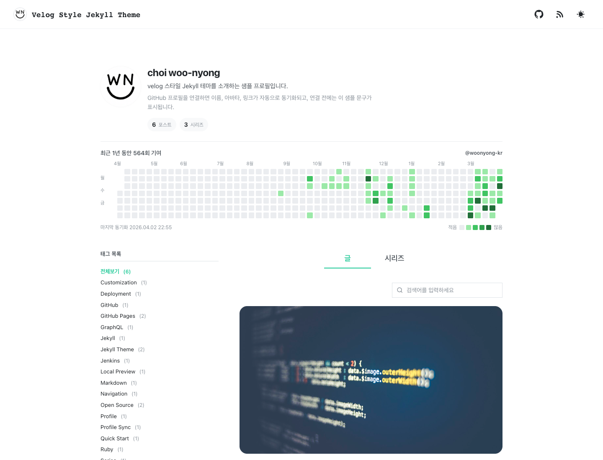
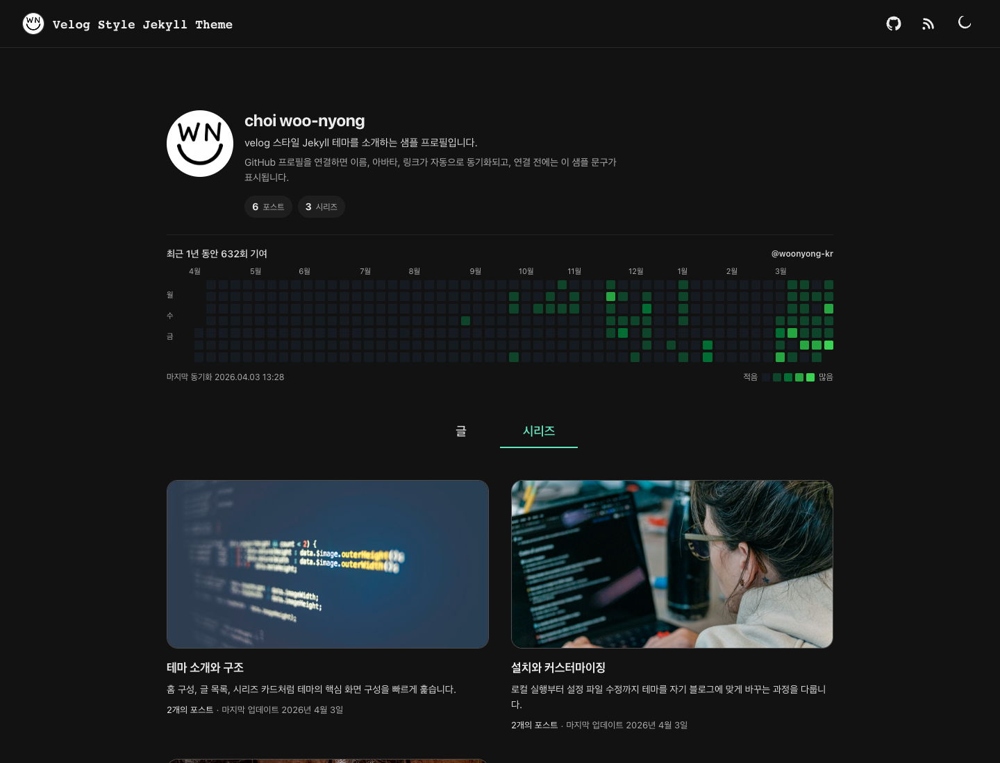

# jekyll-theme-velog

velog 읽는 흐름이 편해서 비슷하게 만들어봤습니다. Jekyll 기반이고 GitHub Pages에 올려서 씁니다.

라이브 데모 → [woonyong-kr.github.io/jekyll-theme-velog](https://woonyong-kr.github.io/jekyll-theme-velog/)

다크 모드 기준으로 찍은 스크린샷입니다.

## 미리보기

### 홈



### 시리즈



### 글


## 포함된 기능

- 글 목록, 태그 필터, 검색
- 시리즈 탭
- 썸네일, 이전/다음 글 네비게이션
- GitHub 프로필 동기화 + 1년 기여 그래프
- 라이트 / 다크 모드 (시스템 설정 자동 반영)
- GitHub Actions 자동 배포
- Jekyll 플러그인: feed, seo-tag, sitemap

## 이 저장소 쓰는 방법

`remote_theme`으로 가져다 쓰는 패키지가 아니라, fork해서 바로 블로그로 쓰는 starter 저장소입니다.

1. 이 저장소를 fork하거나 `Use this template`으로 복제
2. `_config.yml`에서 `url`, `baseurl`, `title`, `description` 수정
3. `_data/` 파일 수정
4. main 브랜치에 push하면 GitHub Actions가 알아서 배포

GitHub Pages 설정에서 소스를 `gh-pages` 브랜치 `/ (root)`로 맞춰야 합니다.

---

`baseurl`은 저장소 이름과 반드시 일치해야 합니다.

```
저장소 이름: my-blog  →  baseurl: "/my-blog"
username.github.io  →  baseurl: ""
```

## 빠른 시작

```bash
BUNDLE_FORCE_RUBY_PLATFORM=true bundle install
BUNDLE_FORCE_RUBY_PLATFORM=true bundle exec jekyll serve
```

로컬 주소: `http://127.0.0.1:4000/jekyll-theme-velog/`

GitHub 프로필과 잔디 그래프를 로컬에서도 보고 싶으면:

```bash
ruby scripts/fetch_github_contributions.rb
```

토큰은 `GITHUB_GRAPHQL_TOKEN`, `GITHUB_TOKEN`, `gh auth login` 중 하나면 됩니다. 없으면 그냥 건너뛰어도 됩니다.

## 설정 파일

처음에 손대야 할 파일은 네 개입니다.

```
_config.yml           사이트 URL, 제목, 외부 연동
_data/profile.yml     토큰 없을 때 보여줄 기본 프로필
_data/theme.yml       헤더 버튼, 탭 이름, 검색 옵션 등 UI 설정
_data/series.yml      시리즈 이름과 설명
```

### _config.yml

```yml
title: 내 블로그
description: 블로그 설명
url: "https://username.github.io"
baseurl: "/repo-name"
```

### _data/theme.yml

자주 건드리는 부분만 추리면 이렇습니다.

```yml
header:
  show_github_link: true
  show_rss_link: true
  show_theme_toggle: true

home:
  initial_post_count: 12
  search_placeholder: 검색어를 입력하세요

hero:
  github_contributions:
    enabled: true
    username: your-github-id

profile:
  github_sync:
    enabled: true
```

### _data/profile.yml

GitHub 동기화가 안 됐을 때 보여줄 fallback입니다.

```yml
display_name: 이름
bio: 한 줄 소개
intro: 추가 정보
avatar: /assets/images/avatar-placeholder.svg
github: https://github.com/your-handle
```

### _data/series.yml

```yml
my-series:
  title: 시리즈 표시 이름
  description: 시리즈 설명
```

글 front matter에서는 키만 씁니다.

```yml
series: my-series
```

## 글 작성

```md
---
title: 글 제목
description: 카드에 보일 설명
date: 2026-01-01 09:00:00 +0900
updated_at: 2026-01-01 21:00:00 +0900
thumbnail: /assets/images/posts/cover.png
series: my-series
tags:
  - Jekyll
  - GitHub Pages
---
```

## GitHub Actions 배포

`.github/workflows/deploy.yml`이 포함돼 있어서 fork하면 바로 동작합니다.

```
main push  →  bundle install  →  잔디 동기화  →  jekyll build  →  gh-pages 배포
```

매일 새벽 3:17에 스케줄 실행도 됩니다 (잔디 그래프 갱신 목적).

잔디 그래프까지 연동하려면 저장소 Settings → Secrets에 `GH_PAT`(read:user 권한 PAT)을 추가합니다. 없으면 `GITHUB_TOKEN`으로 폴백되는데, 기본 배포는 문제없이 됩니다.

### fork 후 체크리스트

1. `_config.yml`의 `baseurl`이 저장소 이름과 맞는지 확인
2. Pages 소스가 `gh-pages` 브랜치 root인지 확인
3. 잔디 그래프 쓸 거면 `GH_PAT` Secret 등록
4. 샘플 글 유지할지 교체할지 결정

### Jenkins

Jenkins 쓰는 환경이면 `Jenkinsfile`도 포함돼 있습니다. 동작 흐름은 Actions와 동일합니다.

필요한 Credentials:

```
credentialsId: github-pages
  username: GitHub 사용자명
  password: GitHub Personal Access Token
```

## 선택적 외부 연동

`_config.yml`에 값만 채우면 활성화됩니다. 빈칸이면 비활성 상태로 유지됩니다.

```yml
# Google Analytics
analytics:
  google:
    measurement_id: "G-XXXXXXXXXX"

# Disqus 댓글
comments:
  provider: "disqus"
  disqus:
    shortname: "your-shortname"

# Algolia 검색
search:
  provider: "algolia"
  algolia:
    app_id: "YOUR_APP_ID"
    api_key: "YOUR_SEARCH_API_KEY"
    index_name: "YOUR_INDEX_NAME"
```

## 트러블슈팅

**스타일이 깨질 때** — `_config.yml`의 `baseurl`이 저장소 이름과 다를 때 CSS, JS, 이미지 경로가 전부 틀어집니다. 먼저 이걸 확인하세요.

**Pages에서 빈 화면** — `gh-pages` 브랜치에 실제로 빌드 결과물이 올라갔는지, Pages 소스 설정이 맞는지 순서대로 확인하면 거의 해결됩니다.

**Actions 실패 후 잔디 그래프가 안 보일 때** — 잔디 동기화 step은 실패해도 빌드가 멈추지 않도록 설계했습니다. 잔디가 안 보이면 `GH_PAT` Secret을 추가해보세요.

**로컬에서 gem 설치 오류** — Apple Silicon이나 네이티브 gem 문제는 `BUNDLE_FORCE_RUBY_PLATFORM=true`로 대부분 해결됩니다.

## 라이선스

MIT

포함된 이미지 출처는 [NOTICE.md](NOTICE.md)에 정리해뒀습니다.
