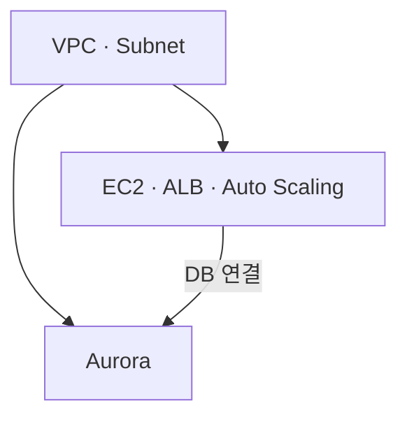
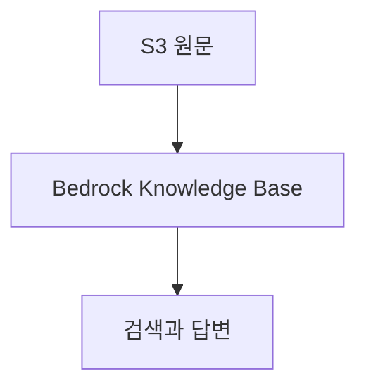

# 클라우드
{: .no_toc }

클라우드에서는 컴퓨팅, 네트워크와 저장소를 필요한 규모로 구성하고 API로 관리한다. 서버를 만드는 일은 그중 한 부분이다. 서비스가 동작하려면 주소와 통신 경로, 접근 권한, 데이터 저장 위치가 맞아야 하며 사용을 멈춘 뒤에도 남아 있는 리소스의 비용을 살펴야 한다.

AWS의 VPC, EC2, ALB, Aurora, S3와 Bedrock을 연결해 보면 이런 경계가 드러난다. 이름을 하나씩 외우기보다 어떤 리소스가 다른 리소스에 의존하는지, 요청이 어떤 경로를 지나는지 따라가는 편이 구성을 이해하기 쉽다.

## 서비스를 연결하는 순서

웹 서버를 배치하려면 먼저 VPC와 Subnet을 정한다. 같은 웹 서버를 여러 대 만들려면 이미지와 생성 설정을 준비하고, ALB가 요청을 전달할 대상과 Health Check를 구성한다. DB를 연결할 때는 웹 서버의 네트워크 접근, Secret을 읽는 IAM 권한, DB 계정을 각각 설정한다.

웹 서비스 배치와 문서 검색은 다음처럼 나누어 볼 수 있다. 그림의 화살표는 리소스 준비 또는 사용 관계를 나타낸다.

문서 검색은 S3 원문을 색인한 뒤 질문에 필요한 내용을 가져오는 흐름이다.

S3 문서를 검색하는 RAG가 EC2 웹 서버 실습을 먼저 끝내야만 가능한 것은 아니다. 필요한 원문, Embedding 모델, Vector Store와 Service Role을 갖추면 별도의 흐름으로 구성할 수 있다. S3 정적 웹 페이지에서 ALB 주소로 이동하는 구성도 가능하지만, 이 링크 이동과 DB 연결을 같은 종류의 의존 관계로 보면 안 된다.

실습 내용을 따라갈 때는 먼저 [비용 관리](/wiki/platform-delivery-operations-topic-342f2ec03420/)에서 알림과 리소스 정리 범위를 정한다. 그다음 [가상 네트워크](/wiki/platform-delivery-operations-topic-82e47b673856/)와 [컴퓨팅](/wiki/platform-delivery-operations-topic-f3ba65e8d3b9/)을 연결해 ALB 주소로 웹 페이지가 열리고 Target Group의 대상이 Healthy인지 확인한다.

데이터 계층은 [Aurora](/wiki/aurora/)와 [객체 저장소](/wiki/platform-delivery-operations-topic-fb76e9d2f23a/)로 이어진다. 웹 앱이 Secret을 읽어 DB에 연결되는지, 정적 웹 페이지가 의도한 웹 서버 주소로 연결되는지 각각 확인한다. [Amazon Bedrock](/wiki/amazon-bedrock/)에서는 Data Source Sync와 검색 결과를 먼저 확인하고, 이어서 생성 답변·도구 호출·입출력 검사를 다룬다.

## 계정과 리전을 먼저 고정하기

행사에서 제공한 실습 계정과 개인 계정은 권한과 사용 기간이 다를 수 있다. 제공된 계정이라면 안내받은 로그인 경로와 Role을 사용하고, 개인 계정이라면 비용 알림과 Budgets를 준비한다. 실습용 브라우저 프로필을 분리하면 서로 다른 계정의 콘솔을 혼동하는 일을 줄일 수 있다.

워크숍에서 지정한 리전을 확인하고 같은 실습의 리소스를 어디에 만들었는지 일관되게 관리한다. 모델이나 기능이 해당 리전을 지원하는지도 확인해야 한다. 이미 만든 리소스가 보이지 않으면 다시 생성하기 전에 계정과 리전부터 살핀다. [Region](/wiki/platform-delivery-operations-topic-92589c24d463/)과 [가용 영역](/wiki/platform-delivery-operations-topic-5f84a0b666fd/)은 서로 다른 배치 경계다.

가이드의 리소스 이름을 따라 만들다가 같은 이름을 발견하면, 기존 리소스의 용도와 연결 관계를 먼저 확인한다. 이름이 같다는 이유만으로 이전 실습의 찌꺼기라고 판단해 삭제하지 않는다. 접근 권한의 기본 구조는 [IAM](/wiki/platform-delivery-operations-iam-5c7a5ae7d73b/)에서 다룬다.

## 실패한 연결부터 좁히기

여러 서비스를 한꺼번에 연결하면 오류가 난 화면과 실제 원인이 있는 위치가 다를 수 있다. 전체를 다시 만드는 대신 요청이 마지막으로 성공한 지점과 다음 연결을 확인한다.

| 증상 | 확인할 연결 |
| --- | --- |
| ALB 주소로 접속하지 못함 | ALB의 Public 경로와 Security Group의 HTTP 허용 여부 |
| ALB는 응답하지만 대상 서버가 Unhealthy | Target Group의 대상·포트·Health Check, EC2의 Security Group, User Data와 서버 프로세스 |
| Private 서버에서 외부 패키지를 받지 못함 | Private Route Table, NAT의 상태, 선택한 NAT 방식의 외부 경로, Subnet 보안 규칙 |
| 웹 앱에서 DB에 연결하지 못함 | DB Security Group의 출발지, Secret 읽기 IAM 권한, `dbname`·사용자 이름·비밀번호 |
| Knowledge Base Sync 실패 | S3 Data Source 경로, Service Role, Embedding 모델 권한, Vector Store 준비 상태 |
| 검색 결과와 답변의 근거가 맞지 않음 | Generate responses를 끄고 검색 Chunk와 Source부터 확인 |
| Agent가 도구를 사용하지 못함 | 도구 선택 여부, 연결한 API·함수의 입력 계약과 호출 권한, 실제 배포 설정 |

이 확인 순서는 무조건 하나의 원인을 가정하기 위한 목록이 아니다. 예를 들어 DB 연결 실패에서도 Secret 조회 오류와 DB 네트워크 오류를 구분해야 한다. RAG에서도 색인 준비, 검색, 생성은 서로 다른 단계다. 실패한 단계를 구분한 뒤 해당 서비스 문서의 구체적인 설정을 살펴본다.

실습을 중간에 멈추거나 마쳤을 때는 계속 비용이 발생하는 리소스와 보존할 데이터를 확인한다. Auto Scaling Group이 있는 상태에서 EC2만 삭제하면 다시 생성될 수 있고, NAT Gateway를 삭제해도 Elastic IP가 남을 수 있다. 삭제 순서는 서비스 이름의 고정 순위보다 실제 의존 관계를 따른다. RDS·NAT·웹 서버와 ALB·S3·Vector Store·VPC의 정리는 [비용 관리](/wiki/platform-delivery-operations-topic-342f2ec03420/)에서 연결 관계별로 다룬다.

관련 실습 구성은 [AWS General Immersion Day](https://catalog.us-east-1.prod.workshops.aws/workshops/869a0a06-1f98-4e19-b5ac-cbb1abdfc041/ko-KR)와 [Amazon Bedrock 워크숍](https://catalog.us-east-1.prod.workshops.aws/workshops/1e5b6626-f63c-41d7-adcb-4a3cdfd279ac/ko-KR)에서 확인할 수 있다. 서비스별 지원 범위와 현재 설정은 각 문서에 연결한 공식 가이드를 함께 확인한다.
