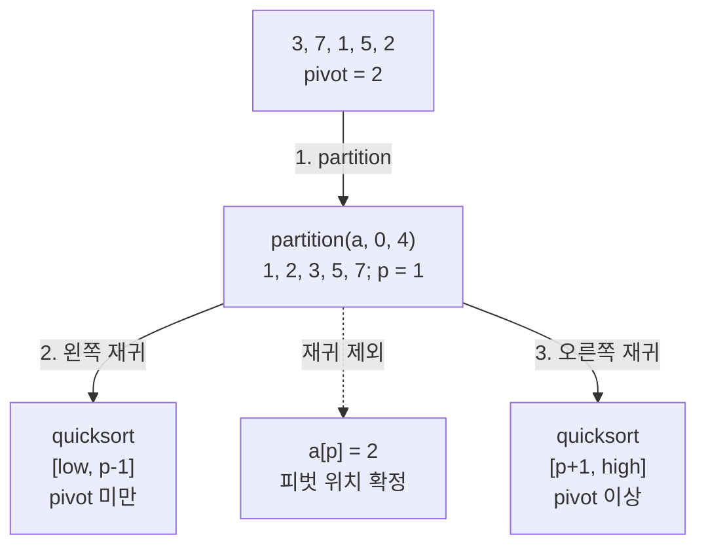

# Quick Sort
{: .no_toc }

## 피벗 하나를 먼저 제자리에 놓기

`[3, 7, 1, 5, 2]`를 오름차순으로 정렬하면서, 마지막 값 `2`의 자리부터 정해 보자. `2`보다 작은 값은 `1` 하나다. 따라서 작은 값을 왼쪽으로 모으고 그 뒤에 `2`를 놓으면, 나머지 값의 순서를 아직 몰라도 `2`는 인덱스 1에 있어야 한다는 사실을 알 수 있다.

이처럼 비교의 기준으로 고른 값을 **피벗(pivot)**, 그 값을 기준으로 구간을 재배치하는 과정을 **파티션(partition)**이라고 한다. 퀵 정렬(Quick Sort)은 파티션 뒤에 남은 왼쪽과 오른쪽 구간을 각각 정렬하는 **분할 정복** 알고리즘이다. 학생 한 명을 기준으로 키가 작은 학생과 같거나 큰 학생을 나눈 다음, 양쪽 무리에서 같은 일을 반복한다고 생각하면 된다. 무리가 한 명 이하가 되면 더 나눌 필요가 없다.

여기서는 맨 끝 원소를 피벗으로 고르는 **Lomuto 파티션**을 사용한다. 피벗보다 작은 값을 왼쪽으로 모으며, 같은 값은 오른쪽에 남긴다. 다음 표는 `i`가 작은 값 구간의 마지막 인덱스이고, `j`가 지금 검사할 인덱스일 때의 변화다.

| 검사한 값 또는 동작 | `i` | 배열 상태 |
| --- | --- | --- |
| 시작: `pivot = 2` | -1 | `[3, 7, 1, 5, 2]` |
| `j = 0`, `3 < 2`는 거짓 | -1 | `[3, 7, 1, 5, 2]` |
| `j = 1`, `7 < 2`는 거짓 | -1 | `[3, 7, 1, 5, 2]` |
| `j = 2`, `1 < 2`이므로 `i`를 늘리고 교환 | 0 | `[1, 7, 3, 5, 2]` |
| `j = 3`, `5 < 2`는 거짓 | 0 | `[1, 7, 3, 5, 2]` |
| `a[i + 1]`과 마지막 피벗을 교환 | 0 | `[1, 2, 3, 5, 7]` |

피벗의 인덱스는 `p = i + 1 = 1`이다. 이 예제는 파티션 한 번만으로 배열 전체가 우연히 정렬된다. 하지만 `[4, 1, 5, 3, 2]`에 같은 절차를 적용하면 `[1, 2, 5, 3, 4]`가 된다. `2`의 위치는 맞아도 오른쪽의 `5, 3, 4`는 아직 정렬되지 않았다. 아래 실행 결과에서 이 차이를 확인한다.

## partition이 반환하는 인덱스

`partition(a, low, high)`는 **양 끝을 포함한 구간** `[low, high]`를 바꾸고, 그 구간에서 피벗이 확정된 인덱스 `p`를 반환한다. 유효한 호출은 길이 `n`인 쓰기 가능한 `int` 배열에 대해 `0 <= low <= high < n`을 만족해야 한다. 아래 예제는 인덱스 계산도 `int`로 하므로 배열 길이는 `INT_MAX` 이하로 한정한다. 범위를 검사해 오류를 돌려주는 API는 아니다.

루프에서 `a[j]`를 검사하기 직전에는 다음 네 구역이 유지된다. 아직 작은 값이 없으면 `i = low - 1`이며, 이 값 자체를 배열 인덱스로 읽지는 않는다.

| 구역 | 그 안의 값 |
| --- | --- |
| `[low, i]` | 모두 `pivot` 미만 |
| `[i + 1, j - 1]` | 모두 `pivot` 이상 |
| `[j, high - 1]` | 아직 검사하지 않음 |
| `high` | 따로 남겨 둔 피벗 |

`a[j] < pivot`이면 작은 구역을 한 칸 늘리고 그 자리로 값을 옮긴다. 거짓이면 `j`만 전진하므로 피벗과 같은 값도 두 번째 구역에 남는다. 검사가 끝나면 `a[i + 1]`과 `a[high]`를 교환한다. 이제 `[low, p - 1]`은 피벗 미만, `a[p]`는 피벗, `[p + 1, high]`는 피벗 이상이다. 교환만 하므로 원소의 값과 개수는 보존되고 지정한 구간 밖은 바뀌지 않는다.

이 반환 계약은 **이 문서의 Lomuto 구현**에 해당한다. 모든 파티션 함수가 피벗의 최종 위치를 반환하는 것은 아니다. 예를 들어 Hoare의 원래 분할 방식은 경계를 반환하며 피벗이 한쪽 구간에 남을 수 있다. [Algorithms, 4th edition의 Quicksort](https://algs4.cs.princeton.edu/23quicksort/)도 이 차이를 별도로 설명한다. 다른 구현을 가져올 때는 반환값의 뜻과 다음 재귀 범위를 함께 확인해야 한다.

## 피벗을 제외하고 다시 나누기

`quicksort(a, low, high)`는 `low >= high`이면 곧바로 돌아온다. 구간이 비었거나 원소가 하나이면 이미 정렬된 상태이기 때문이다. 원소가 둘 이상이면 `partition`으로 `p`를 구한 뒤 `[low, p - 1]`과 `[p + 1, high]`를 각각 정렬한다. `p`는 다시 처리하지 않으므로 두 하위 구간 모두 원래보다 작아지고 재귀가 끝난다.

앞의 배열에서 `partition(a, 0, 4)`가 `p = 1`을 반환하면 `quicksort`는 어느 구간을 다시 정렬하는가?



1. `partition`이 `2`를 인덱스 1에 놓는다. 확정되는 것은 피벗 한 자리이며, 양쪽 구간 내부의 순서는 아직 보장하지 않는다.
2. 왼쪽 재귀 범위는 `[0, 0]`이다. 원소가 하나라 즉시 돌아온다.
3. 오른쪽 재귀 범위는 `[2, 4]`이다. 이 구간에도 같은 파티션과 재귀를 적용한다. `a[1]`은 두 호출에서 모두 제외된다.

빈 배열은 `quicksort(a, 0, -1)`처럼 표현할 수 있다. `partition`을 빈 구간에 직접 호출해서는 안 된다. 아래 프로그램의 `NULL` 검사는 이 즉시 반환 경로에만 해당하며, 실제 원소를 처리하는 호출에는 유효한 배열이 필요하다.

## 두 피벗 선택을 C로 실행하기

다음 프로그램은 마지막 값을 고정해서 쓰는 `quicksort`와, 먼저 피벗 위치를 바꾸는 `quicksort_random`을 같은 입력에 실행한다. `partition_random`은 구간 안에서 선택한 원소를 맨 끝으로 옮긴 뒤 기존 `partition`을 호출한다. 무작위 경로의 재귀 호출도 계속 `quicksort_random`을 사용해야 각 단계에서 그 선택이 적용된다.

`main`의 작은 검사 함수들은 예상한 배열과 실제 배열을 대조한다. 파티션의 반환값·양쪽 조건·범위 밖 값 보존을 검사하고, 전체 정렬은 고정 피벗과 무작위 피벗 모두 확인한다. `srand(7)`은 같은 C 라이브러리에서 난수열을 재현하기 위한 설정이다. 라이브러리가 달라지면 같은 seed라도 피벗 선택 순서가 같다고 가정하지 않는다.

```run-c
#include <assert.h>
#include <limits.h>
#include <stdio.h>
#include <stdlib.h>
#include <string.h>

/* 퀵 정렬 — Lomuto 파티션: 맨 끝을 피벗으로 쓴다 */
int partition(int a[], int low, int high) {
    int pivot = a[high];     // 구간의 맨 끝 값을 기준으로 삼는다
    int i = low - 1;         // '작은 값 구간'의 오른쪽 경계
    for (int j = low; j < high; j++) {
        if (a[j] < pivot) {  // 피벗보다 작으면
            i++;             // 경계를 한 칸 넓히고
            int t = a[i]; a[i] = a[j]; a[j] = t;  // 그 자리로 끌어온다
        }
    }
    int t = a[i + 1]; a[i + 1] = a[high]; a[high] = t;  // 피벗을 경계 뒤에 놓는다
    return i + 1;            // 확정된 피벗의 최종 인덱스
}

/* 퀵 정렬 — 본체: 피벗 자리를 기준으로 좌우를 재귀 정렬 */
void quicksort(int a[], int low, int high) {
    if (low >= high)         // 구간 크기가 1 이하면 종료 조건
        return;
    int p = partition(a, low, high);  // 피벗 자리 p 확정
    quicksort(a, low, p - 1);         // 왼쪽: 피벗보다 작은 구간
    quicksort(a, p + 1, high); // right range: values >= pivot
}

/* Choose a pivot position before the same Lomuto partition. */
int partition_random(int a[], int low, int high) {
    int r = low + rand() % (high - low + 1);  // 구간 안 임의 위치
    int t = a[r]; a[r] = a[high]; a[high] = t; // 그 값을 맨 끝으로 보내 피벗으로
    return partition(a, low, high);            // 이후는 동일
}

void quicksort_random(int a[], int low, int high) {
    if (low >= high)
        return;
    int p = partition_random(a, low, high);
    quicksort_random(a, low, p - 1);
    quicksort_random(a, p + 1, high);
}

static void print_array(const int a[], int n) {
    putchar('[');
    for (int i = 0; i < n; i++)
        printf("%s%d", i == 0 ? "" : ", ", a[i]);
    putchar(']');
}

static void check_partition(const char *name, const int input[],
                            const int expected[], int n,
                            int low, int high, int expected_p) {
    int a[8];
    assert(n <= 8 && 0 <= low && low <= high && high < n);
    memcpy(a, input, (size_t)n * sizeof *a);
    int pivot = input[high];
    int p = partition(a, low, high);
    assert(p == expected_p && low <= p && p <= high);
    assert(a[p] == pivot);
    for (int i = 0; i < n; i++) {
        assert(a[i] == expected[i]);
        if (i < low || i > high)
            assert(a[i] == input[i]);
        else if (i < p)
            assert(a[i] < pivot);
        else if (i > p)
            assert(a[i] >= pivot);
    }
    printf("partition %-10s p=%d ", name, p);
    print_array(a, n);
    putchar('\n');
}

static void check_sort(const char *name, const int input[],
                       const int expected[], int n) {
    int a[8];
    assert(0 <= n && n <= 8);
    for (int mode = 0; mode < 2; mode++) {
        if (n > 0)
            memcpy(a, input, (size_t)n * sizeof *a);
        if (mode == 0)
            quicksort(a, 0, n - 1);
        else
            quicksort_random(a, 0, n - 1);
        for (int i = 0; i < n; i++)
            assert(a[i] == expected[i]);
    }
    printf("sort %-15s fixed/random OK ", name);
    print_array(a, n);
    putchar('\n');
}

int main(void) {
    srand(7);
    check_partition("sample", (int[]){3, 7, 1, 5, 2},
                    (int[]){1, 2, 3, 5, 7}, 5, 0, 4, 1);
    check_partition("not-sorted", (int[]){4, 1, 5, 3, 2},
                    (int[]){1, 2, 5, 3, 4}, 5, 0, 4, 1);
    check_partition("duplicates", (int[]){2, 3, 2, 1, 2},
                    (int[]){1, 2, 2, 2, 3}, 5, 0, 4, 1);
    check_partition("subrange", (int[]){900, 4, 1, 5, 3, 2, -900},
                    (int[]){900, 1, 2, 5, 3, 4, -900}, 7, 1, 5, 2);
    check_partition("all-equal", (int[]){7, 7, 7, 7},
                    (int[]){7, 7, 7, 7}, 4, 0, 3, 0);

    check_sort("empty", NULL, NULL, 0);
    check_sort("single", (int[]){7}, (int[]){7}, 1);
    check_sort("sample", (int[]){3, 7, 1, 5, 2},
               (int[]){1, 2, 3, 5, 7}, 5);
    check_sort("ascending", (int[]){1, 2, 3, 4, 5, 6, 7, 8},
               (int[]){1, 2, 3, 4, 5, 6, 7, 8}, 8);
    check_sort("descending", (int[]){8, 7, 6, 5, 4, 3, 2, 1},
               (int[]){1, 2, 3, 4, 5, 6, 7, 8}, 8);
    check_sort("all-equal", (int[]){7, 7, 7, 7, 7, 7, 7, 7},
               (int[]){7, 7, 7, 7, 7, 7, 7, 7}, 8);
    check_sort("duplicates", (int[]){2, 3, 2, 1, 2},
               (int[]){1, 2, 2, 2, 3}, 5);
    check_sort("negative", (int[]){-3, 0, -1, -3, 2, -8},
               (int[]){-8, -3, -3, -1, 0, 2}, 6);
    check_sort("int-limits", (int[]){INT_MAX, 0, INT_MIN, -1, INT_MAX},
               (int[]){INT_MIN, -1, 0, INT_MAX, INT_MAX}, 5);

    for (int mode = 0; mode < 2; mode++) {
        int a[] = {900, 4, 1, 5, 3, 2, -900};
        int expected[] = {900, 1, 2, 3, 4, 5, -900};
        if (mode == 0)
            quicksort(a, 1, 5);
        else
            quicksort_random(a, 1, 5);
        for (int i = 0; i < 7; i++)
            assert(a[i] == expected[i]);
    }
    puts("subrange sort: fixed/random OK; outside unchanged");

    for (int shape = 0; shape < 3; shape++) {
        for (int mode = 0; mode < 2; mode++) {
            int a[64];
            for (int i = 0; i < 64; i++)
                a[i] = shape == 0 ? i : (shape == 1 ? 63 - i : 7);
            if (mode == 0)
                quicksort(a, 0, 63);
            else
                quicksort_random(a, 0, 63);
            for (int i = 0; i < 64; i++)
                assert(a[i] == (shape == 2 ? 7 : i));
        }
    }
    puts("n=64 ascending/descending/equal: fixed/random OK");
    quicksort(NULL, 0, -1);
    quicksort_random(NULL, 0, -1);
    puts("empty NULL range: fixed/random OK");
    puts("all checks passed");
    return 0;
}
```

코드를 `quicksort.c`로 저장했다면 다음 명령으로 컴파일하고 실행할 수 있다. `assert` 검사를 사용하므로 `NDEBUG`를 정의하지 않는다.

```bash
clang -std=c11 -Wall -Wextra -Wpedantic -Werror -O0 quicksort.c -o quicksort
./quicksort
```

위 프로그램의 실제 실행 stdout은 다음과 같다.

```text
partition sample     p=1 [1, 2, 3, 5, 7]
partition not-sorted p=1 [1, 2, 5, 3, 4]
partition duplicates p=1 [1, 2, 2, 2, 3]
partition subrange   p=2 [900, 1, 2, 5, 3, 4, -900]
partition all-equal  p=0 [7, 7, 7, 7]
sort empty           fixed/random OK []
sort single          fixed/random OK [7]
sort sample          fixed/random OK [1, 2, 3, 5, 7]
sort ascending       fixed/random OK [1, 2, 3, 4, 5, 6, 7, 8]
sort descending      fixed/random OK [1, 2, 3, 4, 5, 6, 7, 8]
sort all-equal       fixed/random OK [7, 7, 7, 7, 7, 7, 7, 7]
sort duplicates      fixed/random OK [1, 2, 2, 2, 3]
sort negative        fixed/random OK [-8, -3, -3, -1, 0, 2]
sort int-limits      fixed/random OK [-2147483648, -1, 0, 2147483647, 2147483647]
subrange sort: fixed/random OK; outside unchanged
n=64 ascending/descending/equal: fixed/random OK
empty NULL range: fixed/random OK
all checks passed
```

`sample`과 `not-sorted`는 모두 `p = 1`을 반환하지만, 두 번째 결과의 오른쪽은 정렬되지 않았다. `duplicates`에서는 `p` 오른쪽에 같은 값 `2`가 남고, `subrange`에서는 바깥의 `900`과 `-900`이 유지된다. 전체 정렬의 `fixed/random OK`는 두 경로가 기대한 배열을 만들었다는 뜻이며, 두 경로의 속도나 비교 횟수가 같다는 뜻은 아니다.

## 같은 값은 계속 오른쪽에 남는다

모든 값이 `7`이면 `a[j] < pivot`이 한 번도 참이 되지 않는다. 따라서 `i`는 `low - 1`에 머물고 `partition`은 항상 `p = low`를 반환한다. 실행 결과의 `all-equal`에서 배열이 그대로인데도 `p = 0`인 이유다. 다음 재귀에는 오른쪽의 `n - 1`개가 남는다.

이 입력에서는 어느 위치를 피벗으로 골라도 값이 `7`이다. 따라서 무작위 피벗도 이 Lomuto 구현의 치우침을 해결하지 못한다. `<`를 단순히 `<=`로 바꾸면 같은 값이 왼쪽으로 몰릴 뿐이다. 같은 값이 많은 입력을 다루려면 작은 값·같은 값·큰 값을 따로 모으는 **3-way 파티션**처럼 분할 방법을 바꿀 수 있다. [Quicksort의 중복 키와 3-way 설명](https://algs4.cs.princeton.edu/23quicksort/)은 그 대안을 다룬다. 그 페이지의 양방향 스캔 구현과 여기의 Lomuto 구현은 같지 않으므로, 같은 값 입력에서의 성능도 그대로 옮겨 해석하면 안 된다.

같은 값의 개수를 보존하는 것과 원래 순서를 보존하는 것도 다르다. 값이 `2`인 두 항목에 구분 표시 `A`, `B`를 붙여 `[2_A, 1, 2_B]`를 손으로 따라가 보자. `1`을 왼쪽으로 옮기면 `[1, 2_A, 2_B]`가 되고, 마지막 피벗 교환으로 `[1, 2_B, 2_A]`가 된다. 피벗 양쪽에 원소가 하나씩만 남아 정렬이 끝나므로 두 항목의 상대 순서는 뒤집힌 채 유지된다. 이렇게 같은 정렬 키의 원래 순서를 보장하지 못하므로 이 구현은 [안정 정렬](/wiki/computer-science-topic-16ffadb31203/)이 아니다. 정수만 출력한 결과에서는 같은 값끼리의 구분이 보이지 않는다.

## 분할의 균형과 호출 깊이

파티션 한 번은 크기 `n`인 구간에서 `n - 1`개의 값을 피벗과 비교한다. 전체 비용은 이 작업을 얼마나 큰 구간들에 반복하느냐에 달려 있다.

### 절반씩 나뉘는 경우와 평균을 구분한다

양쪽이 매번 거의 절반이라면, 반올림과 피벗 한 개의 제외를 생략한 점화식은 `T(n) = 2T(n/2) + Θ(n)`이다. 깊이는 약 `log₂ n`이고 각 깊이에서 처리하는 구간들의 전체 크기는 최대 `n`이므로 전체 비용은 `Θ(n log n)`이다. 이는 **균형 있게 나뉘는 경우의 분석**이다.

평균이나 기대 시간도 말하려면 무엇을 무작위로 보는지 정해야 한다. 서로 다른 키들에서 매 단계의 피벗을 구간 전체에서 균등하게 고르면, 피벗보다 작은 원소 수 `k`는 `0`부터 `n - 1`까지 같은 확률을 갖는다. 따라서 기대 비용은 `E[T(n)] = (1/n) × Σ(E[T(k)] + E[T(n - 1 - k)]) + Θ(n)`으로 계산하며 `Θ(n log n)`이 된다. 모든 분할이 절반이라는 가정으로 이 평균을 증명한 것은 아니다. [Algorithms, 4th edition의 평균 비교 횟수](https://algs4.cs.princeton.edu/23quicksort/) 역시 서로 다른 키와 무작위화의 조건을 둔다.

100만 개를 정렬한다고 생각해 보자. 단순한 비용 모형 `n²`에는 약 1조가, `n log₂ n`에는 약 2천만이 들어가며 두 식의 비율은 약 5만 배다. 초당 1억 회를 처리한다고 가정하면 1조 회는 1만 초, 약 2.8시간이다. 이 숫자들은 복잡도 식과 가상의 처리량을 대입한 값이다. 특정 정렬의 실제 비교 횟수나 측정 시간, 두 프로그램의 속도 차이를 뜻하지 않는다.

### 한 원소씩만 줄어들면 스택도 깊어진다

맨 끝을 피벗으로 고르는 이 구현에서 이미 정렬된 서로 다른 값들은 매번 `p = high`를 만든다. 모두 같은 값들은 반대로 매번 `p = low`를 만든다. 두 경우 모두 다음에 처리할 구간 크기가 `n - 1`이어서 피벗과의 비교 횟수는 `(n - 1) + (n - 2) + … + 1 = n(n - 1)/2`, 즉 `Θ(n²)`이다.

한쪽 재귀 호출이 돌아오기 전에 그 안에서 더 작은 호출을 계속 만들므로 [호출 스택](/wiki/computer-science-topic-931a857d1d9a/)도 최악에는 `Θ(n)` 깊이로 자랄 수 있다. 위 프로그램은 길이 64의 정렬·역순·동일 값 입력에서도 정렬 결과를 확인하지만, 큰 입력의 스택 안전성을 보장하는 구현은 아니다.

Lomuto 파티션 자체는 새 배열을 만들지 않고 상수 개의 변수로 원소를 교환하므로 **제자리 분할의 보조 공간은 `O(1)`**이다. 재귀 스택까지 포함하면 균형 분할에서는 `O(log n)`, 최악에는 `O(n)`의 공간이 필요하다. 제자리라는 말로 정렬 전체의 추가 메모리가 언제나 상수라고 설명해서는 안 된다. 점화식과 비용 모형은 [시간 복잡도](/wiki/computer-science-topic-869aa2bd6535/)에서 이어 볼 수 있다.

## 피벗 선택과 라이브러리의 보장

무작위 피벗은 이미 정렬된 입력에서 맨 끝 값만 계속 고르는 규칙을 벗어나게 한다. 하지만 이번 예제의 `rand() % 폭`은 **균등 선택을 보장하는 구현이 아니다**. `rand()`의 가능한 값 개수가 폭으로 나누어떨어지지 않으면 나머지별로 대응하는 값의 수가 달라지고, 폭이 `RAND_MAX + 1`보다 크면 선택할 수 없는 위치도 생긴다. 난수열 자체의 성질도 C 라이브러리에 달려 있다. [GNU C Library의 ISO C Random Number Functions](https://sourceware.org/glibc/manual/latest/html_node/ISO-Random.html)는 `rand`의 반환 범위와 `srand`의 역할을 설명한다. 따라서 위 실행을 균등 무작위 모델의 기대 성능 증거로 쓰지 않는다.

첫·중간·끝 값 중 중앙값을 피벗으로 쓰는 **median-of-three**도 선택지다. 이는 세 표본의 중앙값이지 구간 전체의 중앙값은 아니므로, 언제나 반으로 나뉘거나 최악 시간이 사라진다고 보장하지 않는다. 작은 구간에서 [삽입 정렬](/wiki/computer-science-topic-2e933dffbb75/)로 전환해 호출 비용을 줄이는 방법도 있다. [Quicksort의 개선 방법](https://algs4.cs.princeton.edu/23quicksort/)은 두 기법을 소개한다. 둘 다 위 C 프로그램에는 적용하지 않았다.

실제 정렬을 선택할 때는 필요한 보장을 먼저 구분한다. [병합 정렬](/wiki/computer-science-topic-2ada7cd17f3c/)은 최악 `O(n log n)`이며, 병합 중 같은 키는 왼쪽 항목부터 선택하면 안정성을 유지할 수 있다. [Heap Sort](/wiki/computer-science-topic-b526fbd435ec/)도 최악 `O(n log n)`이지만 일반적인 제자리 구현은 안정 정렬이 아니다. 퀵 정렬의 분할 깊이가 커지면 힙 정렬로 전환하는 introsort는 최악 시간을 보완하는 결합 방법이다. 이때도 안정성은 따로 확인해야 한다.

C의 `qsort()`라는 이름만으로 내부가 퀵 정렬이라고 판단할 수도 없다. [GNU C Library의 Array Sort Function](https://sourceware.org/glibc/manual/latest/html_node/Array-Sort-Function.html)은 이름의 유래와 실제 구현을 구분하며, 메모리를 확보해 병합 정렬을 시도한다고 설명한다. 이 설명은 GNU C Library에 대한 것이며, 위 프로그램을 실행한 환경의 `qsort` 구현을 확인한 결과는 아니다. `qsort`는 같은 키의 상대 순서도 보장하지 않는다.

새 정렬 코드를 읽을 때는 `partition`이 무엇을 반환하는지, 같은 값이 어느 구간에 남는지, 재귀 범위가 반드시 줄어드는지를 먼저 확인한다. 그 뒤 입력의 중복 정도·최악 시간·스택 사용량·안정성 가운데 무엇이 필요한지를 기준으로 구현을 고르면 된다.
