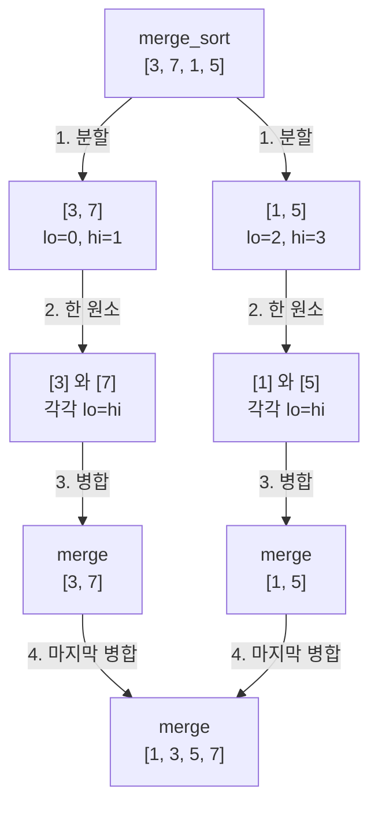

# 병합 정렬
{: .no_toc }

## 정렬된 두 조각의 맨 앞

`[3, 7]`과 `[1, 5]`가 각각 정렬되어 있다면, 두 줄의 맨 앞만 비교해 `[1, 3, 5, 7]`을 만들 수 있다. 처음에는 `3`과 `1` 중 `1`을 고르고, 다음에는 `3`과 `5` 중 `3`을 고른다. 이어서 `5`를 고르면 오른쪽 줄이 비므로 왼쪽에 남은 `7`을 붙인다.

이처럼 정렬된 두 조각을 하나로 합치는 과정이 **병합(merge)**이다. 키순으로 선 두 줄의 맨 앞 사람을 비교해 키가 작은 사람부터 새 줄로 보내는 것과 같다. 이미 각 줄이 정렬되어 있으므로, 뒤에 있는 사람까지 다시 살펴보지 않아도 다음에 올 사람을 고를 수 있다.

코드에서는 왼쪽 조각을 `[lo, mid]`, 오른쪽 조각을 `[mid + 1, hi]`로 나타낸다. 양 끝을 포함하는 구간이며 두 조각은 바로 이어져 있다. `i`는 왼쪽에서 다음에 읽을 위치, `j`는 오른쪽에서 다음에 읽을 위치, `k`는 보조 배열 `tmp`에 다음으로 쓸 위치다. 다음 표는 `a = [3, 7, 1, 5]`, `lo = 0`, `mid = 1`, `hi = 3`인 병합을 따라간다.

| 다음 항목을 고르는 기준 | 선택 | 선택 뒤 `i, j, k` | `tmp`에 확정된 앞부분 |
| --- | --- | --- | --- |
| 시작 | 없음 | `0, 2, 0` | 아직 쓰지 않음 |
| `3`과 `1` 비교 | 오른쪽 `1` | `0, 3, 1` | `[1]` |
| `3`과 `5` 비교 | 왼쪽 `3` | `1, 3, 2` | `[1, 3]` |
| `7`과 `5` 비교 | 오른쪽 `5` | `1, 4, 3` | `[1, 3, 5]` |
| 오른쪽이 비었음 | 왼쪽의 나머지 `7` | `2, 4, 4` | `[1, 3, 5, 7]` |

`tmp[lo..k-1]`에는 지금까지 양쪽에서 꺼낸 항목이 정렬된 순서로 쌓인다. 아직 꺼내지 않은 각 조각도 정렬되어 있으므로 맨 앞의 작은 항목을 고르는 규칙을 계속 적용할 수 있다. 한쪽을 다 읽으면 다른 쪽의 나머지는 이미 정렬되어 있어 그대로 붙인다. 병합이 끝난 뒤 `tmp[lo..hi]`를 `a[lo..hi]`로 복사한다.

`tmp`는 `a`와 겹치지 않는 별도의 쓰기 가능한 공간이어야 하며, 이 구현은 원래 배열과 같은 인덱스로 쓰므로 적어도 `hi + 1`개 항목을 담을 수 있어야 한다. `tmp`를 `a`와 같은 공간으로 쓰면 아직 읽지 않은 값을 덮어쓸 수 있다. 또한 `merge`는 **양쪽 조각이 각각 정렬되어 있다는 전제**로 동작한다. 정렬되지 않은 임의의 두 구간을 합치는 것만으로 정렬이 완성되지는 않는다.

## 나눈 구간이 다시 합쳐지는 순서

처음에 정렬된 조각이 없다면 배열을 계속 반으로 나누면 된다. 원소가 하나인 조각은 이미 정렬되어 있으므로, 거기서부터 인접한 두 조각을 병합해 올라간다. 이것이 **병합 정렬(Merge Sort)**의 분할 정복 방식이다.

`merge_sort(a, lo, hi, tmp)`는 `lo >= hi`이면 돌아온다. 그보다 큰 구간에서는 `mid = lo + (hi - lo) / 2`로 가운데를 구하고, 왼쪽 정렬과 오른쪽 정렬을 마친 뒤 `merge(a, lo, mid, hi, tmp)`를 호출한다. 병합에 들어갈 때 양쪽이 이미 정렬돼 있는 이유는 그 두 재귀 호출이 먼저 끝나기 때문이다.

아래 그림은 `merge_sort`가 나누고 합치는 구간을 크기별로 모은 개념도다. 실제 호출은 왼쪽 정렬을 완료한 뒤 오른쪽 정렬로 이어진다.



1. `[3, 7]`과 `[1, 5]`로 범위를 나눈다. 배열을 새로 복사해 조각을 만드는 것이 아니라 인덱스로 범위를 지정한다.
2. 각 쌍을 한 원소 구간까지 나눈다. 그림에서 `[3]`과 `[7]`, `[1]`과 `[5]`를 함께 적은 상자는 각각의 종료 상태를 묶어 나타낸다.
3. 한 원소 조각들을 병합해 `[3, 7]`과 `[1, 5]`를 얻는다. 실제 코드는 왼쪽 구간의 정렬을 끝낸 다음 오른쪽 구간을 정렬한다.
4. 양쪽 정렬이 끝나면 앞에서 따라간 마지막 병합으로 `[1, 3, 5, 7]`을 만든다.

[Quick Sort](/wiki/computer-science-topic-0865c05ef97a/)의 Lomuto 구현은 피벗을 제자리에 놓은 뒤 양쪽을 재귀 정렬한다. 병합 정렬은 값의 대소와 무관하게 인덱스로 나누고, 재귀 호출이 돌아오며 두 결과를 병합한다. 원소를 정렬된 순서로 재배치하는 작업이 일어나는 단계가 다르다.

## 같은 키의 순서는 왼쪽부터

금액이 같은 주문끼리 날짜순을 유지하고 싶다면, 먼저 날짜순으로 정렬한 뒤 금액을 기준으로 **안정 정렬(stable sort)**할 수 있다. 같은 정렬 키를 가진 항목의 기존 상대 순서를 보존하기 때문에, 두 번째 정렬 뒤에도 같은 금액 안에서는 앞서 만든 날짜순이 유지된다.

병합에서는 두 항목의 키가 같을 때 **왼쪽을 먼저 고르는 `<=`**가 이 순서를 지킨다. 배열을 연속된 두 구간으로 나눴으므로 왼쪽 항목들은 원래 오른쪽 항목들보다 앞에 있었다. 각 조각 내부에서도 맨 앞부터 꺼내며 순서를 바꾸지 않는다. 한 원소 조각에서 시작해 이 규칙을 모든 병합에 적용하면 전체 정렬에서도 같은 키의 순서가 보존된다.

아래 C 프로그램은 이를 숫자만 보고 판단하지 않도록 각 항목에 `key`와 `id`를 둔다. `key`가 정렬 기준이고 `id`는 정렬 전 위치다. **비교에는 `key`만 쓰며 `id`는 비교하지 않는다.** 항목 전체를 옮기므로 식별자도 키와 함께 이동한다. 출력의 `2#0`은 키가 `2`이고 원래 인덱스가 `0`인 항목이라는 뜻이다.

입력 `[2#0, 1#1, 2#2, 1#3, 2#4, 1#5]`를 정렬했을 때 같은 키 `1`의 ID가 `1, 3, 5`, 같은 키 `2`의 ID가 `0, 2, 4`로 남는지 실행에서 확인한다. 모든 값이 같은 입력도 원래 ID 순서가 그대로여야 한다. 단순히 값의 개수가 같다는 것만으로 [안정성](/wiki/computer-science-topic-16ffadb31203/)을 확인한 것은 아니다.

## 보조 배열을 확보한 뒤 정렬하기

`merge_sort_run(a, n)`은 보조 배열을 한 번 확보하고, 그 공간을 모든 재귀 호출에 넘긴다. 자식 구간의 병합 결과는 `a`로 복사되므로 부모가 병합할 때 이전 `tmp` 내용을 보존할 필요가 없다. 정렬이 끝나면 보조 배열만 `free`하고 입력 배열은 호출자에게 남긴다.

보조 배열을 확보하지 못하면 정렬을 시작해서는 안 된다. [GNU C Library의 Basic Memory Allocation](https://sourceware.org/glibc/manual/latest/html_node/Basic-Allocation.html)은 `malloc`이 할당 실패 시 널 포인터를 반환함을 설명한다. 아래 진입점은 `tmp == NULL`이면 `false`를 반환하며, 그 전에 입력 배열을 바꾸지 않는다. 성공하면 `true`를 반환한다.

길이가 음수이거나, 원소가 있는데 입력이 `NULL`이면 `false`다. 빈 배열은 `NULL`과 길이 `0`으로 표현할 수 있으며, 길이가 0 또는 1인 유효한 입력에는 보조 배열을 할당하지 않는다. `n * sizeof(Item)`를 계산하기 전에는 그 결과가 `size_t` 범위를 넘지 않는지도 확인한다. 여기서 `uintmax_t`는 양수가 된 `n`을 충분히 넓은 부호 없는 정수로 비교하기 위해 사용한다.

이 검사가 실제 배열의 용량까지 알아내는 것은 아니다. 호출자는 `n`개 항목을 담은 유효한 배열을 제공해야 한다. 내부의 `merge`와 `merge_sort`를 직접 호출해 원소를 처리할 때도 `0 <= lo <= hi <= INT_MAX - 1`의 유효한 배열 범위, `hi + 1`개 이상을 담는 별도 `tmp` 공간을 지켜야 한다. `merge`에는 추가로 `lo <= mid < hi`인 정렬된 두 구간이 필요하다. 이 조건에서 `lo + (hi - lo) / 2`는 `lo + hi`를 먼저 더할 때 생길 수 있는 오버플로를 피한다. 잘못된 인덱스까지 안전하게 만드는 공식은 아니다.

## 값과 ID를 함께 확인하는 C 프로그램

다음 프로그램은 `merge`, `merge_sort`, `merge_sort_run`을 실제로 호출한다. `verify`는 키의 오름차순과 같은 키의 ID 순서뿐 아니라, 모든 ID가 한 번씩 남고 각 ID에 연결된 키가 바뀌지 않았는지도 확인한다. 예상 순서는 작은 입력마다 직접 지정했다.

`Allocate`는 `malloc`과 같은 형태의 함수를 받기 위한 타입 이름이다. 일반 실행은 `merge_sort_run`을 사용하고, 검사는 내부의 `merge_sort_with_allocator`에 호출 횟수를 세는 함수나 항상 `NULL`을 반환하는 함수를 전달한다. 성공하는 할당 함수는 `free`할 수 있는 메모리를 돌려줘야 한다. 이 장치는 실제 메모리를 고갈시키지 않고 할당 실패 경로를 확인하기 위한 것이다.

```run-c
#include <assert.h>
#include <limits.h>
#include <stdbool.h>
#include <stdint.h>
#include <stdio.h>
#include <stdlib.h>

typedef struct {
    int key;
    int id;
} Item;

/* 병합 정렬 — merge(): a[lo..mid]와 a[mid+1..hi]는 각각 정렬돼 있다 */
void merge(Item a[], int lo, int mid, int hi, Item tmp[]) {
    int i = lo, j = mid + 1, k = lo;
    while (i <= mid && j <= hi) {        // 두 조각의 맨 앞을 비교
        if (a[i].key <= a[j].key)                // 같으면 왼쪽 먼저 → 안정성 보장
            tmp[k++] = a[i++];
        else
            tmp[k++] = a[j++];
    }
    while (i <= mid) tmp[k++] = a[i++];  // 왼쪽 남은 것 붙이기
    while (j <= hi)  tmp[k++] = a[j++];  // 오른쪽 남은 것 붙이기
    for (int x = lo; x <= hi; x++)       // 보조 배열을 원래 자리로 복사
        a[x] = tmp[x];
}

/* 병합 정렬 — 본체: 절반으로 나눠 재귀, 돌아오며 병합 */
void merge_sort(Item a[], int lo, int hi, Item tmp[]) {
    if (lo >= hi)                    // 원소 1개 이하면 종료 조건
        return;
    int mid = lo + (hi - lo) / 2;    // 오버플로 없이 가운데 인덱스 계산
    merge_sort(a, lo, mid, tmp);     // 왼쪽 절반 정렬
    merge_sort(a, mid + 1, hi, tmp); // 오른쪽 절반 정렬
    merge(a, lo, mid, hi, tmp);      // 정렬된 두 절반을 합친다
}

typedef void *(*Allocate)(size_t);

static bool merge_sort_with_allocator(Item a[], int n, Allocate allocate) {
    if (n < 0 || (n > 0 && a == NULL))
        return false;
    if (n < 2)
        return true;
    if (allocate == NULL || (uintmax_t)n > (uintmax_t)SIZE_MAX / sizeof *a)
        return false;
    Item *tmp = allocate((size_t)n * sizeof *tmp);
    if (tmp == NULL)
        return false;
    merge_sort(a, 0, n - 1, tmp);
    free(tmp);
    return true;
}

bool merge_sort_run(Item a[], int n) {
    return merge_sort_with_allocator(a, n, malloc);
}

static void print_items(const Item a[], int n) {
    putchar('[');
    for (int i = 0; i < n; i++)
        printf("%s%d#%d", i == 0 ? "" : ", ", a[i].key, a[i].id);
    putchar(']');
}

static void verify(const Item a[], const int keys[], const int order[],
                   int n, int lo, int hi) {
    bool seen[8] = {false};
    assert(0 <= n && n <= 8);
    for (int i = 0; i < n; i++) {
        int id = a[i].id;
        assert(0 <= id && id < n && !seen[id]);
        seen[id] = true;
        assert(a[i].key == keys[id]);
        assert(id == order[i]);
        if (i > lo && i <= hi) {
            assert(a[i - 1].key <= a[i].key);
            if (a[i - 1].key == a[i].key)
                assert(a[i - 1].id < a[i].id);
        }
    }
}

static void check_sort(const char *name, const int keys[],
                       const int order[], int n) {
    Item a[8];
    assert(0 <= n && n <= 8);
    for (int i = 0; i < n; i++)
        a[i] = (Item){keys[i], i};
    assert(merge_sort_run(a, n));
    verify(a, keys, order, n, 0, n - 1);
    printf("sort %-12s ", name);
    print_items(a, n);
    putchar('\n');
}

static void check_merge(const char *name, const int keys[], const int order[],
                        int n, int lo, int mid, int hi) {
    Item a[8], tmp[8];
    assert(n <= 8 && 0 <= lo && lo <= mid && mid < hi && hi < n);
    for (int i = 0; i < n; i++) {
        a[i] = (Item){keys[i], i};
        tmp[i] = (Item){-99999, -99999};
    }
    for (int i = lo + 1; i <= mid; i++)
        assert(a[i - 1].key <= a[i].key);
    for (int i = mid + 2; i <= hi; i++)
        assert(a[i - 1].key <= a[i].key);
    merge(a, lo, mid, hi, tmp);
    verify(a, keys, order, n, lo, hi);
    for (int i = 0; i < n; i++) {
        if (i < lo || i > hi) {
            assert(a[i].key == keys[i] && a[i].id == i);
            assert(tmp[i].key == -99999 && tmp[i].id == -99999);
        }
    }
    printf("merge %-11s ", name);
    print_items(a, n);
    putchar('\n');
}

static int allocation_calls;

static void *counting_malloc(size_t size) {
    allocation_calls++;
    return malloc(size);
}

static void *failing_malloc(size_t size) {
    (void)size;
    allocation_calls++;
    return NULL;
}

int main(void) {
    check_merge("sample", (int[]){3, 7, 1, 5},
                (int[]){2, 0, 3, 1}, 4, 0, 1, 3);
    check_merge("left-empty", (int[]){1, 2, 3, 4},
                (int[]){0, 1, 2, 3}, 4, 0, 1, 3);
    check_merge("uneven", (int[]){1, 3, 5, 2, 4},
                (int[]){0, 3, 1, 4, 2}, 5, 0, 2, 4);
    check_merge("equal-keys", (int[]){1, 2, 2, 1, 2, 2},
                (int[]){0, 3, 1, 2, 4, 5}, 6, 0, 2, 5);
    check_merge("subrange", (int[]){900, 1, 3, 2, 4, -900},
                (int[]){0, 1, 3, 2, 4, 5}, 6, 1, 2, 4);

    check_sort("empty", NULL, NULL, 0);
    check_sort("single", (int[]){7}, (int[]){0}, 1);
    check_sort("sample", (int[]){3, 7, 1, 5}, (int[]){2, 0, 3, 1}, 4);
    check_sort("ascending", (int[]){1, 2, 3, 4, 5}, (int[]){0, 1, 2, 3, 4}, 5);
    check_sort("descending", (int[]){5, 4, 3, 2, 1}, (int[]){4, 3, 2, 1, 0}, 5);
    check_sort("all-equal", (int[]){7, 7, 7, 7}, (int[]){0, 1, 2, 3}, 4);
    check_sort("duplicates", (int[]){2, 1, 2, 1, 2, 1},
               (int[]){1, 3, 5, 0, 2, 4}, 6);
    check_sort("odd-length", (int[]){4, 2, 5, 2, 0, 4, 1},
               (int[]){4, 6, 1, 3, 0, 5, 2}, 7);
    check_sort("negative", (int[]){-3, 0, -1, -3, 2, -8},
               (int[]){5, 0, 3, 2, 1, 4}, 6);
    check_sort("int-limits", (int[]){INT_MAX, INT_MIN, 0, INT_MAX, INT_MIN},
               (int[]){1, 4, 2, 0, 3}, 5);

    Item partial[] = {{900, 0}, {3, 1}, {1, 2}, {2, 3}, {-900, 4}};
    Item scratch[5];
    merge_sort(partial, 1, 3, scratch);
    verify(partial, (int[]){900, 3, 1, 2, -900},
           (int[]){0, 2, 3, 1, 4}, 5, 1, 3);
    puts("subrange sort: outside keys and ids unchanged");

    Item allocated[] = {{2, 0}, {1, 1}, {2, 2}, {1, 3}, {2, 4}, {1, 5}};
    allocation_calls = 0;
    assert(merge_sort_with_allocator(allocated, 6, counting_malloc));
    assert(allocation_calls == 1);
    verify(allocated, (int[]){2, 1, 2, 1, 2, 1}, (int[]){1, 3, 5, 0, 2, 4}, 6, 0, 5);
    puts("allocation: one buffer for the whole sort");

    Item failed[] = {{3, 0}, {1, 1}, {2, 2}};
    allocation_calls = 0;
    assert(!merge_sort_with_allocator(failed, 3, failing_malloc));
    assert(allocation_calls == 1);
    verify(failed, (int[]){3, 1, 2}, (int[]){0, 1, 2}, 3, 0, -1);
    puts("allocation failure: false; all keys and ids unchanged");

    Item single = {7, 0};
    allocation_calls = 0;
    assert(merge_sort_with_allocator(NULL, 0, counting_malloc));
    assert(merge_sort_with_allocator(&single, 1, counting_malloc));
    assert(allocation_calls == 0 && single.key == 7 && single.id == 0);
    assert(!merge_sort_run(NULL, 1));
    assert(!merge_sort_run(failed, -1));
    verify(failed, (int[]){3, 1, 2}, (int[]){0, 1, 2}, 3, 0, -1);
    puts("empty/single: no allocation; invalid arguments: false");
    puts("all checks passed");
    return 0;
}
```

코드를 `merge-sort.c`로 저장했다면 다음 명령으로 컴파일하고 실행할 수 있다. `assert` 검사를 유지하도록 `NDEBUG`는 정의하지 않는다.

```bash
clang -std=c11 -Wall -Wextra -Wpedantic -Werror -O0 merge-sort.c -o merge-sort
./merge-sort
```

위 프로그램의 실제 실행 stdout은 다음과 같다.

```text
merge sample      [1#2, 3#0, 5#3, 7#1]
merge left-empty  [1#0, 2#1, 3#2, 4#3]
merge uneven      [1#0, 2#3, 3#1, 4#4, 5#2]
merge equal-keys  [1#0, 1#3, 2#1, 2#2, 2#4, 2#5]
merge subrange    [900#0, 1#1, 2#3, 3#2, 4#4, -900#5]
sort empty        []
sort single       [7#0]
sort sample       [1#2, 3#0, 5#3, 7#1]
sort ascending    [1#0, 2#1, 3#2, 4#3, 5#4]
sort descending   [1#4, 2#3, 3#2, 4#1, 5#0]
sort all-equal    [7#0, 7#1, 7#2, 7#3]
sort duplicates   [1#1, 1#3, 1#5, 2#0, 2#2, 2#4]
sort odd-length   [0#4, 1#6, 2#1, 2#3, 4#0, 4#5, 5#2]
sort negative     [-8#5, -3#0, -3#3, -1#2, 0#1, 2#4]
sort int-limits   [-2147483648#1, -2147483648#4, 0#2, 2147483647#0, 2147483647#3]
subrange sort: outside keys and ids unchanged
allocation: one buffer for the whole sort
allocation failure: false; all keys and ids unchanged
empty/single: no allocation; invalid arguments: false
all checks passed
```

`merge equal-keys`는 두 조각에 걸친 같은 키의 순서를, `sort duplicates`와 `sort all-equal`은 전체 재귀 뒤의 순서를 보여 준다. `merge left-empty`는 양쪽에 원소가 있는 상태로 시작해 병합 도중 왼쪽을 먼저 다 읽고 오른쪽의 나머지를 붙이는 경우다. `merge sample`은 반대로 오른쪽이 먼저 빈다. `subrange`에서는 병합·정렬할 범위 밖의 키와 ID가 유지된다.

`allocation failure`는 검사 함수가 `NULL`을 반환했을 때 `false`와 입력 보존을 확인한 결과다. 일반 실행에서 실제 메모리 부족을 일으킨 결과는 아니다. `allocation: one buffer`는 여러 번 병합하는 동안 할당 함수는 한 번만 호출됐다는 뜻이다.

## 입력값이 바뀌어도 같은 깊이로 나눈다

이 구현은 배열 길이로 분할 위치를 정하므로, 정렬된 값·역순·중복값이 들어와도 재귀 구간의 모양이 같다. 길이가 홀수이면 두 조각의 크기가 하나 차이 날 뿐이다. 반올림을 생략하면 점화식은 `T(n) = 2T(n/2) + Θ(n)`이다. 분할 깊이는 `Θ(log n)`이고, 각 깊이에서 병합하는 구간들의 전체 크기는 `O(n)`이어서 최악 시간은 `O(n log n)`이다.

**할당에 성공해 유효한 배열을 정렬하는 위 C 구현**은 이미 정렬된 구간도 병합을 건너뛰지 않는다. 크기 `m`인 병합에서 모든 항목을 `tmp`에 쓰고 다시 `a`로 복사하므로 그 작업은 `Θ(m)`이다. 한쪽이 먼저 비는 시점에 따라 키 비교 횟수는 달라져도, 전체 시간은 최선·평균·최악 모두 `Θ(n log n)`이다. 이는 모든 병합 정렬 변형의 최선 시간이 반드시 같다는 뜻은 아니다.

[Algorithms, 4th edition의 Mergesort](https://algs4.cs.princeton.edu/22mergesort/)는 이미 정렬된 두 구간의 경계가 순서대로라면 병합을 건너뛰는 개선도 소개한다. 그처럼 구현을 바꾸면 정렬된 입력을 선형 시간에 처리할 수 있다. 위 코드에는 그 생략 조건을 넣지 않았다.

추가 메모리는 전체 길이의 보조 배열 `O(n)`과 [재귀 호출 스택](/wiki/computer-science-topic-931a857d1d9a/) `O(log n)`을 합쳐 `O(n)`이다. 재귀마다 길이 `n`의 배열을 새로 할당하는 것은 아니다. 퀵 정렬과 비교할 때도 분할 자체의 보조 공간 `O(1)`과 정렬 전체의 스택을 구분해야 한다. 앞의 Lomuto 퀵 정렬은 균형 분할에서 스택 `O(log n)`, 최악에는 `O(n)`을 사용할 수 있다. 시간과 공간의 표기 기준은 [시간 복잡도](/wiki/computer-science-topic-869aa2bd6535/)에서 이어 볼 수 있다.

## 메모리 밖의 병합과 이미 정렬된 구간

수백 GB의 로그처럼 RAM에 모두 올릴 수 없는 데이터는, 메모리에 들어가는 크기로 나누어 각각 정렬한 뒤 임시 파일에 저장할 수 있다. 이후 정렬된 파일들의 앞부분을 읽어 작은 항목부터 출력하면 큰 정렬 결과를 만들 수 있다. 이처럼 외부 저장장치에 둔 조각을 다루는 방식이 **외부 정렬(external sort)**이다. 조각을 나누고 정렬된 결과를 병합한다는 구조가 연결된다.

외부 정렬에는 파일 입출력·읽기 버퍼·임시 파일 관리가 추가로 필요하다. 위 C 프로그램은 메모리 안의 배열만 정렬하며 그 외부 정렬 기능을 구현하지 않는다. 수백 GB라는 크기도 활용 상황의 예이며 이 프로그램의 처리량을 측정한 값은 아니다.

이미 정렬된 **연속 구간(run)**을 찾아 활용하는 방법도 있다. [Python의 Sorting Techniques](https://docs.python.org/3/howto/sorting.html)는 안정 정렬과 기존 순서를 활용하는 Timsort를 설명한다. [CPython 3.14의 정렬 설계 문서](https://github.com/python/cpython/blob/3.14/Objects/listsort.txt)는 이런 구간을 찾고, 짧은 구간을 안정적인 이진 삽입 정렬로 늘린 뒤 병합하는 방식을 다룬다. 병합 순서를 고르는 전략에는 Powersort를 사용한다고 명시한다. 따라서 단순히 끝까지 반으로 나누는 위 재귀 코드와 같은 구현으로 보면 안 된다. 여러 언어의 안정 정렬 라이브러리가 모두 같은 알고리즘을 쓰는 것도 아니므로 구현과 API 보장은 해당 공식 문서에서 확인해야 한다.

병합 정렬을 선택할 때는 같은 키의 기존 순서가 필요한지, 최악 `O(n log n)`과 보조 배열 비용을 함께 받아들일 수 있는지를 본다. [Heap Sort](/wiki/computer-science-topic-b526fbd435ec/)도 최악 `O(n log n)`이지만 일반적인 제자리 구현은 안정 정렬이 아니다. 정렬된 조각을 합치는 구조가 필요한지까지 함께 보면, [Quick Sort](/wiki/computer-science-topic-0865c05ef97a/)와 병합 정렬 중 무엇을 검토할지 판단할 수 있다.
