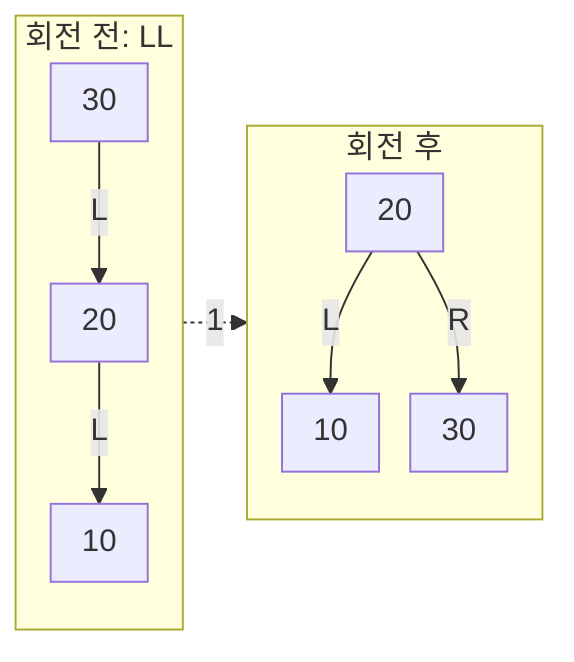
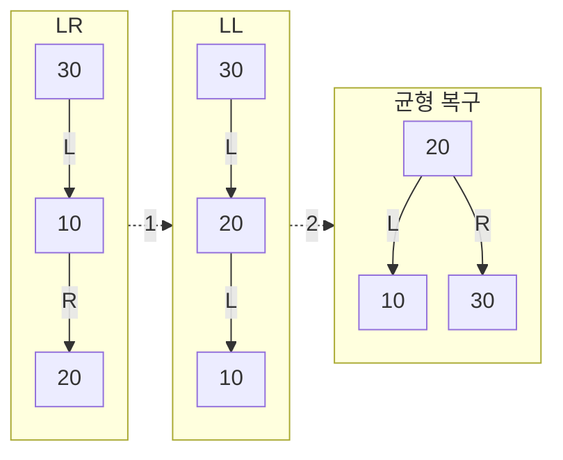

# Balanced Tree
{: .no_toc }

`1, 2, 3, 4, 5`를 차례로 넣어도 값을 빠르게 찾으려면, 값의 대소 관계뿐 아니라 **탐색 경로의 길이**도 관리해야 한다. 균형 탐색 트리(Balanced Search Tree)는 노드를 추가하거나 제거할 때 정해진 균형 조건을 유지해 한쪽으로 길게 늘어나는 일을 막는다.

균형을 정하는 규칙은 구조마다 다르다. **AVL Tree**는 두 부분 트리의 높이 차이를 제한하고, **Red-Black Tree**는 색 규칙으로 경로 길이를 묶는다. 두 구조의 삽입을 각각 Python으로 실행하면서, 회전이 보존하는 키 순서와 서로 다른 균형 조건을 살펴본다.

## 값의 순서만 지키면 길어질 수 있다

[Binary Search Tree](/wiki/computer-science-topic-7ffddbb78b30/)에서는 현재 키보다 작은 값은 왼쪽, 큰 값은 오른쪽으로 내려간다. 서로 다른 키를 저장한다면 모든 노드에서 왼쪽 부분 트리의 키는 현재 키보다 작고 오른쪽 부분 트리의 키는 크다. 이 순서 조건만으로 트리의 모양까지 고르게 정해지지는 않는다.

정렬된 `1, 2, 3, 4, 5`를 균형 조정 없이 삽입하면 모든 새 값이 오른쪽에 붙는다. 다음 줄의 `R`은 오른쪽 자식으로 가는 연결이다.

```text
1 ─R→ 2 ─R→ 3 ─R→ 4 ─R→ 5
```

`5`를 찾으려면 노드 다섯 개를 거친다. 노드에서 가장 먼 Leaf까지의 **간선 수**를 높이로 세면 이 트리의 높이는 4다. 같은 식으로 키가 `n`개 쌓이면 높이는 `n - 1`, 최악 탐색 비용은 `O(n)`이다. Tree라는 이름만으로 로그 시간 탐색이 보장되지는 않는다. 부모·자식과 Root의 기본 관계는 [Tree](/wiki/computer-science-topic-a06ebc760118/)에서 이어 볼 수 있다.

## AVL은 모든 노드의 높이 차이를 제한한다

AVL은 Adelson-Velsky와 Landis의 이름에서 온 명칭이다. 두 연구자의 논문은 1962년에 발표되었다. [원 논문의 저자·연도](https://www.mathnet.ru/eng/dan26964)

이 글에서는 빈 트리의 높이를 `-1`, Leaf 하나의 높이를 `0`으로 둔다. **Balance Factor(BF)**는 다음과 같다.

```text
BF(node) = height(node.left) - height(node.right)
```

왼쪽이 한 단계 더 높으면 `+1`, 같은 높이면 `0`, 오른쪽이 한 단계 더 높으면 `-1`이다. AVL의 불변식은 루트만이 아니라 **모든 노드에서 `-1 <= BF <= 1`**이 성립하는 것이다. 값의 BST 순서 조건도 함께 유지해야 한다.

앞의 막대 모양에서 루트 `1`의 왼쪽 높이는 `-1`, 오른쪽 높이는 `3`이므로 BF는 `-4`다. AVL 삽입은 유효한 AVL 상태에서 키 하나를 넣고 복구하는 연산이다. 삽입 경로에서 높이가 증가해 BF가 `+2`나 `-2`가 된 첫 조상을 고쳐, 이런 긴 막대로 자라기 전에 균형을 되돌린다. 이미 임의로 망가진 BST 전체를 한 번의 회전으로 AVL로 만드는 연산은 아니다.

## 회전은 키를 바꾸지 않고 연결을 바꾼다

`30, 20, 10`을 삽입하면 `30`의 왼쪽 자식 `20`, 그 왼쪽 자식 `10`으로 이어진다. 가장 낮은 위반 노드 `30`에서 왼쪽·왼쪽으로 무거워졌으므로 **LL**이라고 부른다. 오른쪽 회전은 `20`을 위로 올리고 `30`을 그 오른쪽에 연결한다. 그림의 실선은 자식 연결, 점선 1은 `rotate_right`로 회전하는 단계다. L과 R은 각각 왼쪽·오른쪽 자식이며, 화면에서 놓인 방향보다 이 표시를 기준으로 연결을 읽는다.



1번 회전 후 Root는 `20`, 왼쪽은 `10`, 오른쪽은 `30`이다. 높이는 2에서 1로 줄고 BST 순서 `10 < 20 < 30`은 그대로다. 그림에서는 없는 자식을 생략했다.

실제 회전에서는 세 키 사이의 부분 트리도 보존해야 한다. `y = 30`의 왼쪽 자식이 `x = 20`이고, `x.right`에 키 `25`가 있다고 하자. `25`는 `20`보다 크고 `30`보다 작으므로, 오른쪽 회전 뒤에는 `30`의 왼쪽으로 넘어가야 한다.

```text
회전 전: y.left = x, x.right = 25
회전 후: x.right = y, y.left = 25
키 순서: 20 < 25 < 30
```

`rotate_right` 안에서는 `y.left = x.right`를 먼저 수행한 뒤 `x.right = y`로 연결한다. 옮겨야 할 부분 트리를 덮어써 잃어버리지 않는 순서다. 함수 안에서 두 자식 연결을 바꾸고 새 부분 트리 Root인 `x`를 반환한다. 호출자는 그 반환값을 자신의 자식이나 전체 Root에 다시 연결한다. 따라서 `root = insert(root, key)`의 대입도 알고리즘의 일부다.

연결이 달라지면 높이 캐시도 고친다. 아래로 내려간 `y.height`를 먼저 계산하고, 그 값을 사용하는 위쪽 `x.height`를 계산한다. 왼쪽 회전은 이 과정을 좌우로 뒤집는다. 회전 하나는 고정된 수의 연결과 높이만 고치므로 `O(1)`이다.

## 꺾인 경로는 두 번 회전한다

새 키가 어느 쪽으로 들어왔는지에 따라 네 경우를 구분한다. 아래 표는 **서로 다른 키를 유효한 AVL에 삽입한 뒤**의 분류다.

| 경우 | 위반 노드에서 본 삽입 방향 | 복구 |
| --- | --- | --- |
| LL | 왼쪽 자식의 왼쪽 | 위반 노드를 오른쪽 회전 |
| RR | 오른쪽 자식의 오른쪽 | 위반 노드를 왼쪽 회전 |
| LR | 왼쪽 자식의 오른쪽 | 왼쪽 자식을 왼쪽 회전한 뒤 위반 노드를 오른쪽 회전 |
| RL | 오른쪽 자식의 왼쪽 | 오른쪽 자식을 오른쪽 회전한 뒤 위반 노드를 왼쪽 회전 |

`30, 10, 20`은 LR이다. `30 → 10 → 20`으로 내려가는 방향이 왼쪽에서 오른쪽으로 꺾인다. 1번 단계에서 자식 `10`을 왼쪽 회전해 LL 모양을 만들고, 2번 단계에서 `30`을 오른쪽 회전한다.



1번 단계 뒤에는 `30`의 왼쪽에 `20`, 그 왼쪽에 `10`이 있다. 2번 회전 후에는 앞의 LL 결과와 같이 `20`이 Root가 된다. LR 전체는 이중 회전 한 번, 기본 회전 함수 호출로는 두 번이다. RR과 RL은 각각 LL과 LR의 좌우 대칭이다.

정렬된 `1, 2, 3`의 변화도 같은 원리다.

| 단계 | 연결과 높이 |
| --- | --- |
| 1 삽입 | Root 1, 높이 0 |
| 2 삽입 | 1의 오른쪽에 2, Root 높이 1, BF -1 |
| 3을 붙인 직후 | 1의 오른쪽 2, 그 오른쪽 3. Root BF -2 |
| RR 복구 후 | Root 2, 왼쪽 1, 오른쪽 3. 높이 1 |

## 삽입은 내려가고, 높이 갱신은 되돌아온다

`insert`는 먼저 BST 비교로 빈자리를 찾아 `Node(key)`를 만든다. 이후 재귀 호출이 돌아오는 경로에서 자식의 새 Root를 받고 현재 높이를 갱신한다.

```text
빈자리까지 비교하며 내려감
→ 새 Leaf 생성
→ 자식의 새 Root를 연결
→ 현재 height 갱신
→ BF 확인과 필요한 회전
→ 이 부분 트리의 새 Root 반환
```

노드의 `height`를 저장하지 않고 매번 전체 부분 트리를 훑어 계산하면 한 번의 높이 계산도 그 부분 트리 크기에 비례할 수 있다. 높이를 캐시하면 두 자식의 높이로 현재 높이를 `O(1)`에 갱신한다. 대신 회전 뒤 갱신을 빠뜨리거나 순서를 틀리면 이후 BF 판단도 틀어진다.

AVL 삽입에서는 가장 낮은 위반 노드를 단일 또는 이중 회전으로 고치면 해당 부분 트리의 높이가 삽입 전 높이로 돌아간다. 그 위 조상에게 전달되던 높이 증가도 사라지므로 추가 재균형은 필요하지 않다. 아래 재귀 구현은 조상까지 돌아가며 높이와 BF를 계속 확인한다. 모든 삽입에서 회전이 일어나는 것은 아니다. [GNU libavl의 삽입 과정](https://adtinfo.org/libavl.html/Inserting-into-an-AVL-Tree.html)

중복 키의 의미도 먼저 정해야 한다. 아래 프로그램은 **정수 키 집합**이다. 같은 키를 다시 넣으면 기존 노드를 반환하고 새 노드를 추가하지 않는다. 같은 값을 오른쪽에 계속 넣으면서 회전 분류에는 `<`와 `>`만 사용하는 코드는 `1, 1, 1`에서 네 회전 조건을 모두 놓칠 수 있다. 중복을 저장하는 Multiset이 필요하다면 노드에 개수를 두는 등 별도 계약과 구현이 필요하다.

## 삽입과 회전을 확인하는 프로그램

다음 프로그램은 삽입한 트리에서 키를 찾고, 각 삽입 직후에 순서·높이·균형을 검사한다. `verify`는 저장된 높이를 그대로 믿지 않고 실제 자식 연결에서 높이를 다시 계산한다. 노드 ID도 추적해 회전 중에 노드를 잃거나 같은 노드를 여러 곳에 연결하지 않았는지 확인한다. 이 검사는 읽기 전용이며 균형을 고쳐 주지 않는다.

```run-python
# AVL 트리 노드 정의와 높이 계산 — Node / get_height / get_balance
class Node:
    def __init__(self, key):
        self.key = key
        self.left = None
        self.right = None
        self.height = 0       # 리프의 높이는 0

def get_height(node):
    return node.height if node else -1   # 빈 트리는 -1

def get_balance(node):
    if node is None:
        return 0
    # 균형 인수 = 왼쪽 높이 - 오른쪽 높이
    return get_height(node.left) - get_height(node.right)

# AVL 회전 — rotate_right / rotate_left
def rotate_right(y):          # y가 왼쪽으로 무거울 때 (LL)
    x = y.left                # 왼쪽 자식을 위로 올린다
    y.left = x.right          # x의 오른쪽 서브트리를 y의 왼쪽으로 넘긴다
    x.right = y               # y를 x의 오른쪽 자식으로 내린다
    # 아래쪽 y부터 높이 갱신 (순서 중요)
    y.height = 1 + max(get_height(y.left), get_height(y.right))
    x.height = 1 + max(get_height(x.left), get_height(x.right))
    return x                  # 새 부모 x를 돌려준다

def rotate_left(x):           # x가 오른쪽으로 무거울 때 (RR), 좌우 대칭
    y = x.right
    x.right = y.left
    y.left = x
    x.height = 1 + max(get_height(x.left), get_height(x.right))
    y.height = 1 + max(get_height(y.left), get_height(y.right))
    return y

# AVL 삽입 + 재균형 — insert()
def insert(node, key):
    if node is None:
        return Node(key)              # 빈 자리에 새 노드
    if key < node.key:
        node.left = insert(node.left, key)
    elif key > node.key:
        node.right = insert(node.right, key)
    else:
        return node                   # 같은 키는 추가하지 않는다

    # 되돌아 올라오며 높이 갱신
    node.height = 1 + max(get_height(node.left), get_height(node.right))
    balance = get_balance(node)

    if balance > 1 and key < node.left.key:        # LL
        return rotate_right(node)
    if balance < -1 and key > node.right.key:      # RR
        return rotate_left(node)
    if balance > 1 and key > node.left.key:        # LR
        node.left = rotate_left(node.left)
        return rotate_right(node)
    if balance < -1 and key < node.right.key:      # RL
        node.right = rotate_right(node.right)
        return rotate_left(node)
    return node                                    # 균형 OK


def find(node, key):
    while node is not None and node.key != key:
        node = node.left if key < node.key else node.right
    return node


def verify(root, expected):
    """캐시를 믿지 않고 높이·순서·균형·노드 중복을 검사한다."""
    identities = {}

    def visit(node, low, high):
        if node is None:
            return -1, []
        assert id(node) not in identities
        identities[id(node)] = node.key
        assert low is None or low < node.key
        assert high is None or node.key < high
        left_height, left_keys = visit(node.left, low, node.key)
        right_height, right_keys = visit(node.right, node.key, high)
        actual_height = 1 + max(left_height, right_height)
        assert node.height == actual_height
        assert abs(left_height - right_height) <= 1
        return actual_height, left_keys + [node.key] + right_keys

    height, keys = visit(root, None, None)
    assert keys == expected
    return height, identities


def build_checked(values):
    root = None
    expected = []
    old_ids = {}
    for key in values:
        old_node = find(root, key)
        root = insert(root, key)  # 회전으로 바뀐 루트를 다시 받는다.
        if key not in expected:
            expected = sorted(expected + [key])
        _, new_ids = verify(root, expected)
        assert all(new_ids.get(identity) == value
                   for identity, value in old_ids.items())
        assert len(new_ids) - len(old_ids) == (1 if old_node is None else 0)
        if old_node is not None:
            assert find(root, key) is old_node
        old_ids = new_ids
    return root


def fixture(key, left=None, right=None):
    node = Node(key)
    node.left, node.right = left, right
    node.height = 1 + max(get_height(left), get_height(right))
    return node


def main():
    assert verify(None, [])[0] == -1 and find(None, 1) is None
    print("empty: height=-1; search missing")
    one = build_checked([7])
    assert one.height == 0
    print("single: root=7; height=0")

    for name, values in [("LL", [30, 20, 10]), ("RR", [10, 20, 30]),
                         ("LR", [30, 10, 20]), ("RL", [10, 30, 20])]:
        root = build_checked(values)
        assert (root.key, root.left.key, root.right.key, root.height) == (20, 10, 30, 1)
        print(f"{name}: root=20; height=1; inorder=[10, 20, 30]")

    root = build_checked([1, 2, 3, 4, 5])
    assert (root.key, root.left.key, root.right.key) == (2, 1, 4)
    assert (root.right.left.key, root.right.right.key, root.height) == (3, 5, 2)
    print("sorted 1..5: root=2; height=2; inorder=[1, 2, 3, 4, 5]")
    assert find(root, 4) is root.right and find(root, 6) is None
    print("search: 4 found; 6 missing")

    duplicates = build_checked([1, 1, 1])
    assert duplicates.key == 1 and duplicates.height == 0
    print("duplicates [1, 1, 1]: one existing node; height=0")
    build_checked([20, 10, 30, 5, 15, 25, 35, 10, 20, 30, 5])
    print("mixed duplicates: existing node identities preserved")
    build_checked(list(range(1, 32)))
    build_checked(list(range(31, 0, -1)))
    print("ascending/descending 31: invariants checked after every insertion")
    build_checked([0, -3, 8, -10, -1, 5, 12, 6, 7])
    print("mixed negative keys: order, heights and identities preserved")

    middle = fixture(25)
    five, ten, forty = fixture(5), fixture(10), fixture(40)
    ten.left, ten.height = five, 1
    x = fixture(20, ten, middle)
    y = fixture(30, x, forty)
    old_ids = {id(n): n.key for n in [five, ten, x, middle, y, forty]}
    new_root = rotate_right(y)
    assert new_root is x and new_root.right is y and y.left is middle
    assert verify(new_root, [5, 10, 20, 25, 30, 40])[1] == old_ids
    print("rotate_right: middle subtree 25 transferred; all six nodes preserved")

    middle = fixture(25)
    ten, forty_five = fixture(10), fixture(45)
    forty = fixture(40, None, forty_five)
    y = fixture(30, middle, forty)
    x = fixture(20, ten, y)
    old_ids = {id(n): n.key for n in [ten, x, middle, y, forty, forty_five]}
    new_root = rotate_left(x)
    assert new_root is y and new_root.left is x and x.right is middle
    assert verify(new_root, [10, 20, 25, 30, 40, 45])[1] == old_ids
    print("rotate_left: middle subtree 25 transferred; all six nodes preserved")
    print("all checks passed")


if __name__ == "__main__":
    main()
```

코드를 `avl-tree.py`로 저장하고 다음과 같이 실행한다. `assert`를 없애는 `-O` 옵션은 붙이지 않는다. 외부 패키지는 필요하지 않다.

```bash
python3 avl-tree.py
```

실제 실행 출력은 다음과 같다.

```text
empty: height=-1; search missing
single: root=7; height=0
LL: root=20; height=1; inorder=[10, 20, 30]
RR: root=20; height=1; inorder=[10, 20, 30]
LR: root=20; height=1; inorder=[10, 20, 30]
RL: root=20; height=1; inorder=[10, 20, 30]
sorted 1..5: root=2; height=2; inorder=[1, 2, 3, 4, 5]
search: 4 found; 6 missing
duplicates [1, 1, 1]: one existing node; height=0
mixed duplicates: existing node identities preserved
ascending/descending 31: invariants checked after every insertion
mixed negative keys: order, heights and identities preserved
rotate_right: middle subtree 25 transferred; all six nodes preserved
rotate_left: middle subtree 25 transferred; all six nodes preserved
all checks passed
```

LL·RR·LR·RL의 서로 다른 입력이 모두 Root `20`과 높이 `1`로 끝난다. `1..5`는 높이 `2`가 되어 처음의 막대 높이 `4`와 달라진다. `find`는 있는 키 `4`와 없는 키 `6`을 구별한다. `1, 1, 1`은 노드 하나로 남으며, 섞인 입력의 중복도 기존 노드를 유지한다.

두 직접 회전 예제에는 키 `25`인 가운데 부분 트리가 있다. 오른쪽 회전과 왼쪽 회전에서 이 노드가 알맞은 쪽으로 넘어가고 여섯 노드가 모두 보존되는지 확인했다. 작은 세 노드 그림에서 드러나지 않는 연결 이동까지 관찰하는 예제다. 정렬·역순 31개와 음수를 포함한 입력도 각 삽입 뒤 같은 불변식을 검사한다.

## 높이가 로그 범위에 머무는 이유

높이 차이 제한의 효과는 **높이 `h`인 AVL을 만드는 최소 노드 수**로 설명할 수 있다. 이를 `N(h)`라고 하면, 최소한의 노드로 높이를 키우려는 두 자식 높이는 `h-1`과 `h-2`다.

```text
N(-1) = 0
N(0) = 1
N(1) = 2
N(h) = 1 + N(h-1) + N(h-2)     (h >= 1)
높이 0, 1, 2, 3, 4의 최소 노드 수: 1, 2, 4, 7, 12
```

`F(0)=0`, `F(1)=1`인 피보나치 수열로 쓰면 `N(h)=F(h+3)-1`이다. 피보나치 수가 황금비 `φ=(1+√5)/2`의 거듭제곱 비율로 증가하므로, 높이를 한 단계 늘릴 때 필요한 노드 수가 빠르게 증가한다.

`F(k) >= φ^(k-2)`를 이용하면 실제 노드 수 `n`과 높이 `h` 사이에 다음 상한을 얻는다.

```text
n + 1 >= F(h+3) >= φ^(h+1)
h <= log_φ(n+1) - 1
  = log₂(n+1) / log₂φ - 1
  ≈ 1.44042 × log₂(n+1) - 1
```

`1.44`는 밑을 바꿀 때 나오는 계수다. 유한한 크기에서 가산항을 버린 식이나 ‘어떤 트리보다 항상 정확히 44% 이내로 깊다’는 규칙으로 사용하지 않는다. 필요한 결론은 AVL 높이가 최악에도 `O(log n)` 범위라는 것이다.

유효한 AVL에서 탐색과 삽입은 한 경로를 따라가고 노드마다 상수 시간의 비교·갱신을 하므로 `O(log n)`이다. 이는 키 비교를 상수 비용으로 보는 모델이다. 이 예제의 트리 저장 공간은 `O(n)`, 재귀 삽입의 추가 호출 공간은 `O(log n)`이다. 검증 함수는 모든 노드를 읽고 목록·ID를 만들므로 실제 자료구조 연산의 비용과 분리해야 한다. 위 출력은 정확성 확인이며 처리량 벤치마크가 아니다. 비용 표기의 기준은 [시간 복잡도](/wiki/computer-science-topic-869aa2bd6535/)에서 이어진다.

## Red-Black Tree는 색으로 경로 길이를 제한한다

AVL은 두 부분 트리의 높이 차이를 직접 계산한다. **Red-Black Tree**는 키의 BST 순서를 유지하면서 노드의 색에 제약을 둔다. 모든 노드의 높이 차이를 1 이내로 맞추지는 않지만, 어느 경로도 지나치게 길어지지 않도록 한다.

여기서 **NIL Leaf**는 키를 가진 마지막 노드가 아니라, 자식이 없는 자리에 있는 빈 노드를 뜻한다. 일반적인 Leaf와 구별해야 한다. 아래 구현에서는 별도의 NIL 객체를 만들지 않고 `None`을 검정으로 취급한다. 검정 Sentinel 하나를 공유하는 구현도 가능하지만, 두 표현의 종료 조건과 참조 처리를 섞으면 안 된다.

색 규칙은 다음과 같다.

1. 키를 가진 노드는 빨강 또는 검정이다.
2. Root는 검정이다.
3. NIL은 검정이다.
4. 빨간 노드의 자식은 모두 검정이다.
5. 어떤 노드에서 그 아래 NIL까지 내려가는 모든 경로에는 검정 노드가 같은 수만큼 있다.

4번은 빨강이 연달아 붙는 것을 막고, 5번은 어느 쪽으로 내려가도 같은 검정 층을 지나게 한다. BST 순서 조건은 이 색 규칙과 별도로 유지한다. [GNU libavl의 균형 규칙](https://adtinfo.org/libavl.html/RB-Balancing-Rule.html)

### 검정 높이로 전체 높이를 묶는다

이 글의 **검정 높이(black-height)**는 현재 노드에서 NIL로 내려갈 때 만나는 **키를 가진 검정 노드 수**다. 현재 노드가 검정이면 포함하고, 마지막 NIL은 세지 않는다. NIL 자체의 검정 높이는 0이다. 자료마다 시작 노드와 NIL을 세는 방식이 다르므로 식을 비교할 때 이 기준을 먼저 맞춰야 한다.

Root의 검정 높이를 `b`라고 하자. Root는 검정이고 빨강이 연달아 올 수 없으므로, Root에서 NIL 직전까지 만나는 실제 노드 수는 어떤 경로에서도 `b` 이상 `2b` 이하다. 따라서 Root에서 NIL까지의 간선 수로 비교한 최장 경로는 최단 경로의 두 배를 넘지 않는다. 앞의 AVL에서 사용한 실제 Leaf까지의 높이가 `h`라면, 최장 경로의 실제 노드 수는 `h + 1`이다.

검정 높이가 `b`인 부분 트리에는 적어도 `2^b - 1`개의 실제 노드가 필요하다. 검정 Root 아래에는 검정 높이가 `b - 1`인 두 부분 트리가 필요하기 때문이다. 빨간 노드를 끼우더라도 이 최소 노드 수보다 작아지지는 않는다. 실제 노드 수를 `n`으로 두면 다음 관계를 얻는다.

```text
n >= 2^b - 1
b <= log₂(n + 1)
h + 1 <= 2b <= 2 log₂(n + 1)
```

핵심은 검정 높이가 막연히 `log₂ n`과 같다는 가정이 아니라, 색 규칙과 최소 노드 수로부터 **높이의 로그 상한**이 나온다는 점이다. 빈 트리는 `n = 0`, `b = 0`, `h = -1`로 같은 식에 들어간다. [GNU libavl의 높이 분석](https://adtinfo.org/libavl.html/Analysis-of-Red_002dBlack-Balancing-Rule.html)

### 빨강으로 넣은 뒤 부모와 삼촌을 본다

새 키는 BST의 삽입 위치에 빨간 노드로 붙인다. 기존 NIL 자리에 빨간 노드와 두 NIL이 생겨도 검정 높이는 그대로다. 먼저 확인할 위반은 새 노드와 부모가 모두 빨강인 경우다. 부모가 빨강이면 검정 Root가 될 수 없으므로 할아버지도 존재한다.

부모의 형제인 **삼촌(Uncle)**이 빨강이면 부모와 삼촌을 검정으로, 할아버지를 빨강으로 바꾼다. 이 부분 트리 안의 모든 경로는 검정 하나를 더 얻고 할아버지의 검정 하나를 잃으므로, 바깥에서 본 검정 높이는 같다. 다만 할아버지와 그 부모 사이에 빨강이 연달아 생길 수 있어 할아버지부터 다시 검사한다.

`10, 5, 15`를 넣은 상태는 검정 `10` 아래에 빨간 `5`, `15`가 있다. 여기에 `1`을 넣으면 부모 `5`와 삼촌 `15`가 모두 빨강이다.

| 단계 | 10 | 5 | 15 | 1 |
| --- | --- | --- | --- | --- |
| 1을 붙인 직후 | 검정 | 빨강 | 빨강 | 빨강 |
| 부모·삼촌·할아버지 재색칠 | 빨강 | 검정 | 검정 | 빨강 |
| Root를 검정으로 마무리 | 검정 | 검정 | 검정 | 빨강 |

이 경우에는 회전이 없다. 마지막 상태에서 `10 → 15 → NIL`과 `10 → 5 → 1 → NIL`은 실제 검정 노드를 각각 두 개 지난다. 모든 빠진 자식도 NIL로 끝나므로 같은 조건을 만족한다. 검정 Root로 바꾸는 마지막 단계는 모든 경로의 검정 높이를 함께 하나 늘린다.

삼촌이 검정이거나 NIL이면 회전과 재색칠을 사용한다. 새 노드가 부모를 거쳐 할아버지와 일직선이면 한 번 회전한다. 꺾여 있으면 부모를 먼저 회전해 일직선으로 만든 뒤 할아버지를 회전한다. 아래 표의 L/R은 할아버지에서 부모, 부모에서 새 노드로 내려가는 방향이다.

| 방향 | 첫 조정 | 마무리 |
| --- | --- | --- |
| LL | 없음 | 할아버지를 오른쪽 회전 |
| RR | 없음 | 할아버지를 왼쪽 회전 |
| LR | 부모를 왼쪽 회전 | 할아버지를 오른쪽 회전 |
| RL | 부모를 오른쪽 회전 | 할아버지를 왼쪽 회전 |

마무리 회전 전에 위로 올라올 노드는 검정으로, 내려갈 할아버지는 빨강으로 바꾼다. 회전 자체의 키 순서와 가운데 부분 트리 이동은 앞에서 살펴본 AVL과 같다. 이 구현에서는 `parent` 참조도 저장하므로, 옮겨진 자식의 부모와 전체 Root까지 함께 갱신한다.

이 방식의 삽입은 한 번에 최대 두 번 회전한다. 재색칠은 조상을 따라 반복될 수 있어 전체 보정이 상수 시간인 것은 아니다. **AVL 삽입도 한 곳에서 단일 또는 이중 회전으로 복구하므로 최대 두 번**이다. Red-Black 삽입이 언제나 더 적게 회전한다고 비교하면 안 된다. [GNU libavl의 삽입 보정](https://adtinfo.org/libavl.html/Inserting-an-RB-Node-Step-3-_002d-Rebalance.html)

### 양쪽 삽입을 같은 불변식으로 확인한다

다음은 앞의 AVL 예제와 독립적으로 실행하는 정수 집합 프로그램이다. `insert`는 중복 키를 추가하지 않고 기존 노드를 반환한다. `find`는 찾은 노드 또는 `None`을 반환한다. 왼쪽 부모의 경우와 오른쪽 부모의 대칭 경우를 모두 구현했다. 외부 패키지는 필요하지 않다.

`verify`는 실제 자식 연결을 따라 BST 순서, 검정 높이, 빨강 연속 금지, Root 색, 부모 참조, 노드 보존을 검사한다. 삽입 횟수와 별개로 회전 횟수도 세어 각 삽입의 두 번 상한을 확인한다. 이 검증은 `insert_fixup`이 계산한 값을 정답으로 재사용하지 않는다.

```run-python
RED, BLACK = 0, 1


class Node:
    def __init__(self, key, color=RED):
        self.key = key
        self.color = color
        self.left = None
        self.right = None
        self.parent = None


def color(node):
    return BLACK if node is None else node.color


def rotate_left(tree, x):
    y = x.right
    assert y is not None
    x.right = y.left
    if y.left is not None:
        y.left.parent = x
    y.parent = x.parent
    if x.parent is None:
        tree.root = y
    elif x is x.parent.left:
        x.parent.left = y
    else:
        x.parent.right = y
    y.left = x
    x.parent = y
    tree.rotations += 1


def rotate_right(tree, x):
    y = x.left
    assert y is not None
    x.left = y.right
    if y.right is not None:
        y.right.parent = x
    y.parent = x.parent
    if x.parent is None:
        tree.root = y
    elif x is x.parent.left:
        x.parent.left = y
    else:
        x.parent.right = y
    y.right = x
    x.parent = y
    tree.rotations += 1


def insert_fixup(tree, z):
    while color(z.parent) == RED:
        gp = z.parent.parent
        if z.parent is gp.left:
            uncle = gp.right
            if color(uncle) == RED:
                z.parent.color = BLACK
                uncle.color = BLACK
                gp.color = RED
                z = gp
            else:
                if z is z.parent.right:
                    z = z.parent
                    rotate_left(tree, z)
                z.parent.color = BLACK
                gp.color = RED
                rotate_right(tree, gp)
        else:
            uncle = gp.left
            if color(uncle) == RED:
                z.parent.color = BLACK
                uncle.color = BLACK
                gp.color = RED
                z = gp
            else:
                if z is z.parent.left:
                    z = z.parent
                    rotate_right(tree, z)
                z.parent.color = BLACK
                gp.color = RED
                rotate_left(tree, gp)
    tree.root.color = BLACK


class RBTree:
    def __init__(self):
        self.root = None
        self.rotations = 0

    def find(self, key):
        node = self.root
        while node is not None:
            if key == node.key:
                return node
            node = node.left if key < node.key else node.right
        return None

    def insert(self, key):
        parent, node = None, self.root
        while node is not None:
            parent = node
            if key == node.key:
                return node
            node = node.left if key < node.key else node.right
        new = Node(key)
        new.parent = parent
        if parent is None:
            self.root = new
        elif key < parent.key:
            parent.left = new
        else:
            parent.right = new
        insert_fixup(self, new)
        return new


# 아래 함수는 자료구조 연산과 별개로 실제 연결과 불변식을 검사한다.
def verify(tree, expected):
    keys, identities = [], {}

    def visit(node, parent, low, high):
        if node is None:
            return -1, 0  # 높이, NIL을 제외한 검정 높이
        assert id(node) not in identities
        identities[id(node)] = node.key
        assert node.parent is parent
        assert low is None or low < node.key
        assert high is None or node.key < high
        assert node.color in (RED, BLACK)
        if node.color == RED:
            assert node.left is None or node.left.color == BLACK
            assert node.right is None or node.right.color == BLACK
        lh, lb = visit(node.left, node, low, node.key)
        keys.append(node.key)
        rh, rb = visit(node.right, node, node.key, high)
        assert lb == rb
        return 1 + max(lh, rh), lb + (node.color == BLACK)

    if tree.root is not None:
        assert tree.root.color == BLACK and tree.root.parent is None
    height, black_height = visit(tree.root, None, None, None)
    assert keys == sorted(set(expected))
    assert len(keys) >= 2 ** black_height - 1
    assert height + 1 <= 2 * black_height
    return height, black_height, identities


def build_checked(values):
    tree, inserted, previous_ids, steps = RBTree(), [], {}, []
    for key in values:
        existing = tree.find(key)
        before = tree.rotations
        returned = tree.insert(key)
        steps.append(tree.rotations - before)
        assert steps[-1] <= 2
        if existing is not None:
            assert returned is existing and steps[-1] == 0
        inserted.append(key)
        height, bh, identities = verify(tree, inserted)
        assert all(identities.get(node_id) == value
                   for node_id, value in previous_ids.items())
        assert tree.find(key) is returned
        previous_ids = identities
    return tree, steps


def main():
    empty = RBTree()
    assert verify(empty, [])[:2] == (-1, 0)
    assert empty.find(7) is None
    print("empty: height=-1; black-height=0; search missing")
    single, _ = build_checked([7])
    assert verify(single, [7])[:2] == (0, 1)
    print("single: root=7 black; height=0; black-height=1")

    cases = [("LL", [30, 20, 10], 1), ("RR", [10, 20, 30], 1),
             ("LR", [30, 10, 20], 2), ("RL", [10, 30, 20], 2)]
    for name, values, count in cases:
        tree, steps = build_checked(values)
        assert tree.root.key == 20 and steps[-1] == count
        assert tree.root.left.color == RED and tree.root.right.color == RED
        print(f"{name}: root=20 black; last-insert rotations={count}")

    for side, values in [("left", [10, 5, 15, 1]),
                         ("right", [10, 5, 15, 20])]:
        tree, steps = build_checked(values)
        assert tree.root.key == 10 and steps[-1] == 0
        assert tree.root.left.color == tree.root.right.color == BLACK
        assert verify(tree, values)[:2] == (2, 2)
        print(f"red uncle ({side}): root=10 black; rotations=0; black-height=2")

    tree, _ = build_checked([41, 38, 31, 12, 19, 8])
    assert tree.find(19).key == 19 and tree.find(99) is None
    print("mixed insertion: 19 found; 99 missing; all invariants hold")
    for values in [range(1, 32), range(31, 0, -1)]:
        build_checked(values)
    print("ascending/descending 31: invariants and rotation bound checked per insertion")
    tree, _ = build_checked([1, 1, 1])
    assert len(verify(tree, [1])[2]) == 1
    build_checked([0, -3, 8, -10, -1, 5, 12, 6, 7, -3, 8, 0])
    print("duplicates and negative keys: existing nodes and parent links preserved")
    print("all checks passed")


if __name__ == "__main__":
    main()
```

코드를 `red-black-tree.py`로 저장해 `python3 red-black-tree.py`로도 실행할 수 있다. 검증에 사용하는 `assert`가 유지되도록 `-O` 옵션은 붙이지 않는다. 실행 출력은 다음과 같다.

```text
empty: height=-1; black-height=0; search missing
single: root=7 black; height=0; black-height=1
LL: root=20 black; last-insert rotations=1
RR: root=20 black; last-insert rotations=1
LR: root=20 black; last-insert rotations=2
RL: root=20 black; last-insert rotations=2
red uncle (left): root=10 black; rotations=0; black-height=2
red uncle (right): root=10 black; rotations=0; black-height=2
mixed insertion: 19 found; 99 missing; all invariants hold
ascending/descending 31: invariants and rotation bound checked per insertion
duplicates and negative keys: existing nodes and parent links preserved
all checks passed
```

LL·RR은 한 번, LR·RL은 두 번 회전해 Root `20`을 만든다. 삼촌이 빨강인 두 입력은 회전 없이 재색칠하며, 앞의 `10, 5, 15, 1` 예제도 검정 높이 `2`로 끝난다. 정렬·역순 입력은 각 삽입 직후 불변식을 검사한다. 중복 키는 노드를 늘리지 않고, 음수와 섞인 입력에서도 기존 노드와 부모 연결이 유지된다.

키 비교를 상수 비용으로 보면 `find`와 `insert`는 `O(log n)`이다. 트리 저장 공간은 `O(n)`이고, 이 반복문 기반 삽입은 부모 참조를 따라가므로 연산 중 추가 작업 공간은 `O(1)`이다. 모든 노드를 순회하는 `verify`와 기대값을 정렬하는 검사 비용은 별도다. 위 결과는 삽입·탐색의 정확성 확인이며 삭제 구현이나 처리량 측정은 포함하지 않는다.

### 빨간 자식을 묶으면 2-3-4 Tree가 보인다

검정 노드와 그 빨간 자식을 한 덩어리로 묶어 보자. 빨강이 연달아 올 수 없으므로, 한 덩어리에는 키가 하나에서 세 개까지 들어간다.

| 검정 노드의 빨간 자식 수 | 묶인 키 수 | 대응하는 노드 |
| --- | --- | --- |
| 0 | 1 | 2-node |
| 1 | 2 | 3-node |
| 2 | 3 | 4-node |

이름의 2·3·4는 내부 노드가 가질 자식 구간 수다. 색 규칙상 모든 경로의 검정 높이가 같으므로, 묶은 뒤의 Leaf 깊이도 같다. 이렇게 일반적인 Red-Black Tree를 **2-3-4 Tree**로 해석할 수 있다. 앞에서 삼촌이 빨강일 때 재색칠하는 과정은 묶인 4-node를 나누어 가운데 키를 위로 보내는 모습과 연결된다.

다만 별도의 방향 규칙 없이 두 표현이 일대일이라고 하면 부정확하다. 키가 `10, 20`인 3-node는 검정 `20`의 빨간 왼쪽 자식 `10`으로도, 검정 `10`의 빨간 오른쪽 자식 `20`으로도 표현할 수 있다. **Left-Leaning Red-Black Tree**는 이런 방향에 추가 조건을 둔다. 예를 들어 Princeton의 2-3 Tree 구현은 빨간 연결을 왼쪽으로 두는 표현을 사용한다. 이 글의 양방향 Red-Black 구현과 그대로 같은 알고리즘은 아니다. [Princeton의 표현 규칙](https://algs4.cs.princeton.edu/33balanced/)

2-3-4 Tree는 [B-Tree 계열](/wiki/data-b-tree-cd9340fd2546/)의 작은 사례다. 여러 키를 한 노드로 묶어 분기 수를 늘린다는 발상은 같지만, 실제 DB Page에 담을 키 수와 분할·병합 기준은 별도로 결정해야 한다.

## 삭제와 구현의 선택 기준

AVL 삭제도 올바르게 구현하면 `O(log n)`이지만, 이 프로그램에는 삭제 함수가 없다. 삭제는 한 곳을 고친 뒤에도 부분 트리 높이가 줄어 조상에서 다시 균형을 고쳐야 할 수 있다. 삽입의 ‘가장 낮은 위반 한 곳을 복구하면 된다’는 결론을 삭제에 그대로 적용하면 안 된다. 새 키의 대소로 나누는 위 삽입 분기를 삭제에 복사하는 것도 맞지 않는다. [GNU libavl의 삭제 과정](https://adtinfo.org/libavl.html/Deleting-from-an-AVL-Tree.html)

삭제에서는 회전 수의 차이가 더 분명하게 나타난다. AVL은 삭제 뒤 여러 조상에서 다시 균형을 맞추며 최악에 `O(log n)`번 회전할 수 있다. 전통적인 Red-Black 삭제 보정은 최대 세 번 회전하지만, 색 조건을 복구하며 조상을 따라가는 작업은 여전히 필요하다. 여기의 두 프로그램에는 삭제가 없으므로 이는 알고리즘의 비교이며 실행 결과가 아니다. [GNU libavl의 두 구조 비교](https://adtinfo.org/libavl.html/Red_002dBlack-Trees.html)

AVL의 더 엄격한 높이 조건은 탐색 경로를 짧게 제한하는 데 도움이 된다. 그러나 같은 데이터에서 항상 더 얕거나 실제 탐색이 항상 더 빠르다는 뜻은 아니다. 색 변경, 높이 갱신, 키 비교와 메모리 접근은 서로 다른 비용이다. 삽입·삭제 비율, 노드 배치와 캐시, 사용하는 구현에 따라 결과가 달라지므로 회전 횟수 하나만으로 전체 쓰기 비용을 비교할 수 없다. 읽기와 갱신 비율은 후보를 고르는 단서이며, ‘읽기는 AVL, 쓰기는 Red-Black이 언제나 우세’라는 성능 보장은 아니다.

C++ `std::map`의 내부 구조와 표준 계약도 구별해야 한다. [표준 초안의 associative container 요구사항](https://eel.is/c++draft/associative.reqmts)은 `find`와 일반적인 단일 원소 삽입 등에 로그 복잡도를 요구하지만 Red-Black Tree를 지정하지 않는다. [GCC libstdc++의 map 구현](https://github.com/gcc-mirror/gcc/blob/master/libstdc++-v3/include/bits/stl_map.h)은 내부 저장소로 `_Rb_tree`를 사용한다. 구체적인 구현 선택의 근거다.

Java SE 25의 [`TreeMap` 문서](https://docs.oracle.com/en/java/javase/25/docs/api/java.base/java/util/TreeMap.html)는 Red-Black Tree 기반 구현이며 `containsKey`, `get`, `put`, `remove`에 로그 시간 비용을 보장한다고 명시한다. 이것은 특정 API의 문서화된 계약이다. 위 Python 학습 코드로 그 라이브러리의 동작이나 성능까지 검증한 것은 아니다.

[Linux rbtree 문서](https://docs.kernel.org/core-api/rbtree.html)에도 커널의 Red-Black Tree 구현과 사용 인터페이스가 나온다. 그 문서의 오래된 활용 사례를 현재 모든 커널 하위 시스템의 구조로 일반화하지 않는다. Linux 전체가 하나의 트리 종류를 쓰는 것도 아니다.

[DB 인덱스](/wiki/indexes/)에서는 비교 횟수뿐 아니라 Page 접근을 생각해야 한다. [B+ Tree](/wiki/data-b-tree-cd9340fd2546/)와 B-Tree 계열은 한 노드에 여러 키와 자식을 담아 분기 수를 늘린다. 노드에 몇 개가 들어가는지는 Page 크기와 키 크기 등에 따라 달라지며, 항상 수백 개라고 고정할 수 없다. 이 계열의 분할·병합·재분배와 AVL의 이진 회전은 서로 다른 균형 유지 연산이다.
