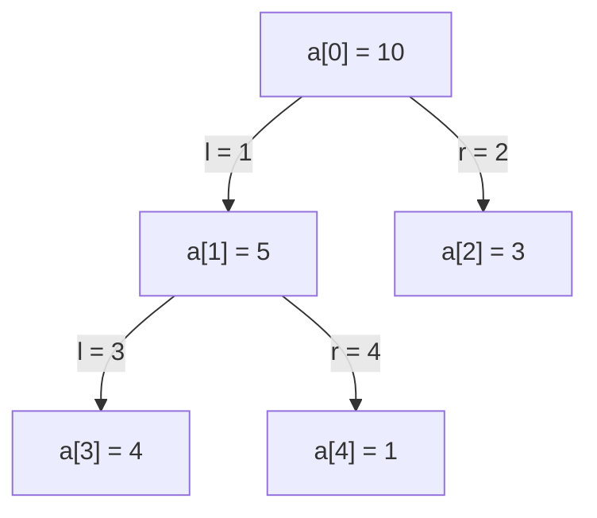

# Heap Sort
{: .no_toc }

## 가장 큰 값을 맨 뒤로 보내기

`[4, 10, 3, 5, 1]`을 오름차순으로 정렬하려면 가장 큰 값 `10`을 맨 뒤에 놓을 수 있다. 다음에는 남은 값 중 가장 큰 `5`를 그 앞에 놓는다. 이렇게 큰 값의 자리를 뒤에서부터 확정할 때, 매번 배열 전체를 다시 뒤지지 않고 다음 최댓값을 찾는 구조가 필요하다.

**힙 정렬(Heap Sort)**은 배열 앞부분을 최댓값이 맨 앞에 있는 **최대 힙(Max Heap)**으로 관리한다. 맨 앞 값을 읽는 데에는 `O(1)`, 그 값을 뒤로 보내고 남은 힙을 정돈하는 데에는 최대 `O(log n)`이 든다. 가장 키가 큰 사람을 줄의 맨 뒤로 보낸 다음, 남은 사람 중 가장 큰 사람을 그 앞에 보내는 과정을 반복한다고 생각할 수 있다.

배열의 앞부분은 다음 최댓값을 찾는 힙으로, 뒷부분은 정렬이 끝난 구간으로 사용한다. 두 구간이 같은 배열을 나누어 쓰므로 별도의 정렬용 배열이 필요하지 않다.

## 완전 이진 트리를 배열로 읽기

여기서 사용하는 [이진 힙](/wiki/computer-science-topic-4a9423be930c/)은 **완전 이진 트리**를 배열로 나타낸 것이다. 마지막 층을 제외한 층은 모두 차 있고, 마지막 층도 왼쪽부터 빈틈없이 채운다. 최대 힙에서는 각 부모의 값이 자식의 값 이상이며, 이 관계를 위로 따라가면 루트가 전체 최댓값임을 알 수 있다. 부모가 자식 이하가 되도록 만든 것은 [Min Heap](/wiki/computer-science-topic-68b9ba7d1d5b/)이다.

배열은 인덱스 0부터 사용한다. 힙의 현재 크기를 `n`, 노드 인덱스를 `i`라고 할 때 관계는 다음과 같다.

| 관계 | 인덱스와 조건 |
| --- | --- |
| 부모 | `i > 0`일 때 `(i - 1) / 2`. 루트 `i = 0`에는 부모가 없다. |
| 왼쪽 자식 | `2 * i + 1`이 `n` 미만인 경우 |
| 오른쪽 자식 | `2 * i + 2`가 `n` 미만인 경우 |

예를 들어 최대 힙 `[10, 5, 3, 4, 1]`의 배열 인덱스를 트리로 연결하면 다음과 같다. `l`과 `r`은 코드에서 계산하는 왼쪽·오른쪽 자식 위치다.



`10`은 자식 `5`, `3` 이상이고 `5`는 자식 `4`, `1` 이상이다. 그러나 배열 전체가 내림차순인 것은 아니다. 인덱스 2의 `3` 뒤에 인덱스 3의 `4`가 온다. 힙 조건은 부모와 자식 사이의 관계를 보장하며, 형제끼리의 순서나 배열 전체의 정렬 순서까지 정하지 않는다.

[Algorithms, 4th edition의 Priority Queues](https://algs4.cs.princeton.edu/24pq/)도 배열 기반 이진 힙을 설명한다. 그 예제는 루트를 인덱스 1에 놓으므로 부모·자식 식이 여기의 0 기준 표현과 다르다. 배열이 어느 인덱스부터 시작하는지 먼저 맞춰 읽어야 한다.

## 자식이 있는 노드만 내려보내기

부모 값이 자식보다 작아졌다면 더 큰 자식과 교환해 아래로 내려보낸다. 이 동작이 **시프트 다운(sift-down, sink)**이다. `sift_down(a, n, i)`는 `i`의 두 자식 쪽 부분 트리가 이미 최대 힙이고, `i`에서 시작하는 관계만 어긋날 수 있다는 전제로 동작한다. 임의의 여러 곳에서 깨진 힙을 한 번에 고치는 함수는 아니다.

부모와 자식 중 가장 큰 위치를 `largest`에 기록한다. `largest == i`이면 부모가 두 자식 이상이므로 멈춘다. 그렇지 않으면 부모와 더 큰 자식을 교환한다. 새 부모는 양쪽 자식 이상이 되고, 아래로 이동한 값이 있는 쪽만 다시 확인하면 된다. 이 전제를 반복해서 유지하며 해당 부분 트리의 힙 조건을 회복한다.

자식 인덱스의 계산 순서도 중요하다. `2 * i + 1`이나 `2 * i + 2`를 먼저 계산한 뒤 `n`과 비교하면, 자식이 없는 큰 잎 인덱스에서 **비교 전에 signed int 오버플로**가 생길 수 있다. 32비트 `int`를 예로 들면 `n = INT_MAX`, `i = 1073741823`은 유효한 잎 위치지만 `2 * i + 2 = 2147483648`은 표현할 수 없다.

아래 코드는 `while (i < n / 2)`로 **왼쪽 자식이 존재하는지 먼저 확인**한다. 이 조건을 만족하는 가장 큰 `i`는 `n / 2 - 1`이므로 `2 * i + 2 <= n <= INT_MAX`가 된다. 따라서 그 안에서 계산하는 `l`, `r`은 정수 범위를 벗어나지 않는다. 다만 마지막 부모에게 왼쪽 자식만 있을 수 있으므로 `r < n`인지는 배열 접근 전에 여전히 확인한다.

이 설명은 `n >= 0`, 실제 힙을 처리할 때 `0 <= i < n`, 그리고 `n`개 원소를 담은 유효한 배열을 전제로 한다. 잘못된 길이나 인덱스를 받아 오류를 반환하는 API는 아니다. 큰 배열을 실제로 만들지 않아도, 자식 존재 조건이 산술 결과의 범위를 어떻게 제한하는지로 이 경계를 확인할 수 있다.

## 아래쪽부터 힙을 만들기

잎은 자식이 없어 이미 힙 조건을 만족한다. 따라서 `build_max_heap`은 마지막 비단말 노드 `n / 2 - 1`부터 인덱스 0까지 거꾸로 `sift_down`을 적용한다. 자식 쪽을 먼저 정돈했으므로 부모를 처리할 때 시프트 다운의 전제가 갖춰진다. 크기가 0이나 1이면 정돈할 비단말 노드가 없다.

`[4, 10, 3, 5, 1]`에서는 마지막 비단말 노드가 인덱스 1이다. 그 값 `10`은 자식 `5`, `1`보다 크므로 그대로 둔다. 인덱스 0의 `4`는 자식 `10`, `3` 중 큰 `10`과 교환해 `[10, 4, 3, 5, 1]`이 된다. 아래로 내려간 `4`를 다시 `5`와 교환하면 `[10, 5, 3, 4, 1]`이 완성된다.

역순 반복문의 `i`는 부호 있는 `int`다. 인덱스 0을 처리한 뒤 `-1`이 되어 `i >= 0`이 거짓이 된다. 같은 조건을 유지한 채 `i`만 부호 없는 타입으로 바꾸면 이 종료 방식이 성립하지 않는다.

## 힙 앞부분과 정렬된 뒷부분

`heap_sort`의 추출 반복이 시작될 때 `[0, end]`는 최대 힙이고, `[end + 1, n - 1]`은 오름차순 정렬이 끝난 구간이다. 정렬된 뒷부분의 값들은 남은 힙의 값들 이상이다. 처음에는 `end = n - 1`이어서 뒷부분이 비어 있다.

루트 `a[0]`과 `a[end]`를 교환하면 현재 최댓값이 `a[end]`에 확정된다. 남은 힙 크기는 `end`이므로 `sift_down(a, end, 0)`으로 앞부분만 정돈한다. 방금 확정한 `a[end]`는 이 호출의 범위 밖이다. 교환 직후에는 루트가 힙 조건을 어길 수 있지만, 시프트 다운을 마치면 다음 반복에 필요한 힙 조건이 다시 성립한다.

앞의 예제에서 첫 추출이 만드는 경계는 다음과 같다. 세로 막대는 힙으로 관리할 앞부분과 정렬된 뒷부분의 경계를 나타낸다.

| 상태 | 배열 | 앞부분의 상태 |
| --- | --- | --- |
| 힙 빌드 완료 | `[10, 5, 3, 4, 1]` | 크기 5의 최대 힙 |
| 루트와 끝 교환 | `[1, 5, 3, 4 │ 10]` | 크기 4, 루트의 힙 조건이 깨짐 |
| `sift_down(a, 4, 0)` 완료 | `[5, 4, 3, 1 │ 10]` | 크기 4의 최대 힙으로 회복 |

이제 다음 최댓값은 루트의 `5`다. 같은 과정을 반복하면 정렬된 뒷부분은 앞으로 늘어나고 힙은 줄어든다. 힙 크기가 1이 되면 전체 결과는 `[1, 3, 4, 5, 10]`이다.

## 경계를 확인하는 C 프로그램

다음 프로그램은 정수 배열을 실제로 힙으로 만들고 정렬한다. `is_max_heap`은 자식에서 부모로 올라가는 식으로 힙 조건을 검사한다. `verify_suffix`는 뒷부분의 오름차순과 남은 힙 값들이 그 뒷부분 이하인지 확인한다. 첫 교환 직후에는 힙 조건이 깨졌다는 사실도 검사하고, 복원 후에는 힙과 정렬 구간을 함께 확인한다.

`heap_sort(a, n)`은 배열의 첫 `n`개를 정렬한다. `n`은 음수가 아니어야 하며 원소가 있으면 충분한 용량의 쓰기 가능한 배열이 필요하다. 빈 배열은 `heap_sort(NULL, 0)`으로 호출할 수 있다. 검사용 작은 배열과 기대값은 정렬 엔진 밖에 있으며, 엔진은 별도의 배열을 할당하지 않는다.

```run-c
#include <assert.h>
#include <limits.h>
#include <stdbool.h>
#include <stdio.h>

/* 힙 정렬 — sift_down: 인덱스 i의 노드를 힙 성질이 회복될 때까지 아래로 내림 */
void sift_down(int a[], int n, int i) {
    while (i < n / 2) {
        int largest = i;            // 부모, 두 자식 중 최댓값 위치
        int l = 2 * i + 1;          // 왼쪽 자식 인덱스
        int r = 2 * i + 2;          // 오른쪽 자식 인덱스
        if (l < n && a[l] > a[largest]) largest = l;
        if (r < n && a[r] > a[largest]) largest = r;
        if (largest == i) break; // parent is at least as large as its children
        int t = a[i]; a[i] = a[largest]; a[largest] = t;  // 더 큰 자식과 교환
        i = largest;                // 내려간 자리에서 다시 비교
    }
}

/* 힙 정렬 — build_max_heap: 배열 전체를 최대 힙으로 변환 */
void build_max_heap(int a[], int n) {
    for (int i = n / 2 - 1; i >= 0; i--)  // 마지막 비단말 노드부터 0까지
        sift_down(a, n, i);               // 각 노드를 아래로 정돈
}

/* 힙 정렬 — heap_sort: 최댓값을 뒤로 빼고 힙을 다시 정돈하길 반복 */
void heap_sort(int a[], int n) {
    build_max_heap(a, n);          // 1단계: 전체를 최대 힙으로
    for (int end = n - 1; end > 0; end--) {
        int t = a[0]; a[0] = a[end]; a[end] = t;  // 꼭대기(최댓값)를 맨 뒤로 확정
        sift_down(a, end, 0);      // 힙 크기를 end로 줄여 다시 정돈
    }
}

static bool is_max_heap(const int a[], int size) {
    for (int child = 1; child < size; child++)
        if (a[(child - 1) / 2] < a[child])
            return false;
    return true;
}

static void verify_suffix(const int a[], int heap_size, int n) {
    for (int i = heap_size + 1; i < n; i++)
        assert(a[i - 1] <= a[i]);
    if (heap_size < n)
        for (int i = 0; i < heap_size; i++)
            assert(a[i] <= a[heap_size]);
}

static void expect_array(const int a[], const int expected[], int n) {
    for (int i = 0; i < n; i++)
        assert(a[i] == expected[i]);
}

static void print_array(const int a[], int n) {
    putchar('[');
    for (int i = 0; i < n; i++)
        printf("%s%d", i == 0 ? "" : ", ", a[i]);
    putchar(']');
}

static void check_sort(const char *name, const int input[],
                       const int expected[], int n) {
    int a[8];
    assert(0 <= n && n <= 8);
    for (int i = 0; i < n; i++)
        a[i] = input[i];
    heap_sort(a, n);
    expect_array(a, expected, n);
    verify_suffix(a, 0, n);
    printf("sort %-11s ", name);
    print_array(a, n);
    putchar('\n');
}

int main(void) {
    int a[] = {4, 10, 3, 5, 1};
    build_max_heap(a, 5);
    expect_array(a, (int[]){10, 5, 3, 4, 1}, 5);
    assert(is_max_heap(a, 5));
    verify_suffix(a, 5, 5);
    printf("build: "); print_array(a, 5); putchar('\n');

    int t = a[0]; a[0] = a[4]; a[4] = t;
    expect_array(a, (int[]){1, 5, 3, 4, 10}, 5);
    assert(!is_max_heap(a, 4));
    verify_suffix(a, 4, 5);
    printf("first swap: "); print_array(a, 5);
    puts("; heap_size=4; prefix needs repair");

    sift_down(a, 4, 0);
    expect_array(a, (int[]){5, 4, 3, 1, 10}, 5);
    assert(is_max_heap(a, 4));
    verify_suffix(a, 4, 5);
    printf("first repair: "); print_array(a, 5);
    puts("; heap prefix and sorted suffix OK");

    int right[] = {1, 3, 5, 2};
    sift_down(right, 4, 0);
    expect_array(right, (int[]){5, 3, 1, 2}, 4);
    assert(is_max_heap(right, 4));
    puts("right child selected: heap restored");

    int subtree[] = {100, 1, 9, 8, 7, 6, 5, 1234};
    sift_down(subtree, 7, 1);
    expect_array(subtree, (int[]){100, 8, 9, 1, 7, 6, 5, 1234}, 8);
    assert(is_max_heap(subtree, 7));
    sift_down(subtree, 7, 6);
    expect_array(subtree, (int[]){100, 8, 9, 1, 7, 6, 5, 1234}, 8);
    puts("subtree and leaf: other nodes and outside sentinel unchanged");

    check_sort("empty", NULL, NULL, 0);
    check_sort("single", (int[]){7}, (int[]){7}, 1);
    check_sort("sample", (int[]){4, 10, 3, 5, 1}, (int[]){1, 3, 4, 5, 10}, 5);
    check_sort("ascending", (int[]){1, 2, 3, 4, 5, 6},
               (int[]){1, 2, 3, 4, 5, 6}, 6);
    check_sort("descending", (int[]){6, 5, 4, 3, 2, 1},
               (int[]){1, 2, 3, 4, 5, 6}, 6);
    check_sort("all-equal", (int[]){7, 7, 7, 7, 7, 7},
               (int[]){7, 7, 7, 7, 7, 7}, 6);
    check_sort("duplicates", (int[]){2, 3, 2, 1, 2},
               (int[]){1, 2, 2, 2, 3}, 5);
    check_sort("negative", (int[]){-3, 0, -1, -3, 2, -8},
               (int[]){-8, -3, -3, -1, 0, 2}, 6);
    check_sort("int-limits", (int[]){INT_MAX, INT_MIN, 0, INT_MIN},
               (int[]){INT_MIN, INT_MIN, 0, INT_MAX}, 4);

    int prefix[] = {4, 10, 3, 5, 1, -999};
    heap_sort(prefix, 5);
    expect_array(prefix, (int[]){1, 3, 4, 5, 10, -999}, 6);
    puts("prefix sort: outside sentinel unchanged");
    heap_sort(NULL, 0);
    puts("empty NULL array: returned");
    puts("all checks passed");
    return 0;
}
```

코드를 `heap-sort.c`로 저장했다면 다음 명령으로 컴파일하고 실행할 수 있다. 검사에 사용하는 `assert`가 유지되도록 `NDEBUG`는 정의하지 않는다.

```bash
clang -std=c11 -Wall -Wextra -Wpedantic -Werror -O0 heap-sort.c -o heap-sort
./heap-sort
```

위 프로그램의 실제 실행 stdout은 다음과 같다.

```text
build: [10, 5, 3, 4, 1]
first swap: [1, 5, 3, 4, 10]; heap_size=4; prefix needs repair
first repair: [5, 4, 3, 1, 10]; heap prefix and sorted suffix OK
right child selected: heap restored
subtree and leaf: other nodes and outside sentinel unchanged
sort empty       []
sort single      [7]
sort sample      [1, 3, 4, 5, 10]
sort ascending   [1, 2, 3, 4, 5, 6]
sort descending  [1, 2, 3, 4, 5, 6]
sort all-equal   [7, 7, 7, 7, 7, 7]
sort duplicates  [1, 2, 2, 2, 3]
sort negative    [-8, -3, -3, -1, 0, 2]
sort int-limits  [-2147483648, -2147483648, 0, 2147483647]
prefix sort: outside sentinel unchanged
empty NULL array: returned
all checks passed
```

`first swap`과 `first repair`는 같은 추출 안의 서로 다른 상태다. `10`의 자리를 확정한 것과 남은 힙을 복원한 것을 구분해 볼 수 있다. `right child selected`는 오른쪽 자식이 더 큰 경우를, `subtree and leaf`는 비루트의 정돈과 잎에서의 즉시 종료를 확인한다. `prefix sort`의 바깥 sentinel은 정렬할 길이 밖의 값이 유지됨을 보여 준다.

빈 배열·단일 값·정렬된 입력·역순·동일 값·중복·음수·정수 경계의 결과도 기대 배열과 대조했다. 이 작은 입력들의 실행은 정렬 결과와 범위 처리를 확인한 것이며, 거대한 배열이나 실행 시간·캐시 성능을 측정한 결과는 아니다.

## 빌드는 선형, 추출은 최악 O(n log n)

시프트 다운 한 번은 완전 이진 트리의 높이만큼, 최대 `O(log n)`층을 내려간다. 부모가 자식 이상이면 더 일찍 멈춘다. 추출은 `n - 1`번 수행하므로 추출 전체의 상한은 `O(n log n)`이다. 트리 높이는 입력값의 배치와 관계없이 배열 길이로 제한된다.

빌드의 비용은 모든 노드에 최대 높이를 곱하는 것보다 작다. 한 층 이상 내려갈 수 있는 노드는 최대 `n/2`개, 두 층 이상은 `n/4`개, 세 층 이상은 `n/8`개다. 각 노드가 내려갈 수 있는 층수를 합치면 `n/2 + n/4 + n/8 + … < n`이므로, 아래쪽부터 만드는 빌드는 `O(n)`이다. 이를 추출 비용과 합친 힙 정렬의 최악 시간 상한은 `O(n log n)`이다.

**최선까지 항상 `Θ(n log n)`인 것은 아니다.** 위 코드에 모두 같은 키를 넣으면 자식이 부모보다 크지 않아 `largest`가 계속 `i`에 남는다. 각 시프트 다운이 첫 검사에서 끝나므로 빌드와 `n - 1`회의 추출을 합쳐 `Θ(n)`이 된다. [Priority Queues의 heapsort 분석 문제](https://algs4.cs.princeton.edu/24pq/)도 중복 키를 허용할 때 이 선형 최선을 구분한다. 여기서는 코드의 종료 조건으로 비용을 분석했으며 비교 횟수를 실행에서 계수하지는 않았다.

정렬 엔진은 반복문과 상수 개의 변수만 사용한다. `sift_down`도 재귀가 아닌 `while`이므로 호출 깊이가 원소 수에 따라 늘어나지 않는다. 따라서 이 구현의 추가 공간은 `O(1)`이다. [Quick Sort](/wiki/computer-science-topic-0865c05ef97a/)의 제자리 파티션과 비교할 때는 그 구현의 재귀 스택까지 구분해서 봐야 한다. 시간과 공간의 계산은 [시간 복잡도](/wiki/computer-science-topic-869aa2bd6535/)에서 이어 볼 수 있다.

## 같은 값의 순서와 실제 속도

같은 키를 가진 항목 두 개에 구분 표시를 붙여 `[2_A, 2_B]`를 손으로 따라가 보자. 최대 힙 조건은 이미 만족하므로 빌드에서는 교환하지 않는다. 하지만 추출에서는 루트와 끝을 교환해 `[2_B, 2_A]`가 되고 정렬이 끝난다. 이렇게 같은 키의 상대 순서를 바꿀 수 있으므로 이 구현은 [안정 정렬](/wiki/computer-science-topic-16ffadb31203/)이 아니다. 위 정수 출력은 같은 값끼리의 구분 표시를 관측하는 실험이 아니며, 이 반례는 코드의 교환을 따른 수동 추적이다.

실제 속도는 시간 복잡도만으로 순위를 정할 수 없다. 힙은 부모에서 `2i+1`, `2i+2` 쪽으로 이동하므로 인접 구간을 순차적으로 읽는 방식과 메모리 접근 패턴이 다르다. 이것이 캐시 사용과 실행 시간에 영향을 줄 수 있지만, 입력 크기·원소 크기·구현·컴파일러·하드웨어에 따라 결과가 달라진다. 힙 정렬이 언제나 퀵 정렬보다 느리거나 캐시 효율이 낮다고 단정할 근거는 이 실행에 없다.

퀵 정렬은 서로 다른 키에서 피벗을 균등하게 무작위 선택한다는 가정 아래 기대 시간이 `O(n log n)`이지만, 실제 분할이 계속 한쪽으로 치우치면 최악 `O(n²)`이 될 수 있다. 일반적인 배열 기반 병합 정렬은 최악 `O(n log n)`을 보장하는 대신 입력 길이에 비례하는 보조 배열을 쓴다.

최악 시간 상한과 일정한 추가 공간이 필요하면 힙 정렬을 검토할 수 있다. 같은 키의 기존 순서가 필요하면 [병합 정렬](/wiki/computer-science-topic-2ada7cd17f3c/) 같은 안정 정렬을 비교하고, 실행 속도를 기준으로 고를 때는 실제 사용할 입력과 구현을 같은 환경에서 측정해야 한다.

## std::sort의 계약과 힙을 사용하는 구현

C++의 [`sort` 표준 초안](https://eel.is/c++draft/sort)은 `N`개 원소에 대해 비교와 projection 횟수의 `O(N log N)`을 요구한다. 특정한 정렬 알고리즘이나 introsort라는 내부 구조를 지정하는 계약은 아니다. 비교 함수의 비용까지 포함한 실제 실행 시간이 모든 상황에서 같다는 뜻도 아니다.

그 보장을 구현하는 한 방법이 **introsort**다. 퀵 정렬식 분할을 진행하되 분할 깊이에 한도를 두고, 그 한도를 소진하면 힙 정렬로 전환해 남은 구간의 최악 비용을 제한한다. [GCC libstdc++의 `__introsort_loop`](https://github.com/gcc-mirror/gcc/blob/master/libstdc++-v3/include/bits/stl_algo.h)는 깊이 제한이 0일 때 `__partial_sort`를 전체 남은 구간에 적용하며, 그 함수 안에는 힙 선택과 힙 정렬이 있다. [LLVM libc++의 `__introsort`](https://github.com/llvm/llvm-project/blob/main/libcxx/include/__algorithm/sort.h)에도 분할을 계속하는 경로에서 깊이 제한이 0이면 힙 정렬로 전환하는 코드가 있다.

이 두 소스는 라이브러리의 구체적인 구현 근거다. 표준이 그 함수명이나 전환 방식을 의무화한 것은 아니며, 위 C 프로그램이 GCC·LLVM의 정렬 구현을 실행한 것도 아니다.

힙을 사용하는 또 다른 이유는 전체를 한 번에 정렬하지 않고 다음 항목만 고를 때 드러난다. [Priority Queue](/wiki/computer-science-topic-368e0d790593/)는 우선순위가 높은 항목을 반복해서 꺼내는 인터페이스이며 이진 힙으로 구현할 수 있다. 작업 우선순위를 다루는 스케줄링이나 다익스트라 최단 경로에서 사용할 수 있지만, 모든 스케줄러와 우선순위 큐가 힙을 쓴다는 뜻은 아니다. 힙 정렬은 그 최댓값 선택과 복원 과정을 배열 전체가 정렬될 때까지 적용한 경우다.
