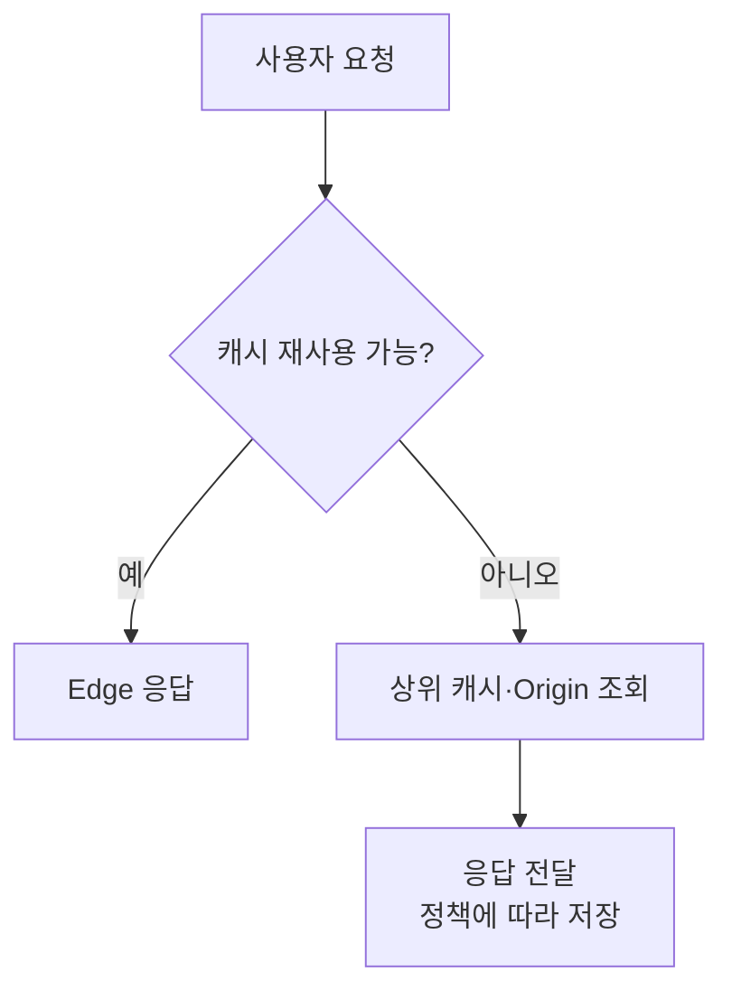

# CDN
{: .no_toc }

CDN(Content Delivery Network)은 여러 지역의 거점을 통해 콘텐츠를 전달하는 구조다. 원본 서버까지 매번 요청을 보내는 대신 가까운 Edge에서 응답을 재사용하면 거리 지연과 원본의 부담을 줄일 수 있다.

Origin은 콘텐츠를 제공하는 원본 서버이고, Edge는 사용자와 가까운 전달 지점이다. 서버들이 모인 접속 거점을 PoP(Point of Presence)라고 부른다. 본사 창고에서만 물건을 보내던 일을 지역 창고에 나누는 상황에 비유할 수 있지만, 실제 CDN의 경로와 캐시 상태는 요청마다 달라질 수 있다.

## 거리가 응답에 더하는 시간

먼 서버와 통신할 때는 서버의 처리 시간 외에 신호가 이동하는 시간이 필요하다. 서울과 상파울루 사이의 전송 거리를 18,000km, 광섬유 안의 신호 속도를 초속 200,000km라고 단순화하면 편도 90ms, 왕복 180ms가 된다.

이는 지연을 이해하기 위한 가정이다. 실제 케이블 경로는 직선이 아니며 장비 처리와 대기, 전송량, 연결 재사용 여부도 영향을 준다. TCP·TLS 연결 초기화와 요청·응답이 여러 왕복을 필요로 하면 거리의 영향이 더해지지만, 모든 요청에 항상 같은 수의 왕복이 발생하지는 않는다.

같은 가정에서 직접 요청의 RTT가 180ms, 사용자와 Edge 사이가 5ms라고 해 보자. Edge가 캐시된 응답을 바로 재사용하면 긴 원본 왕복을 줄일 수 있다. 원본 CPU를 높이는 최적화와 Edge에서 응답하는 최적화는 줄이려는 시간이 다르다.

## Edge까지 연결되는 방법

CDN은 DNS 기반의 응답 선택이나 Anycast 라우팅 등으로 요청을 분산할 수 있다. DNS 응답이 사용자에 따라 달라질 수도 있고, 서로 다른 지역에서 같은 Anycast IP로 연결해 다른 거점에 도달할 수도 있다. 따라서 CDN을 언제나 DNS가 가장 가까운 서버의 서로 다른 IP를 돌려주는 방식으로만 설명해서는 안 된다.

여기서 가깝다는 것은 지도상의 거리만을 뜻하지 않는다. 네트워크 경로, 용량, 거점의 상태와 사업자의 정책이 영향을 준다. 특정 사용자가 어느 거점에 연결되었는지는 실제 응답과 사업자가 제공하는 관찰 정보로 확인해야 한다. [Cloudflare CDN 구조](https://developers.cloudflare.com/reference-architecture/architectures/cdn/)

이름 해석 자체의 역할은 [DNS](/wiki/computer-systems-network-dns-c7fd180532b4/), 경로 선택은 [IP](/wiki/computer-systems-network-ip-cf75ea1b870d/)와 연결된다.

## 캐시를 찾은 뒤의 흐름

Edge는 먼저 이 요청에 재사용할 수 있는 응답이 있는지 판단한다. 캐시에 파일이 있다는 사실만으로 충분하지는 않다. 요청에 맞는 사본인지, 아직 신선한지, 정책상 재사용할 수 있는지를 확인한다.



HIT는 캐시에서 처리한 경우를, MISS는 필요한 사본을 찾지 못한 경우를 설명할 때 쓰는 용어다. 사본이 있어도 오래되었다면 재검증하거나 새로 가져올 수 있다. 여러 캐시 계층을 사용하면 Edge에서 MISS가 나더라도 중간 캐시가 응답할 수 있어, 모든 MISS가 원본 요청 한 번과 일대일로 대응하지는 않는다.

응답을 받았다고 항상 캐시에 저장하는 것도 아니다. 개인화된 응답이나 저장을 금지한 응답은 재사용 대상에서 제외될 수 있다. 저장과 재사용의 HTTP 규칙은 [HTTP 캐시](/wiki/computer-systems-network-http-6165d2538d18/)에서 다룬다.

## TTL과 콘텐츠 변경

TTL은 캐시의 수명을 이야기할 때 자주 쓰는 값이다. HTTP에서는 응답의 신선도와 저장 가능 여부를 구분해서 읽어야 한다.

| Cache-Control 지시 | 읽을 의미 |
| --- | --- |
| `max-age=86400` | 응답의 신선도 수명을 86,400초로 지정 |
| `s-maxage=3600` | 공유 캐시에 적용할 신선도 수명 지정 |
| `private` | 공유 캐시에 응답을 저장하지 않도록 지정 |
| `no-store` | 응답을 저장하지 않도록 지정 |
| `no-cache` | 저장한 응답을 재사용하기 전에 검증하도록 지정 |

`no-cache`는 저장 금지와 같은 뜻이 아니다. 캐시에 사본이 남아 있어도 검증이 필요할 수 있고, 수명이 지났다고 파일이 즉시 삭제되는 것도 아니다. `max-age` 기간 안에서도 요청의 조건이나 캐시 정책에 따라 원본 확인이 일어날 수 있다. [HTTP 캐시 규칙](https://www.rfc-editor.org/rfc/rfc9111.html)

아래 코드는 TTL에 따른 변화만 관찰하는 작은 모형이다. 원본 응답을 가져온 뒤 원본 내용을 바꾸고, 가상의 시간을 5초와 10초로 옮겨 요청한다. 실제 CDN이나 전체 HTTP 캐시 규칙을 구현한 코드는 아니다.

```run-python
ttl = 10
origin_body = "logo-v1"
cached = None


def origin_response():
    body = origin_body.encode("utf-8")
    headers = {"Content-Type": "text/plain; charset=utf-8",
               "Cache-Control": f"public, max-age={ttl}",
               "Content-Length": str(len(body))}
    return headers, body


def edge_request(now):
    global cached
    if cached is not None and now - cached[0] < ttl:
        stored_at, headers, body = cached
        result = "HIT"
    else:
        result = "MISS" if cached is None else "EXPIRED"
        headers, body = origin_response()
        stored_at = now
        cached = (stored_at, headers, body)
    print(f"t={now}: {result}, Age={now-stored_at}, body={body.decode()}")
    print(headers["Cache-Control"])


edge_request(0)
origin_body = "logo-v2"
edge_request(5)
edge_request(10)
```

처음에는 MISS로 `logo-v1`을 받는다. 원본을 `logo-v2`로 바꿔도 5초 시점에는 신선한 사본인 `logo-v1`을 재사용한다. 10초 시점에는 예제의 TTL이 끝나 원본에서 `logo-v2`를 받는다. `ttl`을 바꾸면 변경이 관찰되는 시점도 달라진다.

이 모형은 단일 공개 응답만 저장하며 조건부 요청, Cache Key의 변형, 다단계 캐시는 생략했다. 실제 운영에서는 원본의 Header와 CDN의 정책을 함께 확인해야 한다. 예를 들어 CloudFront의 Minimum TTL을 0보다 크게 설정하면 원본의 `no-cache`·`no-store`·`private`보다 우선해 그 기간 동안 캐시할 수 있다. [CloudFront의 캐시 수명](https://docs.aws.amazon.com/AmazonCloudFront/latest/DeveloperGuide/Expiration.html)

## 적중률과 평균 지연

HIT 비율이 95%, 사용자에서 Edge까지 5ms, MISS일 때 Edge에서 원본까지 추가 왕복이 180ms라고 가정하면 거리 지연의 가중 평균은 14ms다. 다음 계산에서 적중률을 바꾸어 차이를 볼 수 있다.

```run-python
distance_km = 18000
speed_km_per_second = 200000
direct_rtt_ms = 2 * distance_km / speed_km_per_second * 1000
edge_rtt_ms = 5
edge_to_origin_rtt_ms = 180
hit_rate = 0.95

if not 0 <= hit_rate <= 1:
    raise ValueError("적중률은 0에서 1 사이로 지정한다.")

hit_ms = edge_rtt_ms
miss_ms = edge_rtt_ms + edge_to_origin_rtt_ms
average_ms = hit_rate * hit_ms + (1 - hit_rate) * miss_ms
print(f"거리로 가정한 직접 RTT: {direct_rtt_ms:.1f} ms")
print(f"가정한 평균 거리 지연: {average_ms:.1f} ms")
print(f"직접 RTT / 평균 지연: {direct_rtt_ms / average_ms:.2f}")
```

기본값에서는 직접 RTT 180ms와 가정한 평균 14ms의 비율이 약 12.86이다. 이것을 실제 페이지 로딩이 약 13배 빨라진다는 측정 결과로 사용해서는 안 된다. 계산에서 서버 처리, 파일 크기, 연결 비용과 캐시 정책 등은 제외했다.

적중률이 높아지려면 같은 응답을 재사용할 기회가 많아야 한다. TTL만 길게 한다고 모든 요청이 HIT가 되지는 않는다. Query·Cookie·Header 등을 Cache Key에 어떻게 포함하는지, 지역별 요청이 얼마나 모이는지에 따라 달라진다.

## 응답 Header를 읽고 정책 확인하기

curl과 외부 네트워크를 사용할 수 있는 터미널에서 `curl -I`로 HEAD 응답을 확인할 수 있다. `img.example.com`은 설명용 이름이므로 실제 CDN을 거치는 자원 주소로 바꾸어야 한다. HEAD 처리와 GET의 캐시 동작이 항상 같다고 가정하지 말고 필요한 경우 실제 GET 응답도 확인한다.

응답의 `Age`는 원본이 응답을 생성하거나 검증한 이후의 나이를 캐시가 추정한 값이다. 현재 Edge에 저장된 뒤 흐른 시간만을 뜻하지는 않는다. 다른 캐시와 전송을 거치며 이미 시간이 지난 응답을 받을 수 있다.

`max-age=86400`, `Age: 312`라면 다른 조건이 같다는 가정 아래 남은 신선도 수명을 약 86,088초로 볼 수 있다. 이 숫자만으로 캐시 적중이나 다음 원본 요청이 없음을 확정하지는 않는다.

`X-Cache`나 `CF-Cache-Status` 같은 캐시 상태 Header의 이름과 값은 사업자마다 다르다. Cloudflare에서는 HIT 외에도 MISS·EXPIRED·REVALIDATED·BYPASS 등을 구분한다. 실제 사용하는 서비스의 정의와 응답을 함께 읽는다. [Cloudflare 캐시 응답](https://developers.cloudflare.com/cache/concepts/cache-responses/)

이미지·CSS·JavaScript처럼 여러 사용자가 같은 표현을 받는 콘텐츠는 공유 캐시를 적용하기 쉽다. 장바구니나 개인 타임라인은 다른 사용자에게 같은 응답을 재사용해도 되는지부터 판단해야 한다. 응답을 잘못 공유하지 않도록 Cache Key와 제외 정책을 확인한다.

CDN은 캐시 외에도 TLS 종료, 연결 재사용이나 Edge 실행으로 동적인 요청의 전달을 도울 수 있다. 캐시할 수 없는 API라고 해서 CDN을 전혀 사용할 수 없는 것은 아니다. 콘텐츠별로 재사용 가능 여부와 변경 반영 방법을 정하고, 필요한 경우 파일명 버전 관리나 캐시 무효화를 함께 사용한다.
