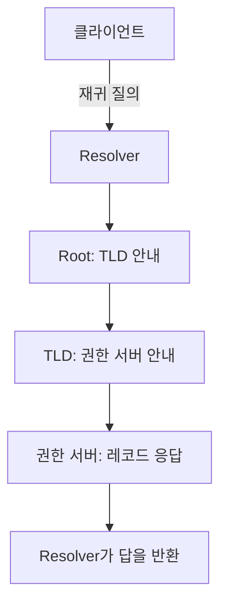

# DNS
{: .no_toc }

DNS는 이름에 연결된 정보를 여러 서버가 나누어 관리하는 시스템이다. 웹 브라우저가 `www.example.com`에 접속하려면 이름에 대응하는 IP 주소가 필요하다. DNS의 A·AAAA 레코드는 이 주소를 제공한다. 메일 서버나 이름의 별칭처럼 주소 이외의 정보도 DNS에 저장한다.

이름과 주소를 분리하면 서버의 IP 주소가 바뀌어도 사용자는 같은 이름으로 서비스를 찾을 수 있다. 다만 DNS가 새 주소를 알려 주는 것과 그 주소의 서버가 요청을 처리하는 것은 별개의 일이다. 이름 해석이 성공한 뒤에도 네트워크 연결, TLS, HTTP 단계에서 각각 실패할 수 있다.

## 이름을 나누어 맡는 구조

`www.example.com.`은 오른쪽부터 루트인 `.`, `com`, `example`, `www`로 읽는다. 일상적으로 이름을 쓸 때는 마지막 점을 생략한다. `com`은 TLD(Top-Level Domain)이며, `www.example.com`은 `example.com` 아래에 있는 이름이다.

DNS의 위임은 안내소가 다음 담당자를 알려 주는 방식과 비슷하다. 루트 서버는 `com`을 담당하는 서버로, `com`의 서버는 `example.com`을 담당하는 서버로 안내한다. 이렇게 나누면 루트 서버가 전 세계 웹 서버의 IP 주소를 모두 보관하거나 갱신할 필요가 없다. 이름의 각 단계가 반드시 별도 서버나 별도 위임에 대응하는 것은 아니다.

특정 Zone의 데이터를 맡아 답하는 서버를 **권한 있는 서버(Authoritative Server)**라고 한다. 다른 Resolver도 그 답을 캐시에 보관할 수 있다. 따라서 주소를 아는 서버가 오직 하나라는 뜻은 아니다. 원래 데이터를 관리하는 역할과 그 답을 재사용하는 역할을 구분하는 표현이다.

### Resolver는 누구에게 묻는가

애플리케이션은 보통 운영체제의 이름 해석 기능이나 설정된 DNS Resolver를 사용한다. 이 Resolver는 통신사·조직이 제공하거나 사용자가 지정한 서버일 수 있다.

클라이언트가 재귀 질의를 보내면 Resolver에 답을 구하는 일을 맡긴다. Resolver에 필요한 정보가 없다면 다른 서버에 묻는다. 이때 Root·TLD·권한 있는 서버의 안내를 따라가며 차례로 묻는 과정은 **반복 질의(Iterative Resolution)**다. 클라이언트가 요청한 재귀 서비스와 Resolver가 외부 서버에 보내는 질의를 같은 의미로 섞어 쓰면 흐름을 오해하기 쉽다. [RFC 9499의 Resolver 용어](https://datatracker.ietf.org/doc/html/rfc9499#section-6)

캐시가 비어 있고 별도의 Forwarder를 거치지 않는 경우를 단순화하면 다음과 같다.



그림에서 Root·TLD·권한 서버를 잇는 선은 Resolver가 질문하는 순서다. Root 서버가 질문을 TLD 서버에 대신 전달한다는 뜻은 아니다. Resolver가 답이나 위임 정보를 캐시하고 있다면 해당 지점부터 처리할 수 있으므로, 조회할 때마다 모든 단계를 거치는 것도 아니다.

## 레코드와 캐시의 유효 시간

DNS 응답은 이름과 그 이름에 연결된 레코드로 이루어진다. 한 이름에 여러 주소가 연결되거나 IPv4와 IPv6 주소가 함께 등록될 수 있다.

| 타입 | 연결하는 정보 |
| --- | --- |
| A | IPv4 주소 |
| AAAA | IPv6 주소 |
| CNAME | 별칭이 가리키는 다른 이름 |
| MX | 메일을 받을 서버의 이름과 우선순위 |
| NS | Zone을 담당하는 이름 서버 |

TTL(Time To Live)은 응답을 캐시에 보관할 수 있는 시간을 초 단위로 나타낸다. TTL이 300이라면 일반적인 캐시 동작에서 최대 5분 동안 그 답을 재사용할 수 있다는 뜻이다. 캐시는 더 일찍 항목을 지울 수도 있으며, 브라우저·OS·Resolver가 모두 똑같이 5분 동안 보관한다는 보장은 없다. [RFC 9499의 TTL 정의](https://datatracker.ietf.org/doc/html/rfc9499#section-5)

캐시된 답이 있으면 상위 서버에 다시 묻는 작업을 줄일 수 있다. 반대로 주소를 변경해도 기존 답을 캐시한 Resolver는 남은 유효 시간 동안 옛 주소를 반환할 수 있다. TTL을 낮추더라도 이미 배포된 응답의 남은 시간을 원격에서 일괄적으로 바꾸는 것은 아니다.

실제 DNS 응답은 DNS 서버에 접근할 수 있는 로컬 터미널에서 `dig`로 확인한다. 다음 명령은 질문과 부가 출력을 줄이고 A 레코드 응답을 보여 준다.

```bash
dig +noall +answer example.com A
```

응답은 `이름 TTL 클래스 타입 값` 순서로 읽는다. 예를 들어 `www.example.com. 300 IN A 192.0.2.10`이라면 이름에 문서용 IPv4 주소 `192.0.2.10`을 연결한 가상의 레코드다. 여기서 `IN`은 Internet 클래스이고 `300`은 TTL이다. 실제 조회의 주소·개수·TTL은 시점과 Resolver에 따라 달라지므로 이 예시 값과 같아야 하는 것은 아니다. [BIND의 dig 사용법](https://bind9.readthedocs.io/en/latest/manpages.html#dig-dns-lookup-utility)

## DNS는 UDP와 TCP를 모두 사용한다

일반적인 DNS는 UDP 또는 TCP의 Port 53을 사용한다. UDP 응답이 잘려 TC(Truncated) 표시가 있으면 TCP로 다시 질의할 수 있다. EDNS를 쓰면 512 Byte보다 큰 UDP 응답도 가능하므로, 응답이 512 Byte를 넘는다는 이유만으로 곧바로 TCP라고 판단해서는 안 된다.

TCP는 영역 전송 같은 특수한 상황에만 쓰이는 예외가 아니다. 범용 DNS 구현에는 UDP와 TCP 지원이 모두 요구되며, 처음부터 TCP를 선택하거나 연결을 재사용하는 것도 가능하다. 방화벽에서 UDP 53만 허용하면 일부 이름 해석이 실패할 수 있다. [RFC 7766](https://www.rfc-editor.org/rfc/rfc7766.html)

전송 계층의 차이는 [UDP](/wiki/computer-systems-network-udp-c5651ad64f2d/)와 [TCP](/wiki/computer-systems-network-tcp-a7f7f386cd75/)에서 다룬다. DNS over HTTPS나 DNS over TLS처럼 암호화된 경로를 사용하는 구성은 이 Port 53 설명과 구분해서 보아야 한다.

## `getaddrinfo()`로 주소 후보 받기

C 프로그램은 `getaddrinfo()`에 호스트와 서비스 이름 또는 Port 문자열을 넘겨 소켓 주소 후보를 받는다. `AF_UNSPEC`은 IPv4·IPv6를 모두 허용하고, `SOCK_STREAM`은 Stream 소켓에 쓸 주소를 요청한다. 반환되는 `addrinfo`들은 `ai_next`로 연결된 List이며, 각 항목의 `ai_addr`와 `ai_addrlen`을 `connect()`에 넘길 수 있다.

이 API 호출이 언제나 DNS 질의를 뜻하지는 않는다. 이름 해석은 시스템 설정에 따라 로컬 호스트 목록 등을 사용할 수 있고, 숫자 IP 주소를 직접 넘길 수도 있다. [getaddrinfo 문서](https://man7.org/linux/man-pages/man3/getaddrinfo.3.html)

아래 코드는 `localhost`에 대응하는 주소 후보를 출력한다. 외부 서버에 접속하지 않으므로 웹 서버가 없어도 실행할 수 있다. 이 실습은 DNS 서버의 위임 경로를 재현하는 대신, 프로그램이 받는 주소 구조를 살펴보기 위한 것이다.

```run-c
#define _POSIX_C_SOURCE 200112L
#include <netdb.h>
#include <stdio.h>
#include <sys/socket.h>

int main(void) {
    const char *host = "localhost";
    struct addrinfo hints = {0};
    struct addrinfo *addresses = NULL;
    hints.ai_family = AF_UNSPEC;
    hints.ai_socktype = SOCK_STREAM;
    hints.ai_flags = AI_NUMERICSERV;

    int error = getaddrinfo(host, "80", &hints, &addresses);
    if (error != 0) {
        fprintf(stderr, "getaddrinfo: %s\n", gai_strerror(error));
        return 1;
    }

    for (struct addrinfo *address = addresses; address; address = address->ai_next) {
        char ip[128], port[16];
        error = getnameinfo(address->ai_addr, address->ai_addrlen,
                            ip, sizeof(ip), port, sizeof(port),
                            NI_NUMERICHOST | NI_NUMERICSERV);
        if (error != 0) {
            fprintf(stderr, "getnameinfo: %s\n", gai_strerror(error));
            freeaddrinfo(addresses);
            return 1;
        }
        printf("%s %s port=%s\n",
               address->ai_family == AF_INET6 ? "IPv6" : "IPv4", ip, port);
    }
    freeaddrinfo(addresses);
    return 0;
}
```

`IPv6 ::1 port=80`, `IPv4 127.0.0.1 port=80`처럼 Loopback 주소를 확인할 수 있다. 주소의 개수와 순서는 실행 환경에 따라 다를 수 있다. `host`를 `127.0.0.1` 또는 `::1`로 바꾸면 숫자 주소를 넘겼을 때의 결과도 비교할 수 있다. Port가 80이라는 사실은 해당 Port에 웹 서버가 실행 중이라는 뜻이 아니다.

실제로 연결할 때는 주소 후보를 순서대로 시도할 수 있다. 다음은 이미 얻은 `addresses`를 사용하는 연결 부분이다. 한 후보에서 실패했다면 생성한 소켓을 닫고 다음 후보로 넘어간다.

```c
int connected_fd = -1;
for (struct addrinfo *address = addresses; address; address = address->ai_next) {
    int fd = socket(address->ai_family, address->ai_socktype, address->ai_protocol);
    if (fd == -1) continue;
    if (connect(fd, address->ai_addr, address->ai_addrlen) == 0) {
        connected_fd = fd;
        break;
    }
    close(fd);
}
freeaddrinfo(addresses);
/* connected_fd가 -1이면 모두 실패했다.
   성공한 소켓은 데이터를 주고받은 뒤 close(connected_fd)로 닫는다. */
```

이 부분을 프로그램에 넣을 때는 `close()`를 선언하는 `<unistd.h>`도 포함한다. `freeaddrinfo()`는 주소 List의 메모리를 해제하며, 열린 소켓을 닫는 함수가 아니다. 위와 같은 순차 연결은 단순한 구현이다. 앞선 후보의 실패를 오래 기다리는 문제까지 다루려면 연결 시도에 대한 시간 제한과 후보 선택 전략이 필요하다.

## 이름 해석 실패와 연결 실패 구분하기

`getaddrinfo()`가 실패하면 반환된 오류 코드와 `gai_strerror()`의 메시지부터 확인한다. 잘못된 이름, 사용 중인 Resolver, 로컬 이름 해석 설정, 일시적인 조회 실패 등을 구분할 단서가 된다. 이 API는 서비스 이름도 해석하므로 실패를 모두 DNS 서버의 문제로 단정하지 않는다.

주소를 얻었는데 `connect()`가 실패한다면 목적지 주소·Port, 서버가 Listen 중인지, Route와 방화벽 규칙을 살핀다. 연결 이후의 TLS 인증서 오류나 [HTTP](/wiki/computer-systems-network-http-2fe226962c51/) 오류는 다시 다른 단계다. IP 주소를 직접 사용하는 연결에는 DNS 조회가 필요하지 않을 수도 있다.

주소를 바꾼 뒤에도 옛 사이트가 보일 때는 현재 권한 서버의 응답과 사용 중인 Resolver의 응답을 비교한다. TTL과 캐시 외에도 수정한 Zone·레코드가 맞는지, NS 위임이 예상한 서버를 가리키는지, 브라우저가 별도의 DNS 설정을 사용하는지 확인한다. 사이트가 느리다는 사실이나 옛 화면이 보인다는 사실만으로 원인을 DNS 캐시 하나로 좁히지는 않는다.
