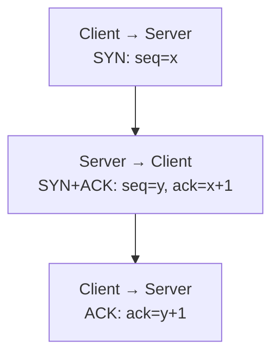
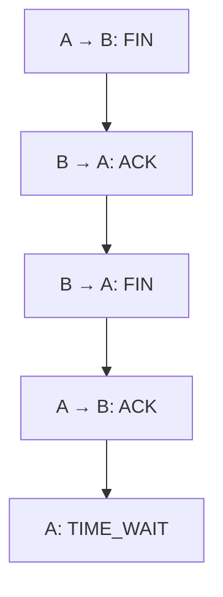

# TCP
{: .no_toc }

TCP(Transmission Control Protocol)는 IP 위에서 순서가 있는 Byte Stream을 제공한다. 연결을 맺은 두 끝점은 데이터를 양방향으로 주고받는다. 네트워크에서 Segment가 유실되거나 순서가 바뀌면 TCP가 재전송과 재조립을 처리한다.

여기서 Stream이라는 말이 중요하다. 송신 프로그램이 `Hello`를 한 번에 썼더라도 수신 프로그램이 반드시 한 번의 `recv()`로 다섯 Byte를 읽는 것은 아니다. 여러 번 쓴 데이터가 한 번에 읽힐 수도 있다. 메시지의 길이나 구분자는 응용 프로토콜에서 정해야 한다.

## 순서와 전송량을 조절하는 정보

TCP는 Sequence Number로 Byte의 위치를 나타내고, ACK로 다음에 받을 Byte의 번호를 알린다. 누락을 감지하거나 재전송 시간이 지나면 필요한 데이터를 다시 보낸다. ACK 하나가 이전의 여러 Byte를 누적해서 확인할 수 있으므로, Byte마다 별도의 응답 패킷을 보내는 구조는 아니다.

**흐름 제어(Flow Control)**는 수신자가 받아들일 수 있는 양을 기준으로 송신량을 조절한다. **혼잡 제어(Congestion Control)**는 네트워크의 혼잡을 고려한다. Receive Window와 Congestion Window가 서로 다른 제약인 이유다. Slow Start와 Congestion Avoidance는 혼잡 제어의 대표적인 과정이다.

TCP 헤더는 Options가 없으면 20 Byte다. 주요 필드는 다음과 같다.

| 필드 | 크기와 의미 |
| --- | --- |
| Source·Destination Port | 각각 16 Bit. 양쪽 소켓의 Port |
| Sequence Number | 32 Bit. Segment가 차지하는 Sequence 공간의 시작 |
| Acknowledgment Number | 32 Bit. 다음에 받을 Sequence Number |
| Flags | SYN, ACK, FIN, RST, PSH, URG 등 제어 정보 |
| Window | 16 Bit. 수신 가능한 양을 알리는 필드 |
| Checksum | 16 Bit. 헤더·데이터 등의 전송 오류 검출에 사용 |

SYN과 FIN도 각각 Sequence 공간 하나를 사용한다. 따라서 Sequence Number를 데이터 Byte만 세는 번호로 생각하면 연결 수립·종료의 ACK 값이 맞지 않는다. Window Scale을 협상한 연결에서는 Window 값에 배율을 적용하므로 16 Bit 필드가 있다는 사실과 실제 수신 Window의 최대 크기도 구분해야 한다.

## 연결을 맺고 양방향을 닫기

일반적인 연결 수립은 SYN, SYN+ACK, ACK를 교환하는 3-way Handshake다. 양쪽은 이 과정에서 자신의 초기 Sequence Number를 알리고 상대가 보낸 번호를 확인한다.



이 과정은 새 연결을 확인하고 지연된 옛 연결 시도와 구별하는 데 필요하다. 단순히 메시지를 세 번 주고받는다고 외우기보다 양쪽이 어떤 Sequence Number를 확인했는지 따라가면 ACK 값의 의미가 드러난다.

연결 종료는 두 방향의 송신을 각각 끝내는 과정이다. 한쪽이 FIN을 보냈더라도 상대방이 보낼 데이터는 남아 있을 수 있다. 그러므로 한 방향을 닫은 뒤에도 반대 방향으로 응답하는 Half-close가 가능하다.



그림은 FIN과 ACK를 따로 보내는 일반적인 예다. 실제로는 ACK와 FIN을 한 Segment로 보낼 수도 있으므로 종료가 언제나 정확히 네 패킷이라는 뜻은 아니다. RST로 연결을 중단하는 경우도 정상적인 FIN 교환과 다르다.

보통 능동적으로 종료를 시작한 쪽이 TIME_WAIT에 들어간다. 그 역할을 클라이언트만 맡는 것은 아니다. 마지막 ACK가 사라져 상대가 FIN을 다시 보낼 때 응답하고, 옛 연결의 Segment가 새 연결에 섞이는 일을 줄이기 위해 기다린다. 규격의 기준은 2 × MSL이며, 모든 OS에서 60초라고 고정할 수 없다. [RFC 9293의 연결 종료](https://datatracker.ietf.org/doc/html/rfc9293#section-3.6)

## `accept()`가 반환하는 소켓

TCP 서버의 기본 호출 흐름은 `socket()` → `bind()` → `listen()` → `accept()`다. `listen()` 소켓은 연결을 받을 준비를 하고, `accept()`는 대기 중인 연결 하나에 사용할 새 소켓을 반환한다. 이후 데이터는 이 연결 소켓으로 주고받는다.

Handshake는 커널의 TCP 구현이 처리하며 `accept()` 호출 전에 이미 진행되거나 끝날 수 있다. `accept()`가 SYN을 받아 직접 Handshake를 실행하는 함수라고 설명하면 서버 코드의 대기열을 오해하기 쉽다. `listen()`의 backlog 역시 모든 OS에서 같은 종류의 패킷을 정확히 그 개수만큼 저장한다는 뜻은 아니다. [accept의 동작](https://man7.org/linux/man-pages/man2/accept.2.html)

여러 클라이언트가 같은 서버 Port에 접속하더라도 각각의 연결 소켓은 구분된다. 서버가 여러 연결을 처리하는 방식은 Thread, Event Loop 등의 동시성 설계와 이어진다.

다음 프로그램은 같은 프로세스 안에 TCP 서버와 클라이언트를 만든다. Loopback 주소와 자동 할당 Port를 사용하므로 외부 서버를 준비할 필요가 없다. 서버의 `accept()` 전에 클라이언트의 `connect()`가 완료되는 순서, Stream을 나누어 읽는 동작, 송신을 끝낸 뒤에도 응답을 받는 동작을 한 번에 확인할 수 있다.

```run-c
#define _POSIX_C_SOURCE 200112L
#include <arpa/inet.h>
#include <errno.h>
#include <stdio.h>
#include <stdlib.h>
#include <sys/socket.h>
#include <sys/time.h>
#include <unistd.h>

static void require(int ok, const char *operation) {
    if (!ok) { perror(operation); exit(1); }
}

static int make_socket(void) {
    int fd = socket(AF_INET, SOCK_STREAM, 0);
    require(fd >= 0, "socket");
    struct timeval timeout = {.tv_sec = 2};
    require(setsockopt(fd, SOL_SOCKET, SO_RCVTIMEO, &timeout, sizeof(timeout)) == 0,
            "receive timeout");
    require(setsockopt(fd, SOL_SOCKET, SO_SNDTIMEO, &timeout, sizeof(timeout)) == 0,
            "send timeout");
    return fd;
}

static void send_all(int fd, const char *data, size_t size) {
    while (size > 0) {
        ssize_t n = send(fd, data, size, 0);
        if (n < 0 && errno == EINTR) continue;
        require(n > 0, "send");
        data += n;
        size -= (size_t)n;
    }
}

static void receive_exact(int fd, char *data, size_t size) {
    while (size > 0) {
        ssize_t n = recv(fd, data, size, 0);
        if (n < 0 && errno == EINTR) continue;
        if (n == 0) { fputs("unexpected EOF\n", stderr); exit(1); }
        require(n > 0, "recv");
        data += n;
        size -= (size_t)n;
    }
}

int main(void) {
    int listener = make_socket();
    struct sockaddr_in address = {
        .sin_family = AF_INET,
        .sin_port = htons(0)
    };
    require(inet_pton(AF_INET, "127.0.0.1", &address.sin_addr) == 1, "inet_pton");
    require(bind(listener, (struct sockaddr *)&address, sizeof(address)) == 0, "bind");
    socklen_t address_size = sizeof(address);
    require(getsockname(listener, (struct sockaddr *)&address, &address_size) == 0,
            "getsockname");
    require(listen(listener, 1) == 0, "listen");

    int client = make_socket();
    require(connect(client, (struct sockaddr *)&address, sizeof(address)) == 0,
            "connect");
    puts("connect 완료, 아직 accept 호출 전");
    int server = accept(listener, NULL, NULL);
    require(server >= 0, "accept");
    struct timeval timeout = {.tv_sec = 2};
    require(setsockopt(server, SOL_SOCKET, SO_RCVTIMEO, &timeout, sizeof(timeout)) == 0,
            "server receive timeout");
    require(setsockopt(server, SOL_SOCKET, SO_SNDTIMEO, &timeout, sizeof(timeout)) == 0,
            "server send timeout");

    send_all(client, "Hello", 5);
    require(shutdown(client, SHUT_WR) == 0, "client shutdown");
    char message[6] = {0};
    receive_exact(server, message, 2);
    printf("서버가 먼저 읽은 2 Byte: %.2s\n", message);
    receive_exact(server, message + 2, 3);
    printf("서버가 이어서 읽은 3 Byte: %.3s\n", message + 2);
    char extra;
    require(recv(server, &extra, 1, 0) == 0, "server EOF");
    puts("클라이언트의 송신은 끝났지만 서버는 응답할 수 있다");
    send_all(server, message, 5);
    require(shutdown(server, SHUT_WR) == 0, "server shutdown");
    receive_exact(client, message, 5);
    printf("클라이언트가 받은 응답: %s\n", message);
    close(server);
    close(client);
    close(listener);
    return 0;
}
```

클라이언트는 `Hello`를 보내지만 서버는 먼저 `He`, 이어서 `llo`를 읽는다. 여기서는 Buffer 길이를 지정해 나누어 읽었다. 이 결과만으로 실제 네트워크의 Segment도 두 개였다고 판단해서는 안 된다. 응용의 읽기 단위와 패킷의 경계는 다르다.

`send_all()`과 `receive_exact()`는 한 번의 호출이 요청한 길이를 모두 처리하지 않을 수 있어서 반복한다. 예제는 메시지가 다섯 Byte라는 것을 양쪽이 미리 알고 있다. 임의 길이의 메시지를 주고받으려면 길이 필드·구분자 같은 Framing 규칙을 추가해야 한다.

`shutdown(client, SHUT_WR)`은 클라이언트의 송신 방향을 끝낸다. 서버가 EOF를 확인한 뒤에도 응답을 보내고, 클라이언트는 그 응답을 읽는다. 열린 File Descriptor를 해제하는 `close()`와 한 방향의 통신을 끝내는 `shutdown()`을 구분해서 볼 수 있다. 수신·송신에는 2초 제한을 두어 문제가 생겼을 때 실습이 계속 대기하지 않도록 했다.

## TCP가 보장하는 범위

TCP의 신뢰성은 상대의 TCP가 받은 Byte를 순서대로 전달하는 기능이다. 연결이 끊어질 수도 있으며, 상대 애플리케이션이 데이터를 읽어 DB에 저장했는지까지 ACK가 증명하지는 않는다. 처리 완료가 필요하면 응용 수준의 응답과 재시도 규칙을 설계해야 한다.

순서 있는 전달이 필요한 데이터에는 TCP가 유용하다. 반대로 오래된 데이터의 재전송을 기다리는 것보다 새 상태가 중요한 경우에는 [UDP](/wiki/computer-systems-network-udp-c5651ad64f2d/)와 상위 프로토콜의 설계를 살펴볼 수 있다. 어느 쪽이 항상 빠르다는 구분보다 누락·지연을 어떻게 처리할지가 선택 기준이다.
