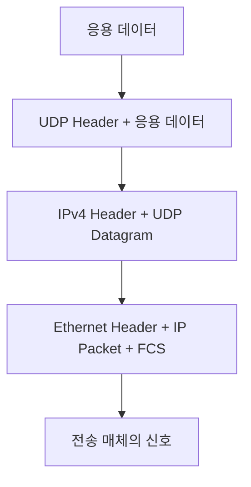

# 계층 모델
{: .no_toc }

웹 페이지를 받는 동안 컴퓨터는 여러 일을 한다. 신호를 전송하고, 다음 장비의 주소를 찾고, 네트워크 사이의 경로를 선택한다. 손실된 데이터를 다시 보내거나 받은 Byte를 HTTP 응답으로 해석하는 일도 필요하다. 계층 모델은 이 책임을 나누어 통신 구조를 설명한다.

각 계층은 아래 계층의 서비스를 사용하고 위 계층에 필요한 기능을 제공한다. 예를 들어 Ethernet을 Wi-Fi로 바꾸더라도 HTTP의 요청 의미를 새로 정의할 필요는 없다. 계층을 나누면 한 부분의 변경을 다른 부분과 구분하고, 장애가 생겼을 때 확인할 범위를 좁힐 수 있다.

## OSI의 일곱 계층

OSI(Open Systems Interconnection)는 통신 기능을 일곱 계층으로 나누는 참조 모델이다. 실제 프로그램이 반드시 일곱 모듈로 구현된다는 뜻은 아니다. 모델의 기본 정의는 ISO/IEC 7498-1과 같은 본문을 사용하는 [ITU-T X.200](https://www.itu.int/rec/T-REC-X.200-199407-I/en)에 있다.

| 계층 | 구분하는 책임 |
| --- | --- |
| 7. 응용 | 애플리케이션 사이의 메시지와 서비스 |
| 6. 표현 | 서로 이해할 수 있는 데이터 표현과 변환 |
| 5. 세션 | 대화의 구성, 동기화와 재개 |
| 4. 전송 | 끝점 사이의 데이터 전달과 필요한 전달 보장 |
| 3. 네트워크 | 여러 네트워크를 지나는 주소 지정과 전달 |
| 2. 데이터 링크 | 연결된 구간에서 Frame 전달 |
| 1. 물리 | 전기·빛·무선 신호를 통한 Bit 전달 |

### 신호와 같은 구간의 전달

물리 계층에서는 케이블, 광섬유, 무선 주파수와 신호의 표현 방식을 다룬다. Hub와 Repeater는 신호를 전달하거나 재생하는 장비로 설명할 수 있다. 수신할 애플리케이션이나 IP 경로를 선택하는 역할과는 다르다.

데이터 링크 계층에서는 Ethernet·Wi-Fi처럼 한 구간에서 데이터를 전달하는 규칙을 다룬다. Ethernet Frame에는 출발지·목적지 MAC 주소, 상위 데이터와 오류 검출용 FCS 등이 들어간다. Switch와 Bridge는 Frame의 전달을 처리한다.

Ethernet MAC 주소는 보통 48 Bit이며 `00:1A:2B:3C:4D:5E`처럼 적는다. 제조사가 부여한 주소만 쓰는 것은 아니다. 소프트웨어가 주소를 설정하거나 Wi-Fi에서 Private MAC 주소를 사용할 수도 있으므로, MAC 주소를 전 세계에서 변하지 않는 장치 신원으로 간주해서는 안 된다. [무선 네트워크의 MAC 주소 보호](https://support.apple.com/guide/security/privacy-features-connecting-wireless-networks-secb9cb3140c/web)

Switch는 수신한 Frame의 출발지 주소를 통해 어느 Port로 해당 MAC에 도달할 수 있는지 학습한다. 알고 있는 목적지에는 해당 Port로 전달하지만, 목적지를 아직 모르는 Unicast나 Broadcast 등은 전달 범위가 달라진다. 모든 Frame을 언제나 한 Port로만 보낸다고 설명하면 이 동작을 놓친다.

### 경로와 통신 끝점

네트워크 계층에서는 목적지까지의 주소 지정과 다음 Hop 선택을 본다. IPv4 주소는 32 Bit, IPv6 주소는 128 Bit다. Router는 목적지 주소와 라우팅 정보를 사용해 다음 전달 경로를 결정한다. 주소 자체가 물리적 위치를 뜻하지는 않으며, 실제 도달 여부는 설정과 경로에 달려 있다.

Router를 3계층 장비라고 부르는 것은 이 전달 기능을 가리킨다. 실제 장비가 방화벽이나 NAT 등의 기능도 수행한다면 Port나 연결 상태를 함께 볼 수 있다. 장비 전체의 기능을 한 계층 번호로 제한할 수는 없다.

IPv4의 ARP는 같은 Link에서 IP에 대응하는 Link 주소를 찾는다. IP 패킷 안에 들어가는 3계층 전달 프로토콜과 구분해야 한다. TCP/IP 호스트 규격도 ARP를 Link 계층에서 다룬다. [RFC 1122의 ARP](https://www.rfc-editor.org/rfc/rfc1122.html#section-2.3.2)

전송 계층에서는 [TCP](/wiki/computer-systems-network-tcp-a7f7f386cd75/)와 [UDP](/wiki/computer-systems-network-udp-c5651ad64f2d/)가 응용에 제공하는 전달 방식을 본다. TCP는 순서 있는 Byte Stream과 재전송·흐름 제어·혼잡 제어를 제공한다. UDP는 Datagram을 전달하며 손실이나 순서 변경을 자체적으로 복구하지 않는다. UDP가 더 단순하다는 사실만으로 모든 상황에서 더 빠르다고 판단하지는 않는다.

Port는 주소·프로토콜과 함께 소켓의 통신을 구분한다. 프로세스 ID와 같은 식별자는 아니다. 주소와 경로는 [IP](/wiki/computer-systems-network-ip-cf75ea1b870d/), 끝점의 구분은 [Port](/wiki/computer-systems-network-topic-3c0bb7fb878f/)에서 다룬다.

### 대화와 데이터의 의미

세션 계층은 대화를 구성하고 동기화하는 책임을 설명한다. 긴 작업의 체크포인트를 두고 끊긴 뒤 재개하는 기능을 생각할 수 있다. 여기서 말하는 세션을 곧바로 웹 로그인 Session이나 TCP 연결과 같은 뜻으로 사용하지는 않는다.

표현 계층은 송신자와 수신자가 데이터를 같은 의미로 이해하기 위한 표현과 변환을 다룬다. ASCII·EBCDIC·UTF-8 같은 문자 표현, JPEG·MPEG와 같은 데이터 형식, 압축과 암호화가 이 책임을 이해하는 예다. 다만 실제 인터넷의 모든 압축·암호화 기능이 하나의 독립된 6계층 모듈에 들어가는 것은 아니다. 예를 들어 TLS와 HTTP의 관계는 사용하는 전송 구조를 함께 살펴야 한다.

응용 계층에서는 HTTP, DNS, FTP, SSH, SMTP·POP3·IMAP처럼 애플리케이션이 사용하는 프로토콜을 다룬다. 브라우저 자체를 응용 계층 프로토콜이라고 부르는 것이 아니라, 브라우저가 HTTP로 요청하고 응답을 읽는 통신 규칙을 보는 것이다.

## 데이터를 감싸서 보내는 과정

캡슐화는 상위 계층에서 받은 데이터를 하위 계층의 전달 단위에 담는 과정이다. 다음은 응용 데이터를 UDP·IPv4·Ethernet으로 보내는 한 예다.



UDP Datagram 전체가 IPv4의 Payload가 되고, IP Packet은 Ethernet Frame에 담긴다. 수신 측에서는 각 프로토콜의 정보를 처리하며 안쪽 데이터를 다음 계층에 넘긴다. 이를 역캡슐화라고 한다.

모든 OSI 계층이 항상 자기 Header를 하나씩 붙인다는 뜻은 아니다. 프로토콜에 따라 Trailer나 별도의 제어 메시지가 있고, 데이터가 나뉘거나 변환될 수도 있다. Router를 지나 다음 Link로 전달할 때는 그 구간에 맞는 Frame으로 다시 담긴다.

## TCP/IP 모델과 비교하기

인터넷 통신은 TCP/IP의 응용·전송·인터넷·Link 계층으로도 설명한다. OSI와 TCP/IP는 기능을 비교할 수 있지만, 하나가 다른 하나의 층을 기계적으로 합쳐 만들어졌다는 뜻은 아니다.

| OSI에서 보는 기능 | TCP/IP에서 비교할 범위 |
| --- | --- |
| 응용·표현·세션 | 응용 프로토콜과 그 구현에서 맡는 기능 |
| 전송 | TCP·UDP 등 전송 계층 |
| 네트워크 | IP·ICMP 등 인터넷 계층 |
| 데이터 링크·물리 | Link와 전송 매체의 기능 |

실제 기능의 경계는 프로토콜마다 다르다. TLS를 무조건 OSI의 한 계층 번호에 고정하거나, 웹 Session을 OSI Session Layer의 구현이라고 단정하면 설명이 어긋날 수 있다. 계층 표는 책임을 비교하는 출발점으로 사용한다.

## Socket API에서 보이는 선택

BSD Socket API의 주소 체계와 소켓 종류는 사용할 통신 방식을 선택한다. IPv4에서 `AF_INET`과 `SOCK_STREAM`을 조합하고 기본 프로토콜을 선택하면 일반적으로 TCP를, `SOCK_DGRAM`을 사용하면 UDP를 사용한다.

아래 코드는 두 종류의 소켓을 만들고 Loopback 주소에 자동 할당 Port를 연결한다. 연결 수립이나 데이터 전송은 하지 않는다.

```run-python
import socket

for name, kind in [("TCP", socket.SOCK_STREAM), ("UDP", socket.SOCK_DGRAM)]:
    with socket.socket(socket.AF_INET, kind) as endpoint:
        endpoint.bind(("127.0.0.1", 0))
        print(f"{name}: {endpoint.family.name}, {endpoint.type.name}")
        print("로컬 주소:", endpoint.getsockname())
    print("소켓 닫힘:", endpoint.fileno() == -1)
```

실행할 때마다 Port가 달라질 수 있다. 여기서 만든 TCP 소켓은 아직 `listen()`이나 `connect()`를 하지 않았으므로 연결된 소켓은 아니다. 같은 API를 사용하더라도 그 뒤의 호출 흐름은 프로토콜에 따라 달라진다. 전체 흐름은 [Socket](/wiki/socket/)에서 이어진다.

Linux의 `AF_PACKET`과 `SOCK_RAW`는 Link 계층의 Packet에 직접 접근하는 별도 경우다. 일반적인 IPv4 소켓과 같은 선택지가 아니며, 생성에는 `CAP_NET_RAW` 권한이 필요하다. 패킷 캡처 도구의 구현도 운영체제에 따라 달라지므로 Wireshark나 tcpdump가 모든 환경에서 같은 Linux API를 쓴다고 가정하지 않는다. [Linux Packet 소켓](https://man7.org/linux/man-pages/man7/packet.7.html)

## 장애를 좁혀 가는 순서

연결이 안 되면 물리 연결, Link와 주소 설정, 라우팅, 전송 연결, 응용 응답을 나누어 확인한다. 아래는 Linux 터미널에서 사용할 수 있는 도구와 관찰 대상이다. 인터페이스 이름과 대상 주소는 실제 환경에 맞춰 선택한다.

| 도구 | 확인할 대상 |
| --- | --- |
| `ip link show` | 인터페이스와 Link 상태 |
| `ip neigh show`, `arping` | 이웃 주소 해석과 같은 Link의 응답 |
| `ip route`, `ping`, `traceroute` | 경로 설정과 탐사 응답 |
| `nc`, `ss -tlnp` | 특정 TCP Port의 연결과 서버 Listening Socket |
| `curl -v` | HTTP 요청·응답과 TLS 등 연결 과정 |

`ip link`의 관리상 `UP` 표시만으로 물리 연결까지 정상이라고 확정하지 않는다. Carrier와 운영 상태도 함께 읽어야 한다. 이름이 `eth0`라고 가정하지 말고 실제 인터페이스 목록부터 확인한다. [Linux 인터페이스 운영 상태](https://www.kernel.org/doc/html/latest/networking/operstates.html)

`ping`이 성공하면 그 대상과 ICMP Echo를 주고받았다는 근거가 된다. 특정 TCP 서비스나 HTTP 응답까지 정상이라는 뜻은 아니다. 반대로 ICMP 응답이 필터링되면 `ping`이 실패해도 웹 서비스는 동작할 수 있다. `traceroute`의 일부 Hop이 응답하지 않는 경우도 전달 경로가 끊겼다고 바로 단정하지 않는다.

TCP 연결이 되는데 HTTP 요청이 실패한다면 요청 형식, TLS, 서버의 처리 기록 등을 이어서 본다. 도메인 이름으로만 실패하면 DNS를 따로 확인한다. 계층 모델은 한 번의 명령으로 고장 위치를 확정하는 규칙이 아니라, 관찰한 결과에 따라 다음 확인 대상을 고르는 기준이다.
