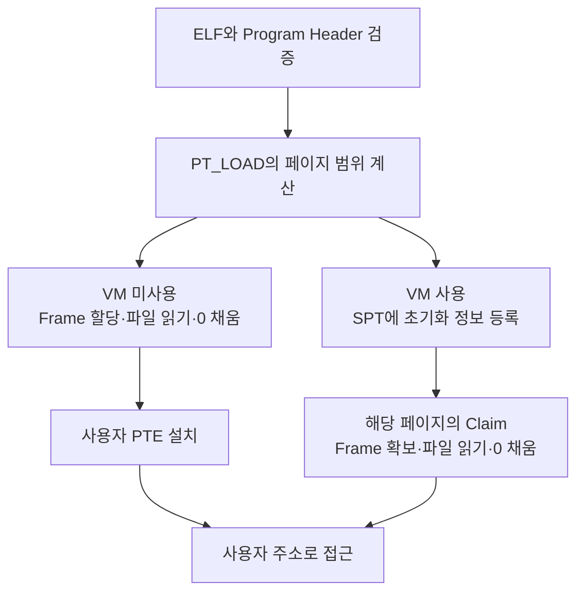

# 실행 파일 적재
{: .no_toc }

실행 파일은 아직 실행 중인 프로세스가 아니다. 로더는 파일의 어느 바이트를 어떤 가상 주소에 배치할지 정하고, 페이지의 권한과 초기 Stack을 준비한 뒤 첫 명령어로 제어를 넘긴다. 파일 offset은 파일 안의 위치이고, 가상 주소는 프로세스가 실행 중에 사용하는 주소다. ELF 적재는 이 두 위치를 연결하는 작업이다.

여기서는 [lrn-pintos의 `process.c`](https://github.com/woonyong-kr/lrn-pintos/blob/5afaa6dc2f7e38f6178cc8fcecad8989518f2eb0/pintos/userprog/process.c)를 기준으로 ELF64 x86-64 적재 경로를 읽는다. `#ifndef VM`의 즉시 적재와 `#else`의 Lazy Loading은 같은 소스 안에 있으므로 빌드 조건도 함께 확인해야 한다.

## Header에서 적재 대상을 찾는다

ELF는 Executable and Linkable Format의 약자다. ELF Header는 파일 형식과 대상 CPU, 진입점, 다른 Header Table의 위치를 알려 준다. Program Header는 적재할 Segment나 실행에 필요한 부가 정보를 기술한다. `.text`, `.data`, `.bss`는 Section 이름이며 Program Header 하나가 여러 Section을 포함할 수 있다. 따라서 Section 이름과 적재 Segment를 일대일로 대응시키지 않는다.

이 PintOS 로더는 Section Header Table을 읽지 않는다. ELF Header와 Program Header를 읽고 `PT_LOAD`가 지정한 바이트를 적재한다. Program Header Table이 반드시 ELF Header 바로 뒤에 온다고 가정하지도 않는다. 위치는 `e_phoff`가 정한다. [ELF Program Header 명세](https://refspecs.linuxfoundation.org/elf/gabi4+/ch5.pheader.html)

### ELF64 Header

이 구조체는 64바이트다. offset은 파일 시작을 기준으로 한다. [ELF Header 필드](https://refspecs.linuxfoundation.org/elf/gabi4+/ch4.eheader.html)

| offset | 크기 | 필드 | 읽을 내용 |
|---|---|---|---|
| `0x00` | 16 | `e_ident` | Magic, Class, Endianness, 형식 버전 등 |
| `0x10` | 2 | `e_type` | 파일 종류. 이 구현은 `ET_EXEC = 2` 허용 |
| `0x12` | 2 | `e_machine` | 대상 CPU. x86-64는 `0x3e` |
| `0x14` | 4 | `e_version` | 형식 버전 |
| `0x18` | 8 | `e_entry` | 최초 실행할 가상 주소 |
| `0x20` | 8 | `e_phoff` | Program Header Table의 파일 offset |
| `0x28` | 8 | `e_shoff` | Section Header Table의 파일 offset |
| `0x30` | 4 | `e_flags` | CPU별 flag |
| `0x34` | 2 | `e_ehsize` | ELF Header 자체의 크기 |
| `0x36` | 2 | `e_phentsize` | Program Header 한 항목의 크기 |
| `0x38` | 2 | `e_phnum` | Program Header 개수 |
| `0x3a` | 2 | `e_shentsize` | Section Header 한 항목의 크기 |
| `0x3c` | 2 | `e_shnum` | Section Header 개수 |
| `0x3e` | 2 | `e_shstrndx` | Section 이름 문자열 Table의 인덱스 |

`read_elf_header()`는 먼저 64바이트를 모두 읽었는지 검사한다. 이어서 처음 7바이트가 `7f 45 4c 46 02 01 01`인지 확인한다. 앞의 4바이트는 ELF Magic이고, 뒤의 3바이트는 64비트·Little Endian·형식 버전 1을 나타낸다. `e_type`, `e_machine`, `e_version`, Program Header 크기 56바이트와 개수 1,024 이하도 확인한다.

Header에 필드가 있다는 사실과 이 로더가 그 필드를 검사한다는 사실은 다르다. 예를 들어 `e_ehsize`는 구조체에 들어 있지만 위 함수의 조건식에는 포함되지 않는다.

### Program Header

ELF64 Program Header 한 항목은 56바이트다. 다음 offset은 해당 항목의 시작을 기준으로 한다.

| offset | 크기 | 필드 | 의미 |
|---|---|---|---|
| `0x00` | 4 | `p_type` | Segment 또는 부가 정보의 종류 |
| `0x04` | 4 | `p_flags` | `PF_R = 4`, `PF_W = 2`, `PF_X = 1` |
| `0x08` | 8 | `p_offset` | 파일에서 읽을 시작 위치 |
| `0x10` | 8 | `p_vaddr` | Segment의 시작 가상 주소 |
| `0x18` | 8 | `p_paddr` | 물리 주소 관련 필드. 이 로더는 사용하지 않음 |
| `0x20` | 8 | `p_filesz` | 파일에 존재하는 바이트 수 |
| `0x28` | 8 | `p_memsz` | 메모리에서 필요한 바이트 수 |
| `0x30` | 8 | `p_align` | 정렬 조건 |

`load_program_headers()`는 `e_phoff + i * 56`에서 항목을 하나씩 읽는다. `read_program_header()`는 위치를 검사하고 56바이트를 모두 읽었는지 확인한다. 이후의 분기는 다음과 같다.

| `p_type` | 이 구현의 처리 |
|---|---|
| `PT_LOAD = 1` | 검증 후 `load_loadable_segment()`에서 적재 준비 |
| `PT_DYNAMIC = 2` | 거부 |
| `PT_INTERP = 3` | 거부 |
| `PT_SHLIB = 5` | 거부 |
| `PT_NULL = 0`, `PT_NOTE = 4`, `PT_PHDR = 6` | 건너뜀 |
| `PT_STACK = 0x6474e551` 및 나머지 값 | 건너뜀 |

`PT_INTERP`는 동적 링커와 같은 Interpreter의 경로를 나타내며 `PT_DYNAMIC`은 동적 링크 정보다. `PT_SHLIB`는 ABI에서 의미가 정해지지 않은 예약 항목이다. 이 셋을 모두 같은 동적 링크 기능이라고 설명할 필요는 없다. GNU Stack 항목을 건너뛴다는 것은 그 항목의 실행 권한 정책을 적용했다는 뜻도 아니다.

다음 예제는 Header 바이트를 만들고 다시 해석한다. 코드와 데이터 Segment를 포함한 실행 파일을 만드는 예제는 아니다. `ident`의 Magic이나 `machine`, `phnum`을 바꾸면 검증 결과도 확인할 수 있다.

```run-python
import struct

elf = struct.Struct('<16sHHIQQQIHHHHHH')
phdr = struct.Struct('<IIQQQQQQ')
ident = b'\x7fELF\x02\x01\x01' + bytes(9)
# 적재할 코드가 없는 Header 예제다. 실행 파일 자체를 만들지는 않는다.
raw = elf.pack(ident, 2, 62, 1, 0x400000, elf.size, 0,
               0, elf.size, phdr.size, 1, 0, 0, 0)
raw += phdr.pack(1, 5, 0x1000, 0x400000, 0, 0x2A00, 0x3000, 0x1000)

if len(raw) < elf.size:
    raise ValueError('ELF Header가 잘렸습니다.')
fields = elf.unpack_from(raw)
ident, kind, machine, version, entry, phoff = fields[:6]
phentsize, phnum = fields[9:11]
if not (ident[:7] == b'\x7fELF\x02\x01\x01'
        and kind == 2 and machine == 62 and version == 1
        and phentsize == phdr.size and phnum <= 1024):
    raise ValueError('이 예제의 ELF64 x86-64 조건과 다릅니다.')
if phoff + phentsize * phnum > len(raw):
    raise ValueError('Program Header Table이 잘렸습니다.')

print('ELF Header bytes:', elf.size)
print('Program Header bytes:', phdr.size)
print('magic:', ident[:4].hex(' '))
print(f'entry={entry:#x}, phoff={phoff:#x}, phnum={phnum}')
for i in range(phnum):
    kind, flags, offset, va, pa, filesz, memsz, align = phdr.unpack_from(
        raw, phoff + i * phentsize)
    print(f'[{i}] type={kind}, flags={flags:#x}, offset={offset:#x}, va={va:#x}')
    print(f'    filesz={filesz:#x}, memsz={memsz:#x}, align={align:#x}')
```

## 파일 바이트를 페이지에 나누기

`PT_LOAD`의 의미 있는 메모리 범위는 `p_vaddr`부터 `p_memsz`바이트다. 앞의 `p_filesz`바이트는 파일에서 읽고, 그 뒤의 `p_memsz - p_filesz`바이트는 0으로 초기화한다. `.bss`처럼 초기값이 0인 데이터는 파일에 같은 크기의 0을 저장하지 않고 이 차이로 표현할 수 있다.

페이지 단위로 적재하려면 그 앞뒤의 정렬 여백도 계산해야 한다. 파일과 가상 주소의 페이지 내 offset이 같을 때, PintOS는 다음 값을 구한다.

```text
file_page   = p_offset에서 페이지 내 offset을 뺀 위치
mem_page    = p_vaddr에서 페이지 내 offset을 뺀 주소
page_offset = p_vaddr의 하위 12비트
전체 범위    = page_offset + p_memsz를 4096의 배수로 올림
```

`p_filesz > 0`이면 `read_bytes = page_offset + p_filesz`다. Segment가 페이지 중간에서 시작하면 파일도 앞쪽 페이지 경계부터 읽으므로 `page_offset`을 더한다. 반면 `p_filesz == 0`이면 읽을 파일 데이터가 없으므로 `read_bytes = 0`으로 두고 전체 페이지 범위를 0으로 채운다. 어느 경우든 `zero_bytes = 전체 범위 - read_bytes`다.

BSS 크기와 `zero_bytes`를 구분해야 한다. `p_filesz = 0x48`, `p_memsz = 0x50`인 정렬된 Segment의 BSS는 8바이트다. 그러나 한 페이지에서 72바이트만 읽으므로 나머지 4,024바이트를 0으로 채운다. 이 값에는 BSS 밖의 페이지 여백도 포함된다.

아래 값은 계산을 위한 입력이다. 특정 `args-none` 또는 `args-single` 바이너리에서 관측한 출력으로 제시하지 않는다. 빌드 옵션과 소스가 달라지면 Program Header의 값도 달라진다.

```run-python
PAGE = 4096


def page_plan(offset, va, filesz, memsz):
    if min(offset, va, filesz, memsz) < 0 or memsz < filesz:
        raise ValueError('음수이거나 메모리 크기가 파일 크기보다 작습니다.')
    if offset % PAGE != va % PAGE:
        raise ValueError('파일과 가상 주소의 페이지 내 offset이 다릅니다.')
    inside = va % PAGE
    file_pos = offset - inside
    page_va = va - inside
    total = (inside + memsz + PAGE - 1) // PAGE * PAGE
    remaining_read = inside + filesz if filesz else 0
    remaining_zero = total - remaining_read
    rows = []
    while remaining_read or remaining_zero:
        read = min(remaining_read, PAGE)
        zero = PAGE - read
        rows.append((page_va, file_pos, read, zero))
        remaining_read -= read
        remaining_zero -= zero
        file_pos += read
        page_va += PAGE
    return rows


cases = [
    ('code', 0x1000, 0x400000, 0x4EF0, 0x4EF0),
    ('BSS only', 0x0F00, 0x405F00, 0, 0x524),
    ('data and BSS', 0x3000, 0x403000, 0x48, 0x50),
    ('inside a page', 0x1123, 0x401123, 13, 21),
]
for name, offset, va, filesz, memsz in cases:
    rows = page_plan(offset, va, filesz, memsz)
    print(f'\n{name}: {len(rows)} pages, BSS={memsz - filesz} bytes')
    for page_va, file_pos, read, zero in rows:
        location = f'{file_pos:#x}' if read else '-'
        print(f'va={page_va:#x}, file={location}, read={read}, zero={zero}')
```

`code`는 5페이지이며 마지막 페이지에서 `0xef0`바이트를 읽고 `0x110`바이트를 0으로 채운다. BSS는 0바이트여도 페이지 끝의 0 채움은 남는다. `BSS only`는 가상 주소의 페이지 내 offset이 `0xf00`이어서, 의미 있는 크기가 `0x524`바이트여도 2페이지를 준비한다.

`inside a page`에서는 Segment의 파일 데이터가 13바이트지만 페이지 경계부터 304바이트를 읽는다. 이 가운데 앞의 291바이트는 정렬 때문에 함께 읽는 범위다. BSS는 8바이트이며 나머지는 페이지 여백이다.

파일 크기를 `0x2a00`으로 바꾸면 4,096·4,096·2,560바이트로 나뉘고 마지막 페이지의 1,536바이트를 0으로 채운다. 두 Segment가 각각 5페이지와 1페이지이고 Stack 1페이지를 즉시 적재한다면 사용자 데이터 Frame은 7개, 28 KiB다. 이 계산에는 Page Table, 커널 객체, 파일 상태의 메모리가 포함되지 않는다.

## 적재 전에 검사하는 범위

`validate_segment()`는 다음 조건을 확인한다. ELF가 선언한 주소를 그대로 PTE에 기록하지 않고 파일과 사용자 주소 공간의 경계를 먼저 확인하는 단계다.

| 검사 | 조건 |
|---|---|
| 페이지 내 위치 | `p_offset % PGSIZE == p_vaddr % PGSIZE` |
| 파일 시작 위치 | `p_offset <= file_length(file)` |
| 크기 관계 | `p_memsz >= p_filesz` |
| 사용자 주소 범위 | 시작 주소와 끝 주소 모두 `KERN_BASE` 미만 |
| 주소 덧셈 | 64비트 덧셈이 감싸져 끝 주소가 시작보다 작아지지 않음 |
| 0번 페이지 | `p_vaddr >= PGSIZE` |

0번 페이지를 비워 두면 일반적인 NULL 포인터 접근이 유효한 사용자 Mapping으로 성공하는 일을 막을 수 있다. 파일 위치와 메모리 위치의 offset을 맞추는 조건은 페이지 단위 복사에서 같은 바이트가 같은 위치에 놓이게 한다. `p_memsz >= p_filesz`는 메모리 범위보다 많은 파일 데이터를 배치하려는 선언을 거부한다.

아래 모델은 이 함수의 검사 범위를 보여 준다. Python의 정수는 자동으로 64비트에서 넘치지 않으므로 끝 주소 계산에는 명시적으로 Mask를 적용했다.

```run-python
PAGE = 4096
KERNEL_BASE = 0x8004000000
U64_MASK = (1 << 64) - 1


def rejected_by(offset, va, filesz, memsz, file_length):
    if any(n < 0 or n > U64_MASK for n in (offset, va, filesz, memsz)):
        raise ValueError('ELF64 필드는 64비트 부호 없는 정수여야 합니다.')
    end = (va + memsz) & U64_MASK
    checks = [
        ('page offset', offset % PAGE == va % PAGE),
        ('file offset', offset <= file_length),
        ('memory size', memsz >= filesz),
        ('user range', va < KERNEL_BASE and end < KERNEL_BASE),
        ('address wrap', end >= va),
        ('page zero', va >= PAGE),
    ]
    return [name for name, passed in checks if not passed]


base = dict(offset=0x1000, va=0x401000, filesz=0x2A00,
            memsz=0x3000, file_length=0x5000)
cases = [
    ('valid', {}),
    ('different page offset', dict(offset=0x1001)),
    ('offset past EOF', dict(offset=0x6000)),
    ('memory too small', dict(memsz=0x100)),
    ('cross kernel boundary', dict(va=KERNEL_BASE - PAGE)),
    ('wrapped end', dict(va=0x400000, memsz=(1 << 64) - 0x200000)),
    ('page zero', dict(va=0)),
    ('data extends past EOF', dict(file_length=0x1100)),
]
for name, changes in cases:
    failures = rejected_by(**(base | changes))
    print(name + ': ' + (', '.join(failures) if failures else 'passes these checks'))
```

마지막 입력은 파일 데이터의 끝이 EOF를 넘지만 이 여섯 검사를 통과한다. 함수가 확인하는 것은 `p_offset`의 범위이며 `p_offset + p_filesz` 전체가 아니기 때문이다. 이후 실제 읽기가 요청 크기를 채우지 못하면 즉시 적재는 실패하고, Lazy Loading에서는 해당 페이지를 읽는 시점에 실패한다. 따라서 이 함수의 통과를 완전한 ELF 유효성 검증과 같게 보지 않는다.

이 코드에는 `p_memsz == 0`을 별도로 거부하는 조건이나 일반적인 `p_align` 유효성 검사도 없다. 또한 64비트 Header의 크기 값을 `uint32_t read_bytes`와 `zero_bytes`로 옮긴다. 큰 입력까지 지원하려면 덧셈, 형 변환, 파일 범위와 자원 제한을 함께 검토해야 한다.

## 즉시 적재와 Lazy Loading

`load()`는 새 PML4를 만들고 활성화한 뒤 명령줄을 복사해 인자를 나눈다. 실행 파일을 열어 쓰기 금지를 설정하고, Header와 Segment를 검사한 다음 Stack과 초기 실행 상태를 만든다.



VM을 사용하지 않는 `load_segment()`는 `PAL_USER`로 Frame을 얻고 `file_read_at()`으로 필요한 바이트를 읽는다. 정확한 크기를 읽지 못하면 방금 얻은 Frame을 반환하고 실패한다. 남은 범위를 `memset()`으로 0으로 채운 뒤 `install_page()`로 Mapping을 설치한다. 설치에 실패해도 그 Frame을 반환한다.

`install_page()`는 중복 Mapping을 검사하고 `pml4_set_page()`를 호출한다. PTE에는 Frame의 물리 주소와 `PTE_P`, `PTE_U`, 필요한 경우 `PTE_W`가 들어간다. `kpage`는 커널이 Frame을 다루는 가상 주소이므로 `vtop(kpage)`로 물리 주소를 구한다. ELF의 `PF_R`, `PF_W`, `PF_X` 중 이 적재 경로가 권한 판단에 쓰는 것은 `PF_W`다. [PintOS Page Table 구현](https://github.com/woonyong-kr/lrn-pintos/blob/5afaa6dc2f7e38f6178cc8fcecad8989518f2eb0/pintos/threads/mmu.c)

VM을 사용하는 `load_segment()`는 아직 사용자 데이터 Frame을 만들지 않는다. 대신 페이지마다 `struct page`, 파일을 다시 연 참조, 파일 offset과 읽기·0 채움 크기를 준비해 SPT에 넣는다. 목표 종류는 `VM_ANON`이며, 최초 상태는 초기화 전인 UNINIT이다. 나중에 `vm_claim_page()`나 Page Fault 처리에서 Frame을 확보하고 `lazy_load_segment()`가 파일을 읽는다. 읽기가 끝나면 콜백이 자신의 파일 참조와 aux를 정리한다.

Lazy Loading도 Metadata 메모리를 사용한다. 또한 `setup_stack()`은 Stack 페이지를 등록한 직후 Claim하므로 초기 Stack까지 첫 사용자 Page Fault로 미루지는 않는다. 필요한 페이지가 적으면 초기 파일 읽기와 Frame 할당을 줄일 수 있지만, 모든 실행에서 더 빠르다거나 처음 실행할 때 Page Fault가 없어야 한다고 단정할 수는 없다. 권한 위반이나 잘못된 주소에 의한 Page Fault는 즉시 적재에서도 발생할 수 있다. [SPT 등록과 Claim 구현](https://github.com/woonyong-kr/lrn-pintos/blob/5afaa6dc2f7e38f6178cc8fcecad8989518f2eb0/pintos/vm/vm.c)

## Stack과 최초 실행 상태

이 소스의 `USER_STACK`은 `0x47480000`이고 초기 Stack 페이지는 `0x4747f000`부터 그 직전까지다. `setup_stack()`은 처음 `RSP`를 `USER_STACK`으로 두지만, `setup_initial_stack()`이 인자 문자열과 포인터를 넣으면서 최종 `RSP`를 낮춘다. 따라서 `load()`가 끝난 뒤에도 `RSP == USER_STACK`이라고 예상하면 안 된다.

명령줄은 공백을 기준으로 분리하며 `argv` 배열은 최대 64개 인자를 받는다. 초기 Stack에는 문자열, 정렬 여백, `argv[argc]`의 NULL, 인자 포인터와 가짜 반환 주소가 들어간다. `RDI`에는 `argc`, `RSI`에는 `argv` 주소를 넣는다. Linux처럼 환경 변수와 Auxiliary Vector를 함께 구성하는 경로는 아니다. 인자의 자세한 배치는 [인자 전달](/wiki/computer-systems-network-topic-1217820258bd/)에서 이어서 다룬다.

Segment와 Stack 준비가 성공하면 `if_->rip = ehdr.e_entry`를 설정하고 `process_exec()`가 `do_iret()`로 사용자 실행 상태를 복원한다. 이 구현은 이전 주소 공간을 먼저 정리하므로 새 적재에 실패했을 때 이전 프로그램으로 돌아가는 방식이 아니다. `process_exec()`는 실패를 반환하고 시스템 콜의 `exec()`가 `exit(-1)`로 처리한다. 실행 파일의 참조는 [파일시스템 구현](/wiki/computer-systems-network-topic-c76b83867c50/#실행 파일의 쓰기를 막는 이유)에서 설명하는 쓰기 보호 수명과 함께 유지된다.

## 바이너리와 GDB에서 확인하기

실제 테스트 바이너리가 있는 Linux 또는 Cross Toolchain 환경에서는 Header를 먼저 확인한다. 경로는 저장소 루트 기준이다.

```sh
file pintos/userprog/build/tests/userprog/args-none
readelf -h -l pintos/userprog/build/tests/userprog/args-none
```

`objdump -f -p`도 파일 형식과 Program Header를 살펴보는 데 사용할 수 있다. 출력에서 entry, Segment 수, 파일 offset과 크기를 읽은 뒤 위 계산 예제의 입력에 넣는다. `.text`와 `.data` Segment가 항상 두 개라는 전제는 두지 않는다.

GDB에서는 디버그 심볼이 있는 커널과 연결한 뒤 함수의 진입점에 중단점을 둔다. 다음은 Header를 읽기 전과 읽은 뒤를 구분하는 명령이다.

```gdb
break read_elf_header
continue
set $header = ehdr
finish
p *$header
x/64xb $header
```

`read_elf_header()` 진입점에서는 출력 Buffer가 아직 읽힌 상태가 아니다. `finish`로 호출이 끝난 뒤 반환값과 Header를 함께 본다. `e_ident`는 고정 길이 배열이므로 NULL 종료 문자열처럼 비교하지 않는다.

Segment를 살펴볼 때는 `load_loadable_segment()`에서 `p *phdr`, `validate_segment()`에서 시작·끝 주소와 반환값, `load_segment()`에서 `ofs`, `upage`, `read_bytes`, `zero_bytes`, `writable`을 확인한다. 함수 이름을 기준으로 `list`와 `next`를 사용하면 빌드마다 달라지는 `load+300` 같은 기계어 offset을 추측하지 않아도 된다.

VM 미사용 빌드에서는 `install_page()`에서 사용자 주소와 커널 Frame 주소를 함께 확인한다. VM 빌드에서는 SPT 등록과 PML4의 현재 Mapping을 구분한다. `info proc mappings`는 PintOS의 SPT를 출력하는 명령이 아니다. `pml4_get_page()`가 아직 NULL이어도 Lazy Page가 SPT에 등록되어 있을 수 있다. 실제 적재 이후에는 entry 주소와 그 주소에 대응하는 커널 가상 주소에서 같은 바이트가 보이는지, BSS 범위가 0인지 확인할 수 있다.

이 문서의 Python 예제는 Header 해석과 계산을 실행한다. GDB 명령은 해당 커널에서 확인할 관찰 절차이며, 새 QEMU 실행의 통과 기록이나 메모리 측정값으로 제시하지 않는다.

## Linux·Windows·QEMU와의 경계

Linux의 `execve()`는 현재 프로세스의 프로그램 이미지를 바꾸며, 성공하면 이전 호출 위치로 돌아오지 않는다. 동적 링크 ELF에서는 `PT_INTERP`가 가리키는 Interpreter가 공유 라이브러리 적재와 연결에 참여한다. Linux의 프로세스 이미지를 설명할 때는 Demand Paging, ASLR, 환경 변수와 Auxiliary Vector, Signal·Thread·권한 상태의 변경도 함께 고려한다. 구체적인 주소 상한, ASLR 설정과 프로그램 Header 수 제한을 모든 Linux 환경에서 같은 상수로 보지 않는다. [Linux execve](https://www.man7.org/linux/man-pages/man2/execve.2.html)

Windows의 PE 이미지는 `MZ` Header와 `PE\0\0` Signature, COFF·Optional Header, Section 정보를 사용한다. 진입점의 `AddressOfEntryPoint`는 Image Base를 기준으로 한 RVA이며 파일 offset과 다르다. Import, Relocation과 DLL 처리가 필요한 것도 단순한 파일 복사로 설명할 수 없는 이유다. `CreateProcess`로 새 프로세스를 만드는 API와 Linux의 `execve()`로 기존 이미지를 교체하는 API도 구분한다. [Microsoft PE 명세](https://learn.microsoft.com/en-us/windows/win32/debug/pe-format)

PintOS를 System Emulation으로 실행하는 QEMU는 Guest CPU·메모리·디스크 장치의 동작을 제공한다. 여기서 Guest 파일시스템 안의 `args-none`을 해석하는 쪽은 PintOS 로더다. Guest가 디스크 바이트를 읽고 PTE를 기록하면 QEMU는 그 장치와 주소 변환 동작을 실행한다. 이 설명은 QEMU 자체에 ELF를 읽는 코드가 없다는 뜻은 아니다. Machine의 Kernel Image를 직접 적재하는 경로와 User Mode Emulation은 별도로 구분해야 한다. [QEMU System Emulation](https://www.qemu.org/docs/master/system/introduction.html), [User Mode Emulation](https://www.qemu.org/docs/master/user/main.html)
