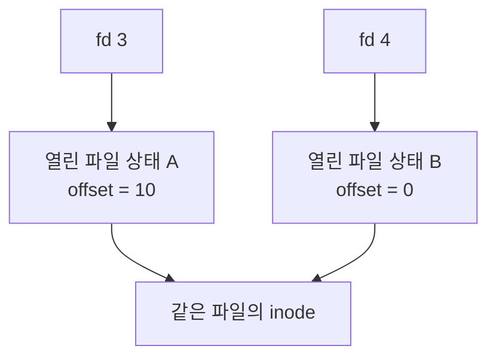

# 파일 접근
{: .no_toc }

파일을 열 때는 경로가 필요하지만, 읽을 때마다 경로를 다시 전달하지는 않는다. Unix 계열에서 `open()`이 돌려주는 File Descriptor, 줄여서 fd를 보관했다가 `read()`, `write()`, `close()`에 넘긴다. fd는 열린 파일을 현재 프로세스 안에서 찾기 위한 음이 아닌 정수다.

`read(3, buffer, size)`의 `3`은 파일 이름이나 디스크 주소, 커널 객체의 포인터가 아니다. 커널은 호출한 프로세스의 fd table에서 3번 항목을 찾아 I/O 대상으로 연결한다. 다른 프로세스의 fd 3은 전혀 다른 파일을 가리킬 수 있다.

## 번호와 열린 파일 상태

파일 접근은 세 가지를 구분하면 이해하기 쉽다.

| 대상 | 담고 있는 의미 | 같은 파일을 다시 열었을 때 |
|---|---|---|
| File Descriptor | 프로세스의 열린 파일 참조 번호 | 새 번호를 받는다 |
| Open File Description | 이번에 열린 파일의 offset과 상태 | `open()`마다 새로 생긴다 |
| inode | 파일의 내용과 Metadata를 식별하는 파일 시스템 객체 | 같은 파일이면 공유할 수 있다 |

예를 들어 한 파일을 두 번 열면 두 번의 `open()`은 각자 읽기 위치를 갖는다. 첫 번째 fd로 10바이트를 읽어도 두 번째 fd의 위치는 처음 그대로다. 파일 내용이 같다는 사실과 읽기 위치를 공유한다는 사실은 별개다.

Linux에서는 프로세스의 `files_struct`가 `fdtable`을 가리키고, fdtable의 파일 포인터 배열이 `struct file`로 이어진다. `struct file`은 Open File Description을 구현하며, 현재 위치인 `f_pos`, 상태를 담는 `f_flags`, 파일 연산을 연결하는 `f_op` 등을 가진다. inode에는 파일 크기, Link 수, Block 정보와 같은 Metadata가 놓인다.



Linux의 fdtable은 필요에 따라 커질 수 있다. 열린 번호와 close-on-exec 상태를 관리하는 Bitmap도 함께 둔다. 배열 조회 자체는 번호로 접근하지만, 실제 커널 구현에는 동시 접근 중인 테이블과 파일 객체의 수명을 보호하는 Lock·RCU 규칙이 더해진다. 프로세스가 허용받은 fd 범위는 `RLIMIT_NOFILE`, 시스템 설정과 실행 환경을 확인해야 하며, 모든 Linux 프로세스의 한도가 같은 값은 아니다. [Linux 커널의 파일 관리](https://docs.kernel.org/filesystems/files.html)

## 같은 offset을 공유하는 경우

`dup(fd)`는 파일을 다시 여는 대신 기존 Open File Description을 가리키는 fd를 하나 더 만든다. 두 fd의 번호는 다르지만 읽기 위치와 파일 상태를 공유한다. 한쪽에서 `read()`나 `lseek()`로 위치를 바꾸면 다른 쪽의 다음 접근에도 반영된다. 반면 fd 자체의 close-on-exec flag는 별도로 관리한다. [dup(2)](https://man7.org/linux/man-pages/man2/dup.2.html)

아래 예제는 임시 파일을 두 번 열고, 첫 번째 fd를 `dup()`으로 복제한다. `open()`과 `dup()`의 차이를 읽은 문자와 offset으로 확인한다. 예제가 만든 파일과 fd는 끝날 때 정리한다.

```run-python
import os
import tempfile
from pathlib import Path

with tempfile.TemporaryDirectory() as directory:
    path = Path(directory) / "letters.txt"
    path.write_bytes(b"ABCDEF")
    owned = set()
    try:
        first = os.open(path, os.O_RDONLY)
        owned.add(first)
        separate = os.open(path, os.O_RDONLY)
        owned.add(separate)
        shared = os.dup(first)
        owned.add(shared)

        print("first:", os.read(first, 2).decode())
        print("dup(first):", os.read(shared, 2).decode())
        print("another open:", os.read(separate, 2).decode())
        print("offsets:", *(os.lseek(fd, 0, os.SEEK_CUR)
                             for fd in (first, shared, separate)))

        old_number = first
        os.close(first)
        owned.remove(first)
        reopened = os.open(path, os.O_RDONLY)
        owned.add(reopened)
        print("closed number reused:", reopened == old_number)
        print("reopened:", os.read(reopened, 2).decode())

        os.unlink(path)
        print("name exists:", path.exists())
        print("still open:", os.read(shared, 2).decode())
    finally:
        for fd in owned:
            os.close(fd)
```

첫 번째 fd는 `AB`, 복제한 fd는 이어서 `CD`를 읽는다. 별도의 `open()`으로 얻은 fd는 처음부터 `AB`를 읽으므로 offset은 각각 `4`, `4`, `2`가 된다. 실행 환경이 먼저 연 fd가 있을 수 있어 실제 번호를 3이나 4로 고정하지 않는다.

뒤쪽의 `close()`와 `unlink()`가 바꾸는 대상은 아래에서 구분한다.

## 닫은 번호는 다시 쓰인다

`open()`은 현재 사용할 수 있는 가장 낮은 fd를 선택한다. `close(fd)`로 번호를 반환하면 이후 `open()`이 그 번호를 다시 사용할 수 있다. 이 규칙에는 0, 1, 2도 포함된다. 표준 입력으로 사용하던 fd 0을 닫았다면 이후에 연 파일이 0번으로 배정될 수도 있다. [open(2)](https://man7.org/linux/man-pages/man2/open.2.html)

`close(a)`를 호출해도 사용자 변수 `a`에 저장된 숫자는 자동으로 지워지지 않는다. 그 사이 새 파일이 같은 번호를 받으면 오래된 변수로 수행한 I/O가 새 파일에 도달할 수 있다. 따라서 번호가 같다는 이유만으로 같은 열린 파일이라고 판단해서는 안 된다. 파일을 닫은 뒤에는 해당 fd를 더 사용하지 않도록 소유권과 정리 경로를 정한다.

앞의 예제에서 다시 연 파일은 새로운 Open File Description을 얻으므로 처음부터 `AB`를 읽는다. 닫힌 번호의 재사용 여부는 출력으로 확인할 수 있다. 동시에 다른 코드가 fd를 할당하는 환경이라면 그 코드가 먼저 번호를 차지할 수도 있다.

## 이름을 지우는 일과 닫는 일

`close(fd)`는 열린 파일 참조를 놓는다. `unlink(path)`는 Directory에서 파일 이름을 제거한다. 따라서 이름을 지운 뒤에도 이미 열린 fd로 파일을 계속 읽을 수 있다. 앞의 예제에서 `name exists`는 `False`가 되지만, 열린 `shared`로는 남은 `EF`를 읽는다.

파일의 저장 공간은 이름과 열린 참조의 수명에 따라 회수된다. Hard Link가 남아 있거나 열린 fd가 있으면 이름 하나를 지웠다는 이유만으로 파일 내용이 즉시 없어지지 않는다. 파일 Mapping 역시 fd와 수명이 같지 않다. Mapping을 만든 뒤 fd를 닫아도 Mapping 자체는 유지될 수 있다. 이름, fd, Mapping 중 어떤 참조를 정리하는지 구분해야 한다. [unlink(2)](https://man7.org/linux/man-pages/man2/unlink.2.html), [mmap(2)](https://man7.org/linux/man-pages/man2/mmap.2.html)

## fork와 exec 사이의 파일 접근

Unix의 `fork()`는 자식에게 부모의 열린 fd를 상속한다. fd table은 별개지만, 상속된 각 fd는 부모와 같은 Open File Description을 참조한다. 자식의 `close(fd)`는 부모의 fd 번호를 닫지 않는다. 반면 자식이 파일을 읽어 offset을 이동시키면 부모의 다음 읽기도 그 위치에서 이어진다. [fork(2)](https://man7.org/linux/man-pages/man2/fork.2.html)

다음 예제는 부모가 `AB`를 읽은 뒤 자식을 만든다. 자식은 `CD`를 읽고 fd를 닫는다. 부모는 자식 종료를 기다린 다음에도 자신의 fd로 `EF`를 읽는다. 자식이 읽은 결과는 Pipe로 전달하며, 두 프로세스의 출력 순서에 기대지 않는다. `fork()`를 지원하는 Unix 환경에서 실행하는 예제다.

```run-python
import os
import tempfile

if not hasattr(os, "fork"):
    raise RuntimeError("이 예제는 fork를 지원하는 Unix 환경이 필요합니다.")

with tempfile.TemporaryFile() as file:
    file.write(b"ABCDEF")
    file.flush()
    file.seek(0)
    fd = file.fileno()
    print("parent before fork:", os.read(fd, 2).decode(), flush=True)
    reader, writer = os.pipe()
    try:
        pid = os.fork()
    except BaseException:
        os.close(reader)
        os.close(writer)
        raise

    if pid == 0:
        os.close(reader)
        status = 1
        try:
            data = os.read(fd, 2)
            os.close(fd)
            if os.write(writer, data) == len(data):
                status = 0
        finally:
            os.close(writer)
            os._exit(status)

    os.close(writer)
    try:
        chunks = []
        while chunk := os.read(reader, 16):
            chunks.append(chunk)
    finally:
        os.close(reader)
        _, status = os.waitpid(pid, 0)
    if not os.WIFEXITED(status) or os.WEXITSTATUS(status) != 0:
        raise RuntimeError("자식 프로세스의 읽기 또는 결과 전달이 실패했습니다.")
    print("child:", b"".join(chunks).decode())
    print("parent after child close:", os.read(fd, 2).decode())
```

`exec()`는 현재 프로세스의 프로그램을 교체한다. fd는 기본적으로 유지되지만 close-on-exec로 지정된 fd는 성공한 `exec()`에서 닫힌다. 언어 Runtime이 새 fd에 이 flag를 기본으로 설정할 수도 있으므로, 시스템 호출의 기본값과 언어 API의 기본값도 구분한다. Python이 새로 만드는 fd는 기본적으로 상속 불가능 상태이며, 이 설정은 위 예제의 `fork()` 자체가 아니라 그 뒤 `exec()` 경계에 관계한다. [Python의 fd 상속](https://docs.python.org/3/library/os.html#inheritance-of-file-descriptors)

이 구조는 Shell의 출력 재지정과도 연결된다. 다만 `echo hello > output.txt` 다음에 `echo world >> output.txt`를 실행하는 사례에서 이어 쓰기를 설명하는 직접적인 조건은 두 번째 열기의 Append 동작이다. 서로 다른 두 명령이 언제나 같은 Open File Description을 공유한다고 설명하면 안 된다.

## 표준 입출력도 다시 연결할 수 있다

Unix에서 fd 0, 1, 2는 각각 표준 입력, 표준 출력, 표준 오류에 쓰는 번호다. 이 번호가 특정 키보드나 화면을 영구히 뜻하지는 않는다. Terminal에서 실행할 때는 TTY에 연결될 수 있고, Shell에서 재지정하면 파일이나 Pipe에 연결될 수 있다.

`dup2(source, 1)`은 표준 출력 번호 1을 `source`와 같은 열린 파일 상태에 연결한다. 기존 1번의 닫기와 새 연결은 원자적으로 처리한다. 먼저 `close(1)`을 하고 나중에 `dup()`을 호출하면 그 사이 다른 Thread나 Signal Handler가 1번을 할당받을 수 있기 때문이다.

TTY에 연결된 경우 Linux의 TTY 계층은 Line Discipline을 통해 입력 편집, Echo, Canonical/Raw 모드와 Signal 생성 등을 처리한다. Terminal 크기 조회나 Background Process의 입출력 제어도 이 계층과 관계한다. 출력 목적지가 Pipe나 일반 파일이라면 이런 Terminal 처리를 그대로 거친다고 볼 수 없다. 또한 Pseudo-terminal의 출력은 Terminal Emulator 쪽으로 전달되므로, 모든 TTY 출력이 물리 UART로 나간다는 설명도 맞지 않는다. [Linux TTY](https://docs.kernel.org/driver-api/tty/index.html)

## OS 구현마다 다른 부분

Windows의 Win32 파일 API는 `HANDLE`을 사용한다. 불투명한 객체 식별자라는 점은 비슷하지만 Unix fd와 같은 작은 정수 배열 첨자로 취급하지 않는다. 파일 삭제 조건, Handle 상속과 `DuplicateHandle`의 동작도 해당 API를 기준으로 읽어야 한다. Unix의 `fork()`·`unlink()` 규칙을 그대로 옮길 수는 없다. [Windows Handle](https://learn.microsoft.com/en-us/windows/win32/sysinfo/handles-and-objects)

학습용 [PintOS](/wiki/pintos/) 구현은 fd table을 한 페이지 배열로 두고, 표준 입력과 출력은 파일 객체 대신 번호 분기로 처리한다. `fork()`에서도 새 `struct file`을 만들어 offset을 복사하므로 이후 위치는 독립적이다. 이러한 차이는 일반적인 Unix 규칙과 구분해서 읽어야 한다.
