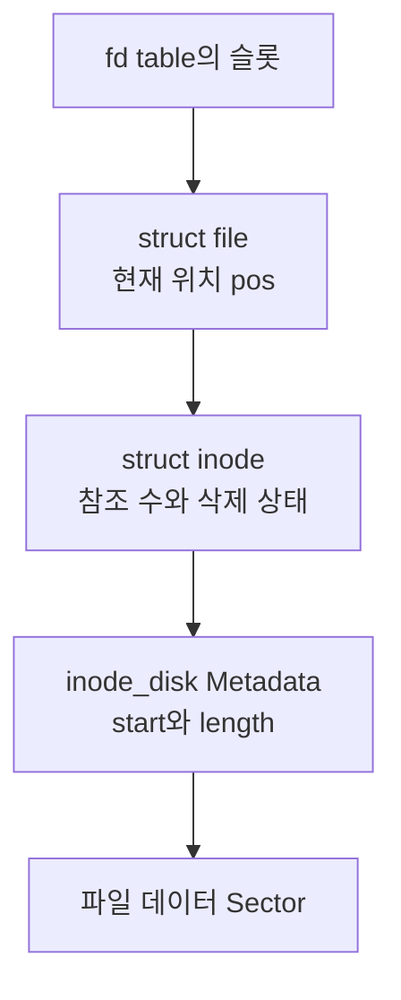
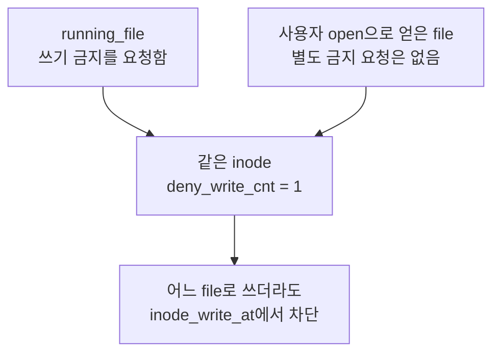

# 파일 시스템 구현
{: .no_toc }

사용자 프로그램의 파일 접근은 fd로 시작하지만, 디스크에서 읽을 Sector까지 가려면 여러 상태를 구분해야 한다. `struct file`은 이번에 열린 파일의 위치를, `struct inode`는 메모리에서 공유하는 파일 정보를, `struct inode_disk`는 디스크에 저장한 Metadata를 담는다.

여기서는 [lrn-pintos의 `5afaa6d` 시점](https://github.com/woonyong-kr/lrn-pintos/tree/5afaa6dc2f7e38f6178cc8fcecad8989518f2eb0)의 파일 객체와 연속 할당 구조를 읽는다. 하위 키워드의 파일 확장·Directory·경로 탐색은 이 구조에서 이어서 다룰 주제다.

## file, inode, inode_disk

`struct file`의 전체 정의는 `file.c`에 있고, 헤더의 함수 원형은 내부 필드를 공개하지 않은 채 `struct file *`를 사용한다. 외부 코드는 `file_read()`·`file_seek()` 같은 API로 파일을 다룬다. 구조체가 메모리에서 어떤 상태를 갖는지와 다른 모듈에 무엇을 공개하는지는 별개의 설계다.

`struct file`에는 `inode` 포인터, 현재 위치인 `pos`, 해당 파일 객체의 쓰기 금지 요청을 나타내는 `deny_write`가 있다. 같은 파일을 여러 번 열면 서로 다른 `struct file`이 같은 inode를 가리킬 수 있다. 각 `pos`가 따로 있으므로 같은 파일 내용에 독립적인 위치로 접근할 수 있다.

메모리의 `struct inode`는 다음 정보를 가진다.

| 필드 | 역할 |
|---|---|
| `elem` | 열린 inode를 관리하는 List의 연결 |
| `sector` | 디스크에 있는 inode Metadata의 Sector 번호 |
| `open_cnt` | 현재 inode를 열어 둔 참조 수 |
| `removed` | 이름을 제거해 마지막 참조가 닫힐 때 회수할 대상인지 표시 |
| `deny_write_cnt` | 이 inode에 적용된 쓰기 금지 요청 수 |
| `data` | 디스크에서 읽은 `struct inode_disk` |

`struct inode_disk`는 첫 데이터 Sector인 `start`, 파일의 Byte 길이인 `length`, 확인용 `magic`, 크기를 한 Sector에 맞추는 여유 공간을 담는다. `INODE_MAGIC`은 `0x494e4f44`다. inode 자체가 놓인 `sector`와 파일 내용이 시작하는 `data.start`는 같은 뜻이 아니다. [inode 구현](https://github.com/woonyong-kr/lrn-pintos/blob/5afaa6dc2f7e38f6178cc8fcecad8989518f2eb0/pintos/filesys/inode.c)



### 구조체의 크기는 배치를 확인한다

이 소스를 Clang의 x86-64 대상으로 분석한 Record Layout은 `struct file` 16바이트, `struct inode` 544바이트, `struct inode_disk` 512바이트다. 커널 실행 중 측정한 결과가 아니라 같은 구조체 정의의 정렬과 Padding을 컴파일러로 확인한 값이다.

`struct file`의 `bool`은 1바이트이며, 앞의 8바이트 포인터와 4바이트 `off_t`에 이어 배치되고 구조체 끝에 정렬용 Padding이 붙는다. `bool` 자체를 4바이트라고 계산하지 않는다. inode의 `data`는 offset 32에서 시작하므로 전체 크기는 `32 + 512 = 544`바이트다. 다른 ABI나 구조체 정의에서는 `sizeof`를 다시 확인해야 한다.

`inode_disk`의 앞 세 필드는 각각 4바이트이고 `unused[125]`가 500바이트를 채워 전체가 `12 + 500 = 512`바이트가 된다. `unused`는 소스에 명시된 배열이며 컴파일러가 자동으로 삽입한 Padding과는 다르다. `inode_create()`는 `ASSERT(sizeof *disk_inode == DISK_SECTOR_SIZE)`로 디스크에 쓸 구조체의 크기를 확인한다.

메모리의 `inode->data`는 디스크에서 읽은 Metadata 사본이다. 이 사본을 변경했다고 디스크에 자동 반영되지는 않는다. 저장 형식을 확장한다면 언제 어떤 Metadata를 `disk_write()`로 기록할지도 함께 정해야 한다.

## 디스크의 inode와 메모리 목록을 비교하기

ext4의 inode table은 디스크에 저장된 inode record들의 배열이다. PintOS의 `open_inodes`는 메모리에서 열린 객체를 관리하는 List이므로 두 구조를 같은 종류의 목록으로 비교하지 않는다. 디스크 구조를 비교할 때는 ext4의 inode record와 PintOS의 `inode_disk`를, 열린 상태를 비교할 때는 각 커널의 메모리 객체를 따로 봐야 한다.

ext4의 디스크 inode record 크기는 포맷 시 정하며 `s_inode_size`에 기록된다. 흔한 기본값은 256바이트지만 모든 환경에서 고정된 값은 아니다. 또한 소유자·그룹·접근 권한을 나타내는 `uid`·`gid`·`mode`와 접근·내용 수정·inode 변경 시각 등을 저장한다. 현재 PintOS의 `inode_disk`에는 이런 필드가 없다. 이 차이는 파일을 어떤 정보로 관리하는지의 차이이며, 구조체 크기만으로 기능이나 성능의 우열을 판단할 수는 없다. [ext4 inode의 저장 형식](https://www.kernel.org/doc/html/latest/filesystems/ext4/inodes.html)

## 열려 있는 inode를 재사용한다

`inode_init()`은 전역 `open_inodes` List를 빈 상태로 초기화한다. 이는 디스크에 있는 모든 파일의 inode 목록이 아니라 현재 메모리에 열린 inode를 관리하는 목록이다.

`inode_open(sector)`는 먼저 `open_inodes` List에서 같은 Sector의 inode가 이미 열려 있는지 찾는다. 있으면 `inode_reopen()`으로 `open_cnt`를 늘려 같은 객체를 돌려준다. 없으면 새 inode를 할당하고 디스크의 Metadata를 읽어 온다.

현재 `inode_open()`은 `malloc()` 실패를 확인한 뒤에만 새 객체를 List에 넣는다. 할당이 실패하면 `NULL`을 반환한다. 마지막 `inode_close()`에서는 `open_cnt`가 0이 된 객체를 List에서 빼고 메모리를 해제한다.

이 검색과 참조 수 변경 자체에 내부 Lock이 있는 것은 아니다. 공유 List 접근이 겹칠 수 있는 호출 경로에서는 호출자가 파일 시스템 Lock 등으로 접근을 보호해야 한다. `deny_write_cnt`는 파일 내용의 쓰기 허용 여부를 나타내며 List와 참조 수에 대한 동시 접근을 막는 Lock을 대신하지 않는다.

이 inode를 받은 `file_open()`은 새 파일 객체의 위치를 0, 쓰기 금지 상태를 `false`로 초기화한다. 따라서 파일을 두 번 열었을 때 inode는 공유해도 파일 객체는 각각 생긴다. 같은 inode를 찾는 List와 프로세스의 fd table은 다른 자료구조다.

`file_open()`은 전달받은 inode의 소유권도 넘겨받는다. 파일 객체 할당에 실패하거나 inode가 `NULL`이면 inode를 닫고 할당한 메모리를 정리한다. 성공한 경우에만 나중의 `file_close()`가 이 참조를 해제한다. `file_reopen()`은 inode 참조를 하나 늘린 뒤 새 파일을 열기 때문에 위치가 0에서 시작한다. 현재 위치까지 복사하는 `file_duplicate()`와 구분해야 한다.

현재 위치를 사용하는 `file_read()`와 `file_write()`는 inode의 위치 지정 I/O에 작업을 맡긴 뒤, 실제 처리한 Byte 수만큼 `pos`를 이동시킨다. 요청한 크기를 전부 처리하지 못했다면 요청 크기 전체를 더하지 않는다. 위치 지정 함수인 `file_read_at()`·`file_write_at()`은 인자로 받은 offset을 사용하며 파일 객체의 현재 위치를 바꾸지 않는다. [file 구현](https://github.com/woonyong-kr/lrn-pintos/blob/5afaa6dc2f7e38f6178cc8fcecad8989518f2eb0/pintos/filesys/file.c)

## Byte 위치를 Sector로 바꾸기

이 구현은 파일 데이터를 연속된 Sector에 저장한다. 유효한 파일 offset이라면 `byte_to_sector()`는 `start + offset / DISK_SECTOR_SIZE`로 위치를 구한다. 파일 길이 밖이면 유효한 데이터 Sector를 반환하지 않는다.

Sector가 512바이트일 때 10,000바이트 파일에는 올림 계산으로 20개 데이터 Sector가 필요하다. 첫 Sector가 50이고 현재 offset이 5,000이면 Sector 번호는 `50 + 5000 / 512 = 59`, 그 Sector 안의 위치는 `5000 % 512 = 392`다.

Sector 59에는 120바이트가 남아 있다. 100바이트를 요청했다면 그 Sector에서 모두 읽을 수 있지만, 200바이트를 요청했다면 120바이트와 다음 Sector의 80바이트로 나뉜다. 읽을 조각의 크기는 요청의 남은 길이, 파일 끝까지의 길이, Sector 끝까지의 길이 중 최솟값이다.

아래 예제는 이 주소 계산을 실행한다. 디스크 장치에 실제 읽기를 요청하는 코드는 아니다.

```run-python
SECTOR_SIZE = 512
start_sector = 50
file_size = 10_000
offset = 5_000
requested = 200

if file_size < 0 or offset < 0 or requested < 0:
    raise ValueError("파일 크기, offset과 요청 크기는 음수가 될 수 없습니다.")

print("allocated sectors:", (file_size + SECTOR_SIZE - 1) // SECTOR_SIZE)
remaining = requested
while remaining and offset < file_size:
    sector = start_sector + offset // SECTOR_SIZE
    inside = offset % SECTOR_SIZE
    chunk = min(remaining, file_size - offset, SECTOR_SIZE - inside)
    print(f"sector={sector}, sector offset={inside}, bytes={chunk}")
    offset += chunk
    remaining -= chunk
print("bytes read:", requested - remaining)
print("new file offset:", offset)
```

실제 `inode_read_at()`은 Sector 전체를 읽을 수 있는 경우 호출자가 건넨 목적지 Buffer로 바로 읽고, 일부만 필요한 경우 임시 Bounce Buffer에 Sector를 읽은 뒤 필요한 범위를 복사한다. 따라서 모든 읽기가 항상 Bounce Buffer를 거치는 것도 아니다. 위의 5,000 offset처럼 Sector 중간에서 시작하는 읽기에서 임시 Buffer가 필요한 이유를 볼 수 있다.

`inode_create()`는 필요한 연속 공간을 Free Map에서 할당하고 Metadata를 기록한 뒤 데이터 Sector를 0으로 채운다. 이 구조에서 파일 크기 변경과 공간 확장을 다루려면 위치 계산뿐 아니라 할당·회수 정책까지 함께 바꿔야 한다. 끝을 넘는 쓰기의 처리와 FAT·Extent의 차이는 [파일 확장](/wiki/computer-systems-network-topic-11f41b49c3a0/)에서 이어진다.

## close와 remove가 만나는 시점

`file_close()`는 해당 파일 객체가 요청한 쓰기 금지를 해제하고, `inode_close()`로 inode 참조를 놓은 뒤 파일 객체를 해제한다. inode의 참조 수가 남아 있으면 다른 파일 객체는 계속 같은 inode를 사용할 수 있다.

이름을 제거하는 경로는 `filesys_remove()`에서 Directory 항목의 `in_use`를 지우고 `inode_remove()`로 `removed`를 설정한다. 이때 이미 열린 fd의 슬롯을 지우지는 않는다. 열린 파일로 계속 읽고 쓸 수 있으며, 마지막 `inode_close()`에서 참조 수가 0이 되었을 때 삭제 표시를 확인해 inode Sector와 데이터 Sector를 Free Map에 반환한다. 이름을 제거하지 않은 파일은 마지막으로 닫혀도 디스크 내용이 유지된다.

[`syn-remove` 테스트](https://github.com/woonyong-kr/lrn-pintos/blob/5afaa6dc2f7e38f6178cc8fcecad8989518f2eb0/pintos/tests/filesys/base/syn-remove.c)는 1,234바이트 파일을 만든 뒤 이름을 제거하고, 열린 fd로 쓰기·처음 위치로 이동·읽기·내용 비교를 수행한다. 이 코드는 이름과 열린 참조의 수명이 다르다는 조건을 검사한다. 현재 문서에서는 테스트 본문을 읽었으며 새 커널 실행 결과로 제시하지 않는다.

현재 `inode_disk`에는 Hard Link 수를 영구 저장하는 `nlink`가 없고, `open_cnt`는 메모리의 열린 참조 수다. Directory에 같은 inode를 가리키는 이름 하나를 추가하는 것만으로 Hard Link를 구현하면, 한쪽 이름을 지운 뒤 다른 이름이 살아 있는데도 공간을 회수할 수 있다. 디스크의 Link 수, Directory 변경과 실패 복구, 마지막 열린 참조의 정리 조건을 함께 바꾸어야 한다. 디스크 구조를 바꾸면 기존 포맷과의 호환성도 검토해야 한다. Symbolic Link에는 경로 저장과 경로 탐색 규칙이 추가로 필요하다. 일반적인 두 Link의 동작은 [File](/wiki/computer-systems-network-topic-23d09155893b/)에서 실제 임시 파일로 비교한다.

## 실행 파일의 쓰기를 막는 이유

실행 파일은 프로그램을 적재할 때 읽을 바이트의 원본이다. 특히 Lazy Loading에서는 실행 도중 Page Fault가 발생했을 때도 파일에서 아직 적재하지 않은 부분을 읽는다. 그 사이 파일 내용이 바뀌면 먼저 적재한 부분과 나중에 적재한 부분이 서로 다른 내용을 바탕으로 실행될 수 있다.

이 문제는 메모리 페이지의 쓰기 권한과 구분해야 한다. PTE의 권한은 현재 Mapping에 대한 접근을 제어한다. 실행 파일을 다른 fd로 열어 파일 시스템에 쓰려는 요청까지 PTE가 판단하는 것은 아니다. 실행 파일 보호는 OS가 파일 참조와 쓰기 경로에서 유지하는 정책이다.

원본 전체를 별도의 Snapshot으로 복사해 실행 상태와 분리하는 방법도 있지만, 이 PintOS 구현은 원본 inode에 대한 쓰기를 거부하는 방식을 사용한다. 모든 OS가 같은 카운터 구조나 파일 삭제 규칙을 사용한다는 뜻은 아니다.

### 실행 파일 참조를 보관한다

`open_executable()`은 실행 파일을 열고 곧바로 `file_deny_write()`를 호출한다. `load()`가 성공하면 이 객체를 `thread->running_file`에 넘겨 프로세스가 사용하는 동안 보관한다. 적재 실패 경로에서는 파일을 닫아 설정한 금지도 해제한다. 성공 경로에서 지역 변수 `file`을 `NULL`로 바꾸는 것은 공통 정리 코드가 `running_file`로 넘긴 객체를 다시 닫지 않게 하기 위해서다.

`running_file`은 사용자 fd table과 별도로 관리한다. 사용자 프로그램이 같은 경로를 다시 열면 다른 `struct file`을 받지만 같은 inode를 참조할 수 있다. 새 객체의 `deny_write`가 `false`라고 해서 쓸 수 있는 것은 아니다. 최종 쓰기 여부는 inode의 누적 카운터로 결정한다.



프로세스가 실행 파일을 더 이상 사용하지 않으면 `close_running_file()`에서 금지를 해제하고 파일을 닫는다. `file_close()`도 내부에서 `file_allow_write()`를 호출하지만, 객체의 flag가 이미 해제되어 있으면 카운터를 다시 줄이지 않는다. 이 정리 경로는 `filesys_lock`으로 보호한다. [실행 파일의 적재·복제·정리](https://github.com/woonyong-kr/lrn-pintos/blob/5afaa6dc2f7e38f6178cc8fcecad8989518f2eb0/pintos/userprog/process.c)

`exec()`는 이전 실행 파일 참조를 정리한 뒤 새 파일을 적재한다. VM을 사용하는 빌드에서는 먼저 이전 주소 공간을 정리하고 `running_file`을 닫는다. Lazy Loading에 연결된 참조를 정리하는 동안 실행 파일이 먼저 해제되지 않도록 순서를 구분한 것이다.

### 객체별 flag와 inode별 카운터

`file_deny_write()`는 한 파일 객체가 금지를 중복 요청하지 않도록 `deny_write`를 확인한다. `file_allow_write()`도 그 객체가 금지를 요청한 경우에만 카운터를 줄인다. inode 함수는 `deny_write_cnt`가 열린 참조 수인 `open_cnt`를 넘지 않는지, 해제할 금지가 남아 있는지 `ASSERT`로 검사한다.

| 호출 | 해당 file의 `deny_write` | inode의 금지 수 |
|---|---|---|
| 처음 상태 | `false` | 0 |
| 첫 `file_deny_write()` | `true` | 1 |
| 같은 객체에 다시 deny | `true` | 1 |
| 첫 `file_allow_write()` | `false` | 0 |
| 같은 객체에 다시 allow | `false` | 0 |

`inode_deny_write()`를 직접 호출한 쪽은 증가와 감소의 짝을 스스로 맞춰야 한다. 한쪽을 빠뜨리면 쓰기를 계속 거부하거나 `ASSERT`에서 실패할 수 있다. file 계층의 flag는 이 짝을 파일 객체의 상태로 관리한다.

이 가드는 같은 객체에 대한 중복 호출을 막는다. 이미 해제한 객체의 포인터를 사용하는 문제나 Lock 없이 여러 Thread가 동시에 flag를 바꾸는 문제까지 해결하는 장치는 아니다.

`file_duplicate()`는 새 객체에도 금지 상태를 적용한다. 따라서 `fork()`한 부모가 먼저 끝나도 자식이 사용하는 실행 파일의 금지가 유지된다. 다음 모델은 객체별 중복 방지와 공유 카운터만 실행해 본다. 실제 파일을 열거나 디스크 쓰기를 시도하는 코드는 아니다.

```run-python
class Inode:
    def __init__(self):
        self.deny_count = 0


class OpenFile:
    def __init__(self, inode):
        self.inode = inode
        self.denied = False

    def deny(self):
        if not self.denied:
            self.denied = True
            self.inode.deny_count += 1

    def allow(self):
        if self.denied:
            self.denied = False
            self.inode.deny_count -= 1

    def duplicate(self):
        child = OpenFile(self.inode)
        if self.denied:
            child.deny()
        return child


inode = Inode()
parent = OpenFile(inode)
parent.deny()
parent.deny()
print("deny twice on one file:", inode.deny_count)
child = parent.duplicate()
print("after duplicate:", inode.deny_count)
parent.allow()
parent.allow()
print("after parent allows twice:", inode.deny_count)
print("write blocked:", inode.deny_count > 0)
child.allow()
print("after child allows:", inode.deny_count)
print("write blocked:", inode.deny_count > 0)
```

같은 객체에 deny를 두 번 해도 1, 복제하면 2, 부모 쪽을 해제하면 1, 자식까지 해제하면 0이 된다. 여러 프로세스가 같은 실행 파일을 사용하면 같은 원리로 마지막 금지 요청이 해제될 때까지 보호한다. 일반적인 `open()`은 inode의 열린 참조 수만 늘릴 수 있으므로 `open_cnt`와 `deny_write_cnt`가 언제나 같지는 않다.

## 쓰기 거부를 검사하는 코드

`inode_write_at()`은 카운터가 0이 아니면 Sector 계산보다 먼저 0을 반환한다. 이는 이 구현에서 0바이트를 썼다는 뜻이다. 파일 객체의 위치 역시 실제 쓴 크기만큼 증가하므로 거부된 쓰기로 전진하지 않는다.

[`rox-simple`](https://github.com/woonyong-kr/lrn-pintos/blob/5afaa6dc2f7e38f6178cc8fcecad8989518f2eb0/pintos/tests/userprog/rox-simple.c)은 자기 실행 파일을 열고 16바이트를 읽은 뒤, 같은 fd로 16바이트 쓰기를 요청해 반환값이 0인지 검사한다. 읽기 다음의 쓰기이므로 위치는 파일 처음인 0이 아니라 16이다. 쓰기가 차단되지 않았다면 Sector 일부의 내용을 수정하는 경로로 내려가겠지만, 정상적인 금지 경로에서는 이 요청의 디스크 쓰기가 발생하지 않는다.

[`child-rox`](https://github.com/woonyong-kr/lrn-pintos/blob/5afaa6dc2f7e38f6178cc8fcecad8989518f2eb0/pintos/tests/userprog/child-rox.c)는 자신의 실행 파일에 대한 쓰기를 거부하는지 확인하고, 깊이를 줄여 자식을 만든 뒤 기다린다. 자식이 끝난 뒤에도 현재 프로세스가 실행 중인 동안 쓰기가 계속 거부되어야 한다. `fork()` 직후에는 같은 실행 파일의 금지가 복제되고, 이어지는 `exec()`에서는 실행 이미지 교체에 따른 참조 정리가 들어가므로 단순히 재귀 깊이만으로 모든 순간의 카운터 값을 단정하지 않는다.

[`rox-child.inc`](https://github.com/woonyong-kr/lrn-pintos/blob/5afaa6dc2f7e38f6178cc8fcecad8989518f2eb0/pintos/tests/userprog/rox-child.inc)의 부모 테스트는 `child-rox`를 실행하기 전에는 그 파일에 쓸 수 있는지 확인한다. 자식의 종료를 기다린 뒤 같은 fd를 처음 위치로 돌려 다시 16바이트를 쓴다. 실행 중에는 보호하고 실행이 끝나면 보호를 해제하는 두 조건을 함께 검사한다.

이 설명은 저장소의 테스트 본문과 커널 구현을 대조한 결과다. QEMU에서 이 테스트를 새로 실행한 통과 기록을 뜻하지 않는다. 커널 재현에서는 `open_executable()`, `file_deny_write()`, `inode_write_at()`, `close_running_file()`의 같은 inode를 따라가며 금지 수와 쓰기 반환값을 확인한다.

QEMU는 Guest가 실행하는 메모리·장치 동작을 제공하며 실행 파일 보호 정책을 정하지 않는다. 디스크 쓰기 Breakpoint가 한 번 걸렸다는 사실만으로 금지가 실패했다고 판정해서도 안 된다. 다른 파일이나 Metadata의 쓰기일 수 있으므로 해당 요청과 Sector까지 연결해야 한다.

## Linux와 Windows에서 비교할 점

Linux에서 실행 중인 일반 파일을 쓰기 목적으로 열 때는 `ETXTBSY`가 대표적인 오류다. PintOS처럼 열기는 허용하고 쓰기에서 0을 반환하는 API와 차이가 있다. 이름 제거는 열린 파일 참조와 별개이므로 기존 inode를 사용하는 프로세스와 같은 경로에 새로 만든 파일도 구분한다. [Linux open 오류](https://man7.org/linux/man-pages/man2/open.2.html)

Linux의 `i_writecount`는 쓰기 접근과 쓰기 금지를 부호로 구분한다. 0은 두 참조가 없는 상태, 양수는 쓰기 접근 수, 음수의 절댓값은 쓰기 금지 참조 수다. `get_write_access()`는 음수가 아닐 때만 원자적으로 증가시키고, `deny_write_access()`는 양수가 아닐 때만 감소시킨다. 반대 상태와 충돌하면 `-ETXTBSY`를 반환한다. 따라서 단순히 `atomic_dec()`를 호출하는 카운터와도 다르다. [Linux inode 쓰기 접근 관리](https://linux.googlesource.com/linux/kernel/git/torvalds/linux.git/+/refs/heads/master/include/linux/fs.h)

Windows의 삭제 가능 여부에는 다른 Handle을 열 때 지정한 `FILE_SHARE_DELETE`, 파일 Mapping, 삭제 방식이 영향을 준다. 일반적인 `DeleteFileW()`의 삭제 표시는 마지막 Handle이 닫힐 때 처리되며, POSIX 삭제 방식은 열린 Handle이 남아 있을 때 이름을 제거할 수 있다. 실행 파일을 바꾸는 문제를 살펴볼 때도 파일 쓰기, 이름 제거, 열린 참조의 수명을 나누어 확인해야 한다. [Windows 파일 삭제 조건](https://learn.microsoft.com/en-us/windows/win32/api/fileapi/nf-fileapi-deletefilew)

fd의 할당·재사용·상속은 프로세스의 테이블에서, 파일 위치와 금지는 열린 파일 객체에서, 디스크 공간의 마지막 회수는 inode에서 결정한다. 이 책임을 구분하면 “fd를 닫았다”, “파일 이름을 지웠다”, “디스크 공간을 반환했다”가 서로 다른 시점일 수 있음을 설명할 수 있다.
