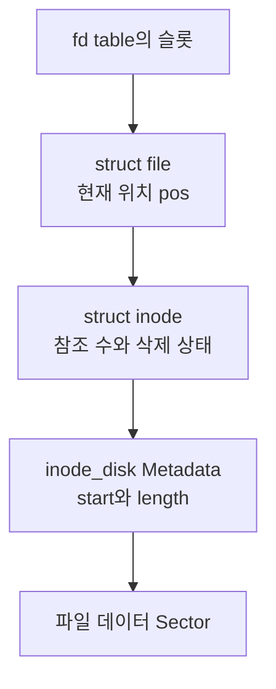

# 파일 시스템 구현
{: .no_toc }

사용자 프로그램의 파일 접근은 fd로 시작하지만, 디스크에서 읽을 Sector까지 가려면 여러 상태를 구분해야 한다. `struct file`은 이번에 열린 파일의 위치를, `struct inode`는 메모리에서 공유하는 파일 정보를, `struct inode_disk`는 디스크에 저장한 Metadata를 담는다.

여기서는 [lrn-pintos의 `5afaa6d` 시점](https://github.com/woonyong-kr/lrn-pintos/tree/5afaa6dc2f7e38f6178cc8fcecad8989518f2eb0)의 파일 객체와 연속 할당 구조를 읽는다. 하위 키워드의 파일 확장·Directory·경로 탐색은 이 구조에서 이어서 다룰 주제다.

## file, inode, inode_disk

`struct file`에는 `inode` 포인터, 현재 위치인 `pos`, 해당 파일 객체의 쓰기 금지 요청을 나타내는 `deny_write`가 있다. 같은 파일을 여러 번 열면 서로 다른 `struct file`이 같은 inode를 가리킬 수 있다. 각 `pos`가 따로 있으므로 같은 파일 내용에 독립적인 위치로 접근할 수 있다.

메모리의 `struct inode`는 다음 정보를 가진다.

| 필드 | 역할 |
|---|---|
| `elem` | 열린 inode를 관리하는 List의 연결 |
| `sector` | 디스크에 있는 inode Metadata의 Sector 번호 |
| `open_cnt` | 현재 inode를 열어 둔 참조 수 |
| `removed` | 이름을 제거해 마지막 참조가 닫힐 때 회수할 대상인지 표시 |
| `deny_write_cnt` | 이 inode에 적용된 쓰기 금지 요청 수 |
| `data` | 디스크에서 읽은 `struct inode_disk` |

`struct inode_disk`는 첫 데이터 Sector인 `start`, 파일의 Byte 길이인 `length`, 확인용 `magic`, 크기를 한 Sector에 맞추는 여유 공간을 담는다. `INODE_MAGIC`은 `0x494e4f44`다. inode 자체가 놓인 `sector`와 파일 내용이 시작하는 `data.start`는 같은 뜻이 아니다. [inode 구현](https://github.com/woonyong-kr/lrn-pintos/blob/5afaa6dc2f7e38f6178cc8fcecad8989518f2eb0/pintos/filesys/inode.c)



### 구조체의 크기는 배치를 확인한다

이 소스를 Clang의 x86-64 대상으로 분석한 Record Layout은 `struct file` 16바이트, `struct inode` 544바이트, `struct inode_disk` 512바이트다. 커널 실행 중 측정한 결과가 아니라 같은 구조체 정의의 정렬과 Padding을 컴파일러로 확인한 값이다.

`struct file`의 `bool`은 1바이트이며, 앞의 8바이트 포인터와 4바이트 `off_t`에 이어 배치되고 구조체 끝에 정렬용 Padding이 붙는다. `bool` 자체를 4바이트라고 계산하지 않는다. inode의 `data`는 offset 32에서 시작하므로 전체 크기는 `32 + 512 = 544`바이트다. 다른 ABI나 구조체 정의에서는 `sizeof`를 다시 확인해야 한다.

## 열려 있는 inode를 재사용한다

`inode_open(sector)`는 먼저 `open_inodes` List에서 같은 Sector의 inode가 이미 열려 있는지 찾는다. 있으면 `inode_reopen()`으로 `open_cnt`를 늘려 같은 객체를 돌려준다. 없으면 새 inode를 할당하고 디스크의 Metadata를 읽어 온다.

이 inode를 받은 `file_open()`은 새 파일 객체의 위치를 0, 쓰기 금지 상태를 `false`로 초기화한다. 따라서 파일을 두 번 열었을 때 inode는 공유해도 파일 객체는 각각 생긴다. 같은 inode를 찾는 List와 프로세스의 fd table은 다른 자료구조다.

현재 위치를 사용하는 `file_read()`와 `file_write()`는 inode의 위치 지정 I/O에 작업을 맡긴 뒤, 실제 처리한 Byte 수만큼 `pos`를 이동시킨다. 요청한 크기를 전부 처리하지 못했다면 요청 크기 전체를 더하지 않는다. 위치 지정 함수인 `file_read_at()`·`file_write_at()`은 인자로 받은 offset을 사용하며 파일 객체의 현재 위치를 바꾸지 않는다. [file 구현](https://github.com/woonyong-kr/lrn-pintos/blob/5afaa6dc2f7e38f6178cc8fcecad8989518f2eb0/pintos/filesys/file.c)

## Byte 위치를 Sector로 바꾸기

이 구현은 파일 데이터를 연속된 Sector에 저장한다. 유효한 파일 offset이라면 `byte_to_sector()`는 `start + offset / DISK_SECTOR_SIZE`로 위치를 구한다. 파일 길이 밖이면 유효한 데이터 Sector를 반환하지 않는다.

Sector가 512바이트일 때 10,000바이트 파일에는 올림 계산으로 20개 데이터 Sector가 필요하다. 첫 Sector가 50이고 현재 offset이 5,000이면 Sector 번호는 `50 + 5000 / 512 = 59`, 그 Sector 안의 위치는 `5000 % 512 = 392`다.

Sector 59에는 120바이트가 남아 있다. 100바이트를 요청했다면 그 Sector에서 모두 읽을 수 있지만, 200바이트를 요청했다면 120바이트와 다음 Sector의 80바이트로 나뉜다. 읽을 조각의 크기는 요청의 남은 길이, 파일 끝까지의 길이, Sector 끝까지의 길이 중 최솟값이다.

아래 예제는 이 주소 계산을 실행한다. 디스크 장치에 실제 읽기를 요청하는 코드는 아니다.

```run-python
SECTOR_SIZE = 512
start_sector = 50
file_size = 10_000
offset = 5_000
requested = 200

if file_size < 0 or offset < 0 or requested < 0:
    raise ValueError("파일 크기, offset과 요청 크기는 음수가 될 수 없습니다.")

print("allocated sectors:", (file_size + SECTOR_SIZE - 1) // SECTOR_SIZE)
remaining = requested
while remaining and offset < file_size:
    sector = start_sector + offset // SECTOR_SIZE
    inside = offset % SECTOR_SIZE
    chunk = min(remaining, file_size - offset, SECTOR_SIZE - inside)
    print(f"sector={sector}, sector offset={inside}, bytes={chunk}")
    offset += chunk
    remaining -= chunk
print("bytes read:", requested - remaining)
print("new file offset:", offset)
```

실제 `inode_read_at()`은 Sector 전체를 읽을 수 있는 경우 호출자가 건넨 목적지 Buffer로 바로 읽고, 일부만 필요한 경우 임시 Bounce Buffer에 Sector를 읽은 뒤 필요한 범위를 복사한다. 따라서 모든 읽기가 항상 Bounce Buffer를 거치는 것도 아니다. 위의 5,000 offset처럼 Sector 중간에서 시작하는 읽기에서 임시 Buffer가 필요한 이유를 볼 수 있다.

`inode_create()`는 필요한 연속 공간을 Free Map에서 할당하고 Metadata를 기록한 뒤 데이터 Sector를 0으로 채운다. 이 구조에서 파일 크기 변경과 공간 확장을 다루려면 위치 계산뿐 아니라 할당·회수 정책까지 함께 바꿔야 한다.

## close와 remove가 만나는 시점

`file_close()`는 해당 파일 객체가 요청한 쓰기 금지를 해제하고, `inode_close()`로 inode 참조를 놓은 뒤 파일 객체를 해제한다. inode의 참조 수가 남아 있으면 다른 파일 객체는 계속 같은 inode를 사용할 수 있다.

이름을 제거하는 경로는 `filesys_remove()`에서 Directory 항목의 `in_use`를 지우고 `inode_remove()`로 `removed`를 설정한다. 이때 이미 열린 fd의 슬롯을 지우지는 않는다. 열린 파일로 계속 읽고 쓸 수 있으며, 마지막 `inode_close()`에서 참조 수가 0이 되었을 때 삭제 표시를 확인해 inode Sector와 데이터 Sector를 Free Map에 반환한다. 이름을 제거하지 않은 파일은 마지막으로 닫혀도 디스크 내용이 유지된다.

[`syn-remove` 테스트](https://github.com/woonyong-kr/lrn-pintos/blob/5afaa6dc2f7e38f6178cc8fcecad8989518f2eb0/pintos/tests/filesys/base/syn-remove.c)는 1,234바이트 파일을 만든 뒤 이름을 제거하고, 열린 fd로 쓰기·처음 위치로 이동·읽기·내용 비교를 수행한다. 이 코드는 이름과 열린 참조의 수명이 다르다는 조건을 검사한다. 현재 문서에서는 테스트 본문을 읽었으며 새 커널 실행 결과로 제시하지 않는다.

## 쓰기 금지 상태와 참조 수

`file_deny_write()`는 한 파일 객체가 쓰기 금지를 중복 요청하지 않도록 `deny_write`를 확인한 뒤 inode의 금지 수를 늘린다. `file_allow_write()`는 그 객체가 금지를 요청했을 때만 상태를 해제하고 수를 줄인다. inode의 `deny_write_cnt`가 0보다 크면 `inode_write_at()`은 쓰지 않고 0을 반환한다.

따라서 한 inode를 여러 파일 객체가 열어 둔 경우 쓰기 금지의 영향은 그 inode에 대한 쓰기로 이어진다. 객체 하나의 `deny_write`와 inode의 누적 `deny_write_cnt`를 구분해야 중복 해제나 실행 파일 보호의 수명을 판단할 수 있다. `file_duplicate()`도 원본이 쓰기 금지 상태이면 새 객체에 금지를 적용하고, 각 객체가 닫힐 때 자신의 요청을 해제한다.

fd의 할당·재사용·상속은 프로세스의 테이블에서, 파일 위치와 금지는 열린 파일 객체에서, 디스크 공간의 마지막 회수는 inode에서 결정한다. 이 책임을 구분하면 “fd를 닫았다”, “파일 이름을 지웠다”, “디스크 공간을 반환했다”가 서로 다른 시점일 수 있음을 설명할 수 있다.
