# B+ Tree
{: .no_toc }

100만 개의 행이 있는 테이블에서 `id = 742301`인 행을 찾는다고 하자. 별도 구조가 없으면 처음부터 끝까지 비교하는 풀 스캔(full scan)이 필요하고, 최악의 경우 비교 횟수는 100만 번에 이른다. 정렬된 메모리 배열이라면 이진 탐색(binary search)으로 log₂(1,000,000) ≈ 20번 만에 찾을 수 있지만, 디스크 기반 DB에서는 비교 횟수만으로 비용을 판단할 수 없다.

DBMS는 저장된 내용을 보통 Page 단위로 관리하고 읽는다. Page 크기는 제품과 설정에 따라 다르며, 장치의 물리적 입출력 단위와도 구분해야 한다. 이진 탐색이 멀리 떨어진 위치로 이동할 때마다 새 페이지를 읽어야 한다면, 20번의 비교가 20번의 디스크 접근으로 이어질 수 있다. 따라서 디스크 접근을 줄이려면 한 번 읽은 페이지 안에서 가능한 한 많은 갈림길을 처리해야 한다.

## 페이지 안의 갈림길

이진 탐색 트리(BST, Binary Search Tree)는 노드 하나에 키 1개와 자식 2개를 둔다. 한 번 내려갈 때 선택할 수 있는 갈림길이 2개이므로 데이터가 많아질수록 트리가 깊어진다. 노드가 각각 디스크 페이지에 놓인다면 이 깊이가 디스크 접근 횟수로 이어진다.

B-Tree는 노드 하나에 여러 키를 담아 자식 수를 늘린다. 한 페이지에 키를 수백 개 담을 수 있다면, 페이지를 한 번 읽고 수백 갈래 가운데 하나를 선택할 수 있다. 갈림길이 2개에서 수백 개로 늘어나면 같은 수의 키를 더 얕은 트리에 담을 수 있다.

BST가 두 갈래 길만 있는 미로라면, B-Tree는 한 층마다 수백 개의 문이 있는 건물에 가깝다. 같은 방을 찾아가더라도 후자는 오르내려야 하는 층이 적다.

## 분기 수와 트리 높이

분기 수, 즉 한 내부 노드의 자식 수를 b라고 하자. 각 층의 갈림길이 비슷하게 채워져 있다는 단순화 아래에서, log_b(N)은 데이터 수 N에 따라 탐색 깊이가 얼마나 느리게 늘어나는지 비교하는 근사값이다. 실제 높이는 Leaf의 수용량과 각 Page의 채움 비율에도 영향을 받는다.

- BST: b = 2 → log₂(1,000,000) ≈ 20층
- B+Tree (한 노드 약 300 분기): log₃₀₀(1,000,000) = ln(1,000,000) / ln(300) ≈ 13.8 / 5.7 ≈ 2.4층

이 계산은 분기 수에 따른 깊이 차이를 보여 주는 예시다. 실제 Tree가 반드시 3층이라는 뜻은 아니며, Cache에 있는 Page는 디스크에서 다시 읽지 않을 수 있다. Index에서 찾은 행의 위치로 Heap Page를 읽는 비용도 별도로 계산해야 한다.

## 내부 노드와 연결된 리프

B-Tree와 B+Tree는 모두 다방향 트리지만, 키와 실제 데이터를 배치하는 위치가 다르다.

- B-Tree
  - 모든 노드가 키와 실제 데이터를 함께 가진다.
  - 내부 노드에서 키를 찾으면 탐색을 바로 끝낼 수 있다.
  - 내부 노드도 데이터를 담기 때문에 한 노드에 들어가는 키 수가 줄고, 범위 검색(`BETWEEN`, `ORDER BY`)은 리프만 이어 읽는 구조보다 까다롭다.
- B+Tree
  - 내부 노드는 키만 두고 길 안내, 즉 라우팅을 담당한다.
  - 실제 데이터 또는 데이터 위치는 모두 리프(leaf) 노드에 둔다.
  - 리프 노드는 순서대로 연결된다. 아래 lrn-sql 예시는 앞·뒤 Leaf를 모두 참조한다.
  - 내부 노드가 가벼워 분기 수를 더 늘릴 수 있고, 범위 검색은 시작 리프부터 연결된 리프를 순서대로 읽을 수 있다.

`WHERE age BETWEEN 20 AND 30`과 같은 범위 조회에서는 먼저 시작 리프를 찾고, 이후에는 옆 리프를 따라가며 값을 읽는다. 내부 노드에는 갈림길의 경계값(separator)만 있고, 리프에는 정렬된 실제 키와 데이터 위치가 있다.

```mermaid
%% B+Tree 구조 — 내부 노드는 separator만, 리프는 정렬된 키와 행 위치를 들고 양방향 연결
flowchart TD
  root["내부 노드 (라우팅)<br/>separator 키: [30 &#124; 60]"]
  l1["리프 [10, 20]<br/>+ 행 위치(row_ref)"]
  l2["리프 [30, 45]<br/>+ 행 위치(row_ref)"]
  l3["리프 [60, 80]<br/>+ 행 위치(row_ref)"]
  root -->|key &lt; 30| l1
  root -->|30 ≤ key &lt; 60| l2
  root -->|key ≥ 60| l3
  l1 <-->|정렬 연결| l2
  l2 <--> l3
```

내부 노드의 키 `30`, `60`은 실제 데이터가 아니다. `30`보다 작은 키는 왼쪽으로 보내고 `60` 이상의 키는 오른쪽으로 보내는 경계값이다. 행 데이터 또는 행의 위치는 맨 아래 Leaf에 있으며, 리프는 정렬 순서대로 연결된다. 이러한 배치는 분기 수를 늘리면서 범위 검색을 순차 읽기로 처리할 수 있게 한다.

구체적인 Page 크기와 탐색 코드는 [B+ Tree 구현](/wiki/data-b-tree-99b399d45cdf/)에서 이어서 살펴본다. PostgreSQL에서도 B-Tree는 여러 자식을 갖는 균형 Tree로 설명하며, 정렬 가능한 값을 Index Key로 다룬다. [PostgreSQL B-Tree 문서](https://www.postgresql.org/docs/18/btree.html)
