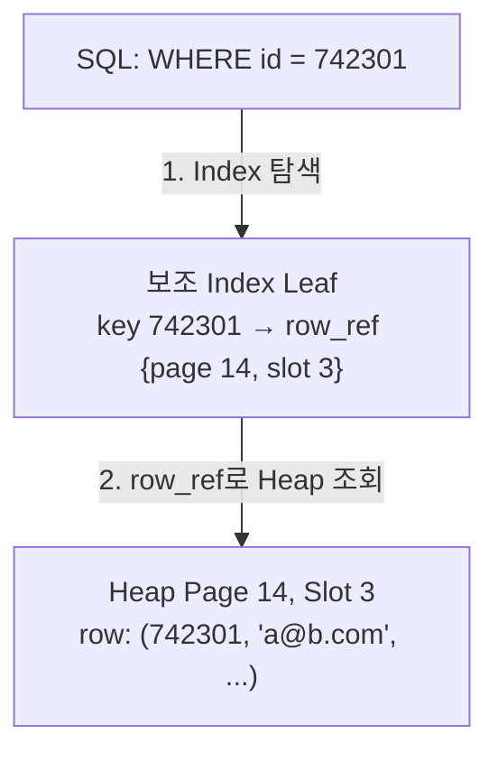

# DB 인덱스
{: .no_toc }

회원 100만 명이 있는 `users` Table에서 이메일이 `a@b.com`인 행을 찾는다고 하자. 이메일로 찾을 경로가 없으면 DB는 Table을 훑으며 각 행이 조건에 맞는지 확인해야 한다. 이 접근을 Full Table Scan이라고 한다. 행이 늘면 확인할 데이터도 늘어나지만, 행 수가 두 배라고 실행 시간이 반드시 두 배가 되는 것은 아니다. 실제 시간에는 캐시와 저장 장치, 실행 계획도 영향을 준다.

## 찾아보기에서 본문으로

500쪽짜리 책에서 ‘B+ Tree’가 나오는 곳을 찾으려면 처음부터 책장을 넘길 수 있다. 책 뒤의 찾아보기에 ‘B+ Tree … 312쪽’이 있다면 먼저 그 항목을 찾고 312쪽을 펼치면 된다. 특정 값을 찾을 경로와 본문의 위치를 함께 관리하는 자료구조가 DB의 Index다.

정렬된 Key를 사용하는 Index에서는 Table의 모든 행을 비교하는 대신 Key를 따라 후보를 좁힐 수 있다. [B+ Tree](/wiki/data-b-tree-cd9340fd2546/)는 한 Node에 여러 Key를 담아 Tree 높이를 낮추는 대표적인 구조다. 다만 Hash, Bitmap, Inverted, Spatial Index처럼 다른 구조도 있으므로 모든 Index가 값을 정렬하거나 `CREATE INDEX`가 항상 B+ Tree를 만든다고 가정하지 않는다.

## Index를 만들기 전과 후

조회 결과가 같아도 DB가 그 결과를 찾는 경로는 달라질 수 있다. 아래 예제는 SQLite에서 Table과 두 행을 만든 뒤, 같은 조건의 실행 계획을 Index 생성 전후로 확인한다. `EXPLAIN QUERY PLAN`은 조회 결과 대신 DB가 선택한 접근 방법을 보여 준다.

```run-sql
CREATE TABLE users (
    id INTEGER PRIMARY KEY,
    email TEXT NOT NULL
);
INSERT INTO users (id, email)
VALUES (1, 'a@b.com'), (2, 'c@d.com');

EXPLAIN QUERY PLAN
SELECT * FROM users WHERE email = 'a@b.com';

CREATE INDEX idx_users_email ON users(email);

EXPLAIN QUERY PLAN
SELECT * FROM users WHERE email = 'a@b.com';

SELECT * FROM users WHERE email = 'a@b.com';
```

이 예제에서 확인할 부분은 처음 계획의 `SCAN users`가 Index 생성 후 `SEARCH users USING COVERING INDEX idx_users_email`로 바뀌는지다. 마지막 조회는 같은 행 `1|a@b.com`을 반환한다. 실행 계획의 숫자와 표시 형식은 SQLite 버전에 따라 달라질 수 있다. 작은 Table의 접근 방법을 비교하는 예제이므로 이 결과를 100만 행의 성능 측정값으로 해석하지 않는다. [SQLite EXPLAIN QUERY PLAN](https://sqlite.org/eqp.html)

## 리프에 들어 있는 값

Tree의 끝에 있는 Leaf가 무엇을 담는지에 따라 Index를 찾은 다음 단계가 달라진다. 행 자체를 얻을 수도 있고, 그 행을 다시 찾을 위치나 Key를 얻을 수도 있다.

SQL Server의 Rowstore를 기준으로 보면 Clustered Index는 행 데이터를 Leaf에 저장한다. 가나다순 사전에서 단어를 찾으면 그 자리에 뜻이 있는 모습과 비슷하다. 행을 저장하는 기준 순서는 하나이므로 Table당 Clustered Index도 하나다. 반면 Nonclustered Index는 본문과 별도로 만들며 이메일용과 이름용처럼 여러 개를 둘 수 있다. 본문 위치를 가리키는 값은 Table이 Heap인지 Clustered Table인지에 따라 행의 위치 또는 Clustered Key가 된다. `PRIMARY KEY`가 기본적으로 Clustered Index를 만드는 경우도 있지만, 이미 Clustered Index가 있는지와 명시한 설정을 함께 봐야 한다. [SQL Server Index 종류](https://learn.microsoft.com/en-us/sql/relational-databases/indexes/clustered-and-nonclustered-indexes-described?view=sql-server-ver17)

이 이름을 다른 DB에 그대로 대입하면 혼동하기 쉽다.

| 제품과 저장 구조 | Leaf에서 행을 찾는 방식 |
| --- | --- |
| MySQL InnoDB | Primary Key를 기준으로 행을 저장한다. Secondary Index의 Leaf에는 대상 행의 Primary Key가 들어간다. |
| PostgreSQL의 일반 Index | Heap Tuple의 위치를 가리킨다. `CLUSTER`는 지정한 Index 순서로 Table을 재배치하지만 이후 변경에도 그 순서를 계속 유지하는 기능은 아니다. |
| lrn-sql의 보조 Index | `id`와 Heap Page의 행 위치인 `row_ref`를 저장한다. |

제품별 동작은 [MySQL InnoDB Index](https://dev.mysql.com/doc/refman/8.4/en/innodb-index-types.html)와 [PostgreSQL CLUSTER](https://www.postgresql.org/docs/18/sql-cluster.html)에서 확인할 수 있다. Table 자체를 Index 구조로 저장하는 Index-Organized Table도 있으므로, 이름뿐 아니라 실제 저장 구조를 확인해야 한다.

쿼리에 필요한 값이 모두 Index에 있으면 본문을 따로 읽지 않고 응답할 수 있다. 이를 Covering Index라고 한다. 앞의 SQLite 예제에서는 `email`과 행 식별 값만으로 조회를 처리할 수 있어 계획에 `COVERING`이 표시된다. ‘보조 Index를 사용하면 언제나 Table을 한 번 더 읽는다’는 규칙으로 외우지 않는 이유다.

## lrn-sql에서 행 위치 따라가기

lrn-sql의 `leaf_entry_t`는 `id` Key와 `row_ref`를 묶는다. `bptree_search()`가 이 위치를 반환하면 호출한 쪽이 Heap Page에서 실제 행을 읽는다. 다음 구성도에서 `id = 742301`을 찾은 뒤 `row_ref`로 어떤 위치를 읽는가?



첫 단계에서 얻은 것은 행이 아니라 Page 14의 Slot 3이라는 위치다. 이 위치로 본문을 읽는 두 번째 단계가 이어진다. `leaf_entry_t`의 바이트 배치와 실제 탐색 함수는 [B+ Tree 구현](/wiki/data-b-tree-99b399d45cdf/)에서 확인할 수 있다. Tree 높이에 따른 Page 접근과 실제 디스크 I/O 횟수는 캐시 때문에 다를 수 있으며, 이 구성도는 측정 결과가 아니다.

## 읽기 경로를 추가하는 비용

Index를 추가하면 DB는 Table의 변경과 함께 Index도 관리해야 한다. `INSERT`와 `DELETE`는 관련 Key를 넣고 지우며, `UPDATE`가 어느 Index를 고치는지는 바뀐 Column과 제품 구현에 따라 달라진다. Index가 다섯 개라고 모든 `UPDATE`가 반드시 Tree 다섯 개를 똑같이 고치는 것은 아니다.

별도 Index는 저장 공간도 사용한다. 따라서 검색 조건으로 자주 쓰는 Column, 값이 바뀌는 빈도, 쿼리가 선택하는 행의 비율을 함께 살펴야 한다. 읽기가 많고 변경이 적은 Column은 후보가 될 수 있지만, 그것만으로 생성 여부가 결정되지는 않는다. 조회 결과가 Table 대부분이라면 Scan이 더 적은 비용으로 처리될 수도 있다.

Index를 추가한 뒤에는 실제 쿼리의 실행 계획과 읽기·쓰기 비용을 비교한다. 사용하지 않는 Index를 계속 쌓거나 모든 Column에 일괄적으로 만드는 대신, 줄이려던 조회 비용이 유지 비용보다 큰지 확인해야 한다. 저장 모델의 차이는 [Database](/wiki/data-storage/), Key를 여러 개 담는 Tree의 원리는 [B+ Tree](/wiki/data-b-tree-cd9340fd2546/)로 이어진다.
