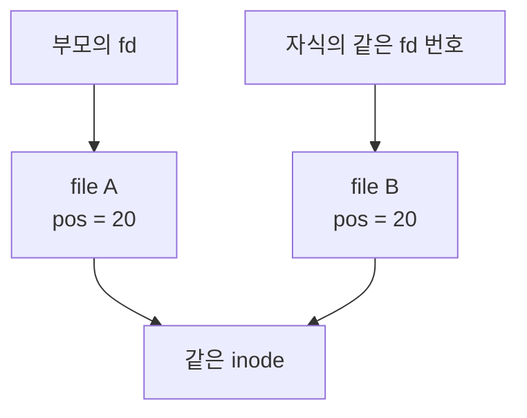

# File Descriptor
{: .no_toc }

PintOS의 사용자 프로그램은 `open("sample.txt")`으로 받은 정수를 `read()`, `write()`, `close()`에 다시 전달한다. 이 번호를 커널의 파일 객체로 바꾸는 곳이 프로세스별 `fd_table`이다. [파일 접근](/wiki/computer-systems-network-topic-a803731abfdb/)에서 설명한 fd 개념을 작은 커널 안에서 따라갈 수 있다.

여기서는 [lrn-pintos의 `5afaa6d` 시점](https://github.com/woonyong-kr/lrn-pintos/tree/5afaa6dc2f7e38f6178cc8fcecad8989518f2eb0)을 기준으로 구조와 동작을 읽는다. 이 저장소는 KAIST PintOS 기반의 팀 학습 구현을 보존한 것으로, Linux의 모든 파일 접근 규칙을 구현하지는 않는다.

## 사용자에게 돌려주는 것은 슬롯 번호다

`struct thread`의 `fd_table`은 `struct file *`를 담는 배열이다. 파일을 열면 커널은 파일 객체의 포인터를 빈 슬롯에 넣고 그 인덱스만 사용자에게 반환한다. 사용자 변수 `fd`에는 커널 주소가 들어 있지 않는다.

| 단계 | 현재 코드의 처리 |
|---|---|
| `open()` | 사용자 경로 문자열을 커널 메모리로 복사하고 `filesys_open()` 호출 |
| fd 할당 | `process_add_file()`이 fd 2부터 빈 슬롯을 찾아 파일 포인터 저장 |
| I/O 대상 조회 | `process_get_file(fd)`가 범위와 테이블을 확인하고 파일 포인터 반환 |
| `close()` | 파일 참조를 닫고 슬롯을 `NULL`로 변경 |
| 프로세스 종료 | 모든 일반 파일 슬롯을 닫은 뒤 fd table 페이지 해제 |

`open()`이 파일 객체를 얻었더라도 테이블에 빈 슬롯이 없으면 성공할 수 없다. 현재 구현은 이 경우 `file_close()`로 방금 얻은 객체를 정리하고 `-1`을 반환한다. 사용자 문자열을 복사한 페이지도 성공·실패 경로에서 해제한다. [파일 열기와 I/O 구현](https://github.com/woonyong-kr/lrn-pintos/blob/5afaa6dc2f7e38f6178cc8fcecad8989518f2eb0/pintos/userprog/syscall.c)

프로세스 A와 B가 모두 fd 2를 갖더라도 각자 자신의 테이블을 조회한다. 따라서 같은 숫자만으로 다른 프로세스의 파일에 접근할 수는 없다.

### 한 페이지에 들어가는 fd

테이블은 `palloc_get_page(PAL_ZERO)`로 받은 한 페이지이며, 초기 슬롯은 모두 `NULL`이다. 범위는 다음 식으로 정한다.

```c
#define FD_MAX (PGSIZE / sizeof(struct file *))
```

x86-64에서 페이지가 4,096바이트이고 포인터가 8바이트이면 총 512슬롯이다. 유효한 인덱스는 0부터 511까지이며, 0과 1을 표준 입출력에 예약하므로 일반 파일에 사용할 수 있는 슬롯은 최대 510개다. 테이블 용량을 계산할 때 예약 슬롯을 다시 더하면 안 된다.

슬롯 주소와 슬롯에 저장된 파일 주소도 구분한다. 배열 시작 주소가 가령 `0x80045000`이라면 fd 2의 슬롯 주소는 `base + 2 × 8`, 즉 `0x80045010`이다. 이곳에 저장된 값이 실제 `struct file`의 주소다. Little-endian 환경에서 포인터 값 `0x80041230`은 `30 12 04 80 00 00 00 00` 순서의 바이트로 놓인다. 이 주소들은 계산을 설명하기 위한 가정이며 실행 중 관찰한 주소가 아니다.

## close 이후의 재사용

`process_add_file()`은 매번 2번부터 시작해 가장 낮은 빈 슬롯을 찾는다. `next_fd`라는 필드가 있지만 현재 할당 Loop의 시작점에는 사용하지 않는다. 조회는 배열 인덱스 접근이므로 `O(1)`, 빈 슬롯 검색은 최악에 테이블 크기에 비례한다.

fd 2와 3이 열린 상태에서 2를 닫으면 다음과 같이 바뀐다.

```text
close 전: fd_table[2] → file A, fd_table[3] → file B
close 후: fd_table[2] = NULL,   fd_table[3] → file B
다음 open: fd_table[2] → file C, 사용자에게 2 반환
```

사용자 변수에 남은 2가 file A를 계속 뜻하는 것은 아니다. 새 `open()` 뒤에는 file C를 가리킨다. 이미 닫힌 번호를 다시 `close()`하는 경우도 구분해야 한다. 현재 코드는 슬롯이 비어 있으면 아무 일도 하지 않지만, 같은 번호가 다른 파일에 재할당된 뒤라면 그 파일을 닫게 된다. `close-twice` 테스트는 사이에 새 할당이 없는 경우를 다룬다.

`process_close_file()`은 `filesys_lock`을 잡고 파일을 닫은 뒤 슬롯을 비운다. 닫은 번호가 `next_fd`보다 작으면 `next_fd`도 그 번호로 낮춘다. 이 마지막 갱신은 아래의 `fork()` 복제 범위와 함께 읽어야 한다.

## 복제할 슬롯을 next_fd로 제한하면

fd 2, 3, 4를 열면 `next_fd`는 5가 된다. 여기에서 3만 닫으면 fd 4는 그대로 열려 있지만 `next_fd`는 3으로 내려간다.

| 값 | `close(3)` 뒤의 상태 |
|---|---|
| `fd_table[2]` | 열려 있음 |
| `fd_table[3]` | `NULL` |
| `fd_table[4]` | 열려 있음 |
| `next_fd` | 3 |

현재 `duplicate_fd_table()`은 `fd < parent->next_fd && fd < FD_MAX`를 조건으로 순회한다. 위 상태에서는 fd 2만 처리하고 끝나므로, fd 4에 대해서는 `file_duplicate()`를 호출하지 않는다. 복제 함수가 실패한 것이 아니라 그 슬롯을 방문하지 않은 것이다. 이 결론은 현재 `close()`와 복제 Loop를 함께 읽은 결과다. [fd 할당·복제·정리 코드](https://github.com/woonyong-kr/lrn-pintos/blob/5afaa6dc2f7e38f6178cc8fcecad8989518f2eb0/pintos/userprog/process.c)

아래는 두 순회 범위를 비교하는 Python 모델이다. 파일 포인터는 이름으로, 테이블은 8칸으로 줄였다. PintOS 커널이나 `fork()`를 실행하는 예제가 아니라 현재 코드의 슬롯 선택 조건을 실행해 보는 예제다.

```run-python
FD_MAX = 8  # 표를 짧게 보기 위한 크기다. 실제 구현은 포인터 한 페이지다.


class DescriptorTable:
    def __init__(self):
        self.slots = [None] * FD_MAX
        self.next_fd = 2

    def open(self, name):
        for fd in range(2, FD_MAX):
            if self.slots[fd] is None:
                self.slots[fd] = name
                if fd >= self.next_fd:
                    self.next_fd = fd + 1
                return fd
        return -1

    def close(self, fd):
        if 2 <= fd < FD_MAX and self.slots[fd] is not None:
            self.slots[fd] = None
            if fd < self.next_fd:
                self.next_fd = fd

    def inherited_numbers(self, use_hint):
        stop = min(self.next_fd, FD_MAX) if use_hint else FD_MAX
        return [fd for fd in range(2, stop) if self.slots[fd] is not None]


parent = DescriptorTable()
opened = [parent.open(name) for name in ("A", "B", "C")]
print("opened:", opened)
parent.close(opened[1])
print("after close:", parent.slots)
print("next_fd:", parent.next_fd)
print("copy below next_fd:", parent.inherited_numbers(use_hint=True))
print("copy all open slots:", parent.inherited_numbers(use_hint=False))
print("next open:", parent.open("D"))
```

`next_fd`를 상한으로 쓰면 `[2]`, 실제 열린 슬롯을 모두 보면 `[2, 4]`가 출력된다. 뒤이은 `open()`은 비어 있는 3을 다시 사용한다. 닫을 번호를 바꿔 보면 `next_fd`와 열린 슬롯의 범위가 언제 달라지는지 확인할 수 있다.

복제의 기준은 실제로 열린 슬롯이다. 고정 배열에서는 2부터 `FD_MAX - 1`까지 검사하는 방법이 단순하다. 더 좁은 순회 범위를 유지하려면 그 상한이 항상 가장 큰 열린 fd보다 크다는 조건을 별도로 보장해야 한다. 다음 할당 후보와 열린 범위의 상한을 같은 의미로 취급해서는 안 된다.

커널에서 이 경로를 재현할 때는 `open` 세 번, 중간 `close`, `fork("child")`, 자식의 남은 큰 fd 읽기 순서로 검사한다. 자식의 사용자 변수에 4가 남아 있어도 자식 테이블의 4번이 `NULL`이면 `read()`는 파일 시스템에 도달하기 전에 실패한다. 이 경우 1바이트 읽기 성공 여부를 종료 상태로 전달하면 부모의 `wait()`에서 판정할 수 있다. 현재 문서에 커널 재현 실행 결과를 포함한 것은 아니다.

## 파일 위치는 복사한 뒤 따로 움직인다

복제 대상에 포함된 슬롯에서는 `file_duplicate()`가 새 `struct file`을 만들고 원래 `pos`를 복사한다. inode는 `inode_reopen()`으로 같은 파일을 참조한다. 쓰기 금지 중인 파일이면 새 객체에도 해당 상태를 적용한다.



복제 직후 위치가 모두 20이어도 자식이 10바이트를 읽으면 자식의 `pos`만 30이 된다. 부모는 20을 유지한다. Linux `fork()`처럼 같은 Open File Description을 공유하는 구조와 다르다. 같은 inode를 참조한다는 이유만으로 offset도 공유한다고 판단할 수 없다. 객체와 inode의 수명은 [파일 시스템 구현](/wiki/computer-systems-network-topic-c76b83867c50/)에서 이어서 다룬다.

이 차이는 저장소의 [`fork-read` 테스트](https://github.com/woonyong-kr/lrn-pintos/blob/5afaa6dc2f7e38f6178cc8fcecad8989518f2eb0/pintos/tests/userprog/fork-read.c)에서도 읽을 수 있다. 부모가 먼저 20바이트를 읽고 자식을 만든 뒤, 자식과 부모가 각각 나머지 내용을 읽도록 검사한다. 자식이 fd를 닫은 뒤에도 부모의 fd는 유지되어야 한다. 여기서는 테스트가 요구하는 동작을 확인한 것이며, 테스트를 새로 실행해 통과했다는 뜻은 아니다.

`file_duplicate()`와 `file_reopen()`도 다르다. 둘 다 같은 inode를 참조하는 새 파일 객체를 얻지만 `file_reopen()`은 처음 위치인 0에서 시작하고, `file_duplicate()`는 기존 위치와 쓰기 금지 상태를 이어받는다. [두 함수의 구현](https://github.com/woonyong-kr/lrn-pintos/blob/5afaa6dc2f7e38f6178cc8fcecad8989518f2eb0/pintos/filesys/file.c)

자식 테이블을 만들다가 일부 파일 복제에 실패하면 이미 복제한 파일과 테이블 페이지를 모두 정리한다. 정상 복제의 메모리는 테이블 한 페이지와 복제한 파일 객체 수에 비례한다. x86-64 대상으로 실제 구조체 배치를 확인하면 `struct file`은 16바이트이므로 파일 세 개의 객체와 테이블 자체는 `4096 + 3 × 16 = 4144`바이트다. Allocator의 추가 비용과 프로세스의 다른 메모리는 포함하지 않은 값이며, 실행 시간이나 CPU Cycle 수를 측정한 값도 아니다.

## exec와 프로세스 종료

`__do_fork()`는 부모의 Register Frame과 주소 공간을 복제한 뒤 파일 테이블을 복제한다. 자식의 반환 Register를 0으로 설정하고 사용자 모드로 돌아가며, 부모는 자식의 Thread ID를 반환받는다. 파일 테이블은 메모리 복제와 별도로 준비해야 하는 커널 자원이다.

현재 `process_exec()`는 주소 공간을 교체하면서 fd table을 유지한다. 따라서 `fork()` 직후 `exec()`한 자식도 상속받은 fd로 파일을 읽을 수 있다. [`multi-child-fd`](https://github.com/woonyong-kr/lrn-pintos/blob/5afaa6dc2f7e38f6178cc8fcecad8989518f2eb0/pintos/tests/userprog/multi-child-fd.c)와 [`child-close`](https://github.com/woonyong-kr/lrn-pintos/blob/5afaa6dc2f7e38f6178cc8fcecad8989518f2eb0/pintos/tests/userprog/child-close.c)는 이 흐름을 검사한다. 전자의 옛 주석에는 파일 Handle을 상속하지 않는다고 적혀 있지만, 현재 테스트 본문과 후자의 설명은 상속되는 fd를 사용한다. 동작은 주석 한 줄보다 실제 호출과 검사 조건을 기준으로 읽는다.

종료할 때는 `close_open_files()`가 2부터 `FD_MAX - 1`까지 모든 슬롯을 닫고, 마지막에 테이블 페이지를 해제한다. 테이블 페이지만 반환하면 파일 객체와 inode 참조가 남으므로 슬롯 정리가 먼저다. 실행 중인 ELF를 보관하는 `running_file`은 별도 참조이며 일반 fd table과 따로 닫는다. VM 빌드에서는 Mapping 등을 정리하는 `process_cleanup()`이 파일 정리보다 앞에 온다.

## 표준 입력과 출력은 번호 분기다

현재 구현은 `fd_table[0]`과 `fd_table[1]`에 파일 객체를 저장하지 않는다. `read()`와 `write()`가 번호를 확인하고 직접 입력 또는 출력 함수로 연결한다. 아래 표는 읽거나 쓸 크기가 0보다 큰 경우다. 크기 0은 먼저 0을 반환한다.

| fd | `read()` | `write()` |
|---|---|---|
| 0 | `input_getc()`로 입력 Byte 읽기 | `-1` |
| 1 | `-1` | `putbuf()`로 콘솔 출력 |
| 2 이상 | 테이블 조회 후 `file_read()` | 테이블 조회 후 `file_write()` |

사용자 Buffer는 검증한 뒤 커널 임시 페이지를 거쳐 복사한다. 일반 파일 I/O와 stdout 출력은 현재 코드에서 `filesys_lock`으로 보호하며, 입력을 기다리는 `input_getc()`에는 같은 Lock을 잡지 않는다. 읽기·쓰기는 페이지 크기 단위로 나누고, 실제 처리한 Byte 수와 부분 실패를 반영한다.

`close(0)`과 `close(1)`은 예약 번호를 유지한 채 아무 일도 하지 않는다. `close()` 자체가 반환값 없는 API이므로 이를 성공·실패 숫자로 설명하지 않는다. fd 2는 Unix의 stderr와 달리 일반 파일로 할당할 수 있다. 현재 구현에는 Unix식 `dup2()` 재지정, Pipe로 연결한 표준 입출력, 다중 TTY와 Job Control을 제공하는 계층이 없다.

파일 조회 실패도 함수마다 반환 방식이 다르다. 현재 `filesize()`는 파일을 찾지 못하면 `-1`, `seek()`는 아무 동작도 하지 않고, `tell()`은 0을 반환한다. 세 함수 모두 파일 포인터를 검사한다. `tell()`의 0만으로 정상적인 처음 위치와 잘못된 fd를 구분할 수는 없다.

## 콘솔과 디스크가 QEMU에 닿는 곳

사용자 `printf()`는 표준 출력 번호로 쓰기를 요청한다. PintOS의 `putbuf()`는 `putchar_have_lock()`을 통해 Serial과 VGA 출력 경로로 연결한다. Serial 출력은 `serial_putc()`와 Port I/O로 장치에 문자를 보낸다. 입력은 키보드 또는 Serial 장치에서 `input_putc()`로 Queue에 들어오고, `input_getc()`가 Byte를 꺼낸다. 따라서 모든 stdin 입력이 그래픽 창의 PS/2 키보드에서만 들어온다고 설명하면 안 된다.

저장소의 실행 도구는 QEMU에 `-serial mon:stdio`를 전달한다. Serial과 QEMU Monitor를 호스트의 표준 입출력에 함께 연결하는 설정이다. Serial Backend를 PTY, Socket, 파일 등으로 바꾸면 호스트 쪽 도착점도 달라진다. 이 장치 연결 설정이 fd 0이나 1의 의미를 정하는 것은 아니다. [PintOS 실행 도구](https://github.com/woonyong-kr/lrn-pintos/blob/5afaa6dc2f7e38f6178cc8fcecad8989518f2eb0/pintos/utils/pintos), [QEMU Serial·Character Backend](https://www.qemu.org/docs/master/system/invocation.html)

일반 파일은 `file_read()`·`file_write()`에서 inode를 거쳐 디스크의 Sector I/O로 내려간다. QEMU는 Guest 장치의 동작을 제공하고 Block Backend를 통해 호스트의 디스크 이미지 등에 접근한다. PintOS의 fd와 QEMU 프로세스가 호스트에서 연 fd는 서로 다른 번호 체계다. `process_get_file()`에서 실패한 요청은 해당 파일의 디스크 I/O까지 내려가지 않는다.

## GDB에서는 객체의 수명을 따라간다

QEMU GDB Stub에 연결해 해당 커널의 Debug Symbol을 읽은 상태라면 `duplicate_fd_table()` 진입점에서 부모의 열린 슬롯을 확인할 수 있다. 다음 명령은 커널 디버깅용 관찰 예시이며, 이 문서에서 실행 결과를 확인한 스크립트는 아니다.

```gdb
break duplicate_fd_table
continue
set $fd_parent = parent
set $fd_child = curr
print $fd_parent->next_fd
print/x $fd_parent->fd_table[2]
print/x $fd_parent->fd_table[3]
print/x $fd_parent->fd_table[4]
finish
print/x $fd_child->fd_table
```

복제가 성공했고 자식 테이블이 `NULL`이 아닌 것을 확인한 뒤 4번 슬롯을 비교한다. 함수 진입 시점에는 자식 테이블을 아직 할당하지 않았으므로 먼저 역참조하지 않는다. 파일 객체의 offset도 객체가 생성된 뒤, 닫히기 전에 확인해야 한다.

| 확인하려는 동작 | 멈출 함수 | 관찰할 값 |
|---|---|---|
| 낮은 번호 재사용 | `process_add_file()` | 슬롯을 채운 뒤의 `fd`, `fd_table[fd]` |
| 슬롯 해제 | `process_close_file_unlocked()` | 함수 인자 `fd`, 닫기 전후 슬롯 |
| offset 복사 | `file_duplicate()` | 생성 후 원본과 새 객체의 주소·`pos`·inode |
| 잘못된 fd 조회 | `process_get_file()` | 범위 검사와 반환 포인터 |
| 이름 제거 뒤 참조 유지 | `inode_remove()`, `inode_close()` | `removed`, `open_cnt` |

전체 테이블을 확인할 때도 `next_fd`까지만 출력하면 같은 누락을 관찰 도구에서 반복한다. 테이블의 실제 용량을 상한으로 삼아 열린 슬롯을 찾는다. 함수 지역 변수는 선언·초기화된 이후에 확인하고, 디버그 세션에 따라 달라지는 주소를 고정된 정답으로 사용하지 않는다.
