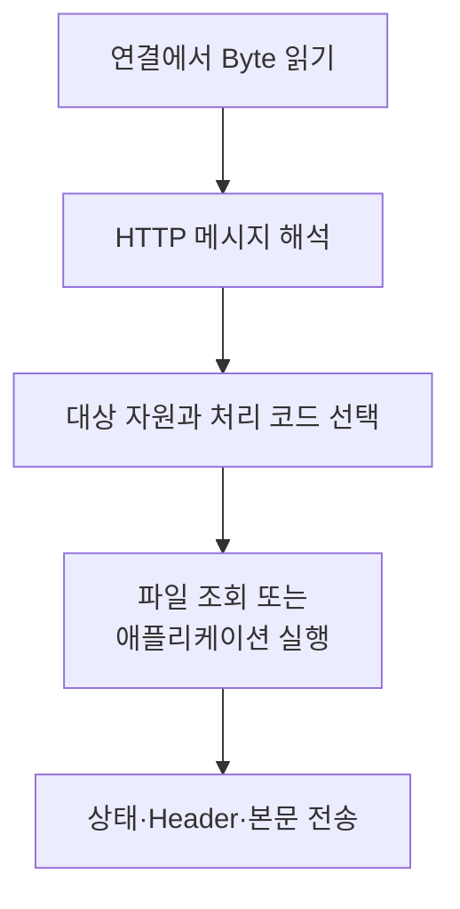

# 웹 서버
{: .no_toc }

웹 서버는 HTTP 요청을 받아 처리하고 응답을 돌려주는 프로그램이다. 브라우저의 `fetch()` 호출을 서버 쪽에서 보면, 연결을 받고 Byte를 읽어 HTTP 메시지로 해석한 뒤 파일이나 애플리케이션의 처리 결과를 보내는 흐름이 된다.

서버 코드의 흐름을 볼 때는 네트워크 연결과 HTTP 요청을 구분한다. 하나의 연결에서 여러 요청을 처리할 수도 있고, 요청 하나를 처리하는 동안 파일·DB·다른 서버와 추가로 통신할 수도 있다.

## 연결을 받는 준비와 요청 처리

일반적인 TCP 서버는 클라이언트 요청이 오기 전에 Listening Socket을 준비한다. `socket()`으로 소켓을 만들고 `bind()`로 로컬 주소를 지정한 뒤 `listen()`으로 연결을 받을 수 있는 상태로 둔다. `accept()`는 대기 중인 연결을 처리할 Connected Socket을 반환한다.

Listening Socket은 다음 연결을 받는 창구로 남고, Connected Socket은 한 연결의 데이터를 읽고 쓰는 데 사용된다. 커널의 TCP Handshake 처리와 프로그램의 `accept()` 호출 시점은 구분해야 한다. API의 연결·오류 처리와 실행 예제는 [Socket](/wiki/socket/)에 있다.

연결을 받은 뒤에는 다음 작업이 이어진다.

이는 처리 단계를 나누어 보는 그림이다. 전체 요청이 Buffer 하나에 들어와야만 일을 시작한다는 뜻은 아니다. 메시지를 나누어 읽거나 본문을 Streaming으로 처리할 수도 있다. 한 번의 `read()` 결과와 HTTP 메시지 하나를 같은 것으로 가정해서는 안 된다.

응답을 보낸 뒤 연결을 닫을지, 다음 요청을 받을지는 HTTP 버전과 메시지·서버의 정책에 따라 달라진다. HTTP/1.1 서버가 항상 요청마다 연결을 닫는 것은 아니다. 시작 줄과 Header, 본문 경계를 읽는 예제는 [요청과 응답](/wiki/computer-systems-network-topic-58802d355c9c/)에서 확인할 수 있다.

## 파일 응답과 애플리케이션 응답

정적 파일 요청이라면 서버는 요청 대상을 제공할 파일에 연결하고 형식과 길이를 확인한 뒤 내용을 전송한다. URI가 곧바로 디스크의 임의 경로가 되어서는 안 된다. 공개할 경로의 범위와 접근 권한을 확인하는 단계가 필요하다.

애플리케이션 응답은 계산이나 저장소 조회 등의 결과로 만든다. 서버가 요청 정보와 본문을 처리 코드에 전달하고, 처리 코드는 상태·Header·본문을 돌려준다. [REST](/wiki/backend-services-rest-c3f71fdaf43a/)의 라우팅 예제는 Method와 경로에 따라 이 처리 코드를 선택하는 부분을 보여 준다.

CGI는 웹 서버가 외부 프로그램과 요청·응답을 주고받는 인터페이스의 한 예다. 요청 정보는 환경 변수 등으로, 요청 본문은 표준 입력으로 전달하고 프로그램의 출력을 응답에 사용한다. 일반적인 CGI 응답에서는 서버가 프로그램의 응답 필드를 해석해 클라이언트에 보낼 메시지를 만든다. [CGI 1.1](https://www.rfc-editor.org/rfc/rfc3875.html)

프레임워크를 사용하면 이런 연결과 메시지 처리의 상당 부분을 서버 구현에 맡긴다. 그래도 서버와 애플리케이션 사이의 계약은 남는다. Python의 [WSGI](https://peps.python.org/pep-3333/)와 [ASGI](https://asgi.readthedocs.io/en/latest/specs/main.html)는 그 경계를 정의하는 인터페이스다. 특정 프레임워크가 어떤 소켓이나 Worker 구조를 사용하는지는 실제로 실행한 서버 구현과 설정을 함께 봐야 한다.

## 여러 요청을 처리하는 방식

하나의 연결을 끝까지 처리한 뒤 다음 연결로 넘어가는 순차 서버는 흐름을 읽기 쉽다. 반면 현재 클라이언트의 입력이나 저장소 응답을 기다리는 동안 다른 요청의 처리가 늦어질 수 있다.

Process로 작업을 나누면 주소 공간의 격리를 얻지만 생성·통신·자원 사용의 비용이 생긴다. Thread는 같은 주소 공간을 공유해 상태에 접근하기 쉽지만 동기화가 필요하다. Event Loop와 Nonblocking 입출력은 여러 연결의 대기를 함께 다룰 수 있지만, 오래 걸리는 동기 작업이나 CPU 연산이 Loop를 막지 않도록 해야 한다.

어떤 방식이 적합한지는 동시에 처리할 연결 수뿐 아니라 요청이 주로 어디에서 시간을 쓰는지에 따라 달라진다. Worker 수만 늘리면 파일 Descriptor 한도나 DB 연결 수처럼 다른 자원이 먼저 부족해질 수도 있다.

## 실행 흐름에서 확인할 정보

코드나 로그를 읽을 때는 연결을 받은 지점, HTTP 메시지 해석, 처리 코드 선택, 응답 전송을 연결해서 본다. 파일을 제공한다면 파일 Descriptor의 생성과 해제도 따로 확인한다. Listening Socket, 연결 소켓과 파일 Descriptor는 맡는 역할과 수명이 다르다.

Descriptor 번호는 닫은 뒤 다른 작업에 재사용될 수 있으므로 번호 하나를 영구적인 요청 ID처럼 사용하지 않는다. 요청 식별자와 연결·Worker 정보를 함께 보면 여러 요청의 로그가 섞여도 흐름을 구분하기 쉽다. Proxy를 거친 요청이라면 [Proxy](/wiki/computer-systems-network-topic-e8bae755299d/)가 원본 서버에 보낸 별도 요청도 확인한다.

이 구조는 DB 서버처럼 다른 프로토콜을 처리하는 프로그램에도 응용할 수 있다. 다만 HTTP 파싱과 데이터베이스의 메시지 규칙이 같아지는 것은 아니다. 연결의 수명, 메시지 경계와 처리 결과를 각각 추적한다는 관점이 이어진다.
